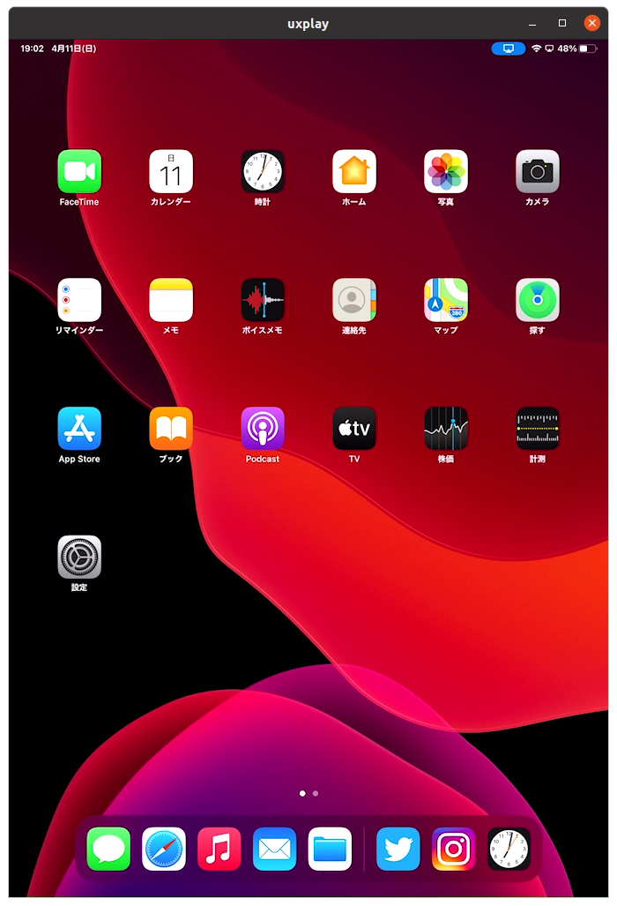

# UxPlayを使ってiPadをミラーリングする
- 参考
    - https://slash-mochi.net/?p=4068
## UxPlayの導入
- ```./mirroring.sh```を作ったので，それを実行する．
## UxPlayの使い方
### ミラーリングの開始
- 導入したPCで以下のコマンドを実行
    ```
    cd ~/Uxplay/build
    ./uxplay
    ```
- 接続したいiPadで，画面ミラーリング→UxPlay
    
### ミラーリングの終了
- iPad側
    - ミラーリングの停止
- PC側
    - 画面を閉じる
    - UxPlay起動時のターミナルでCtrl+C

## 追記 (4/14)
- 何故かうまくミラーリングできないってことがあった
    ```
    tcbn@tcbn-N14xZU:~/UxPlay/build$ ./uxplay 
    Initialized server socket(s)
    *** WARNING *** The program 'uxplay' uses the Apple Bonjour compatibility layer of Avahi.
    *** WARNING *** Please fix your application to use the native API of Avahi!
    *** WARNING *** For more information see <http://0pointer.de/blog/projects/avahi-compat.html>
    ```
    - 原因が分かり次第なんとかしたい．