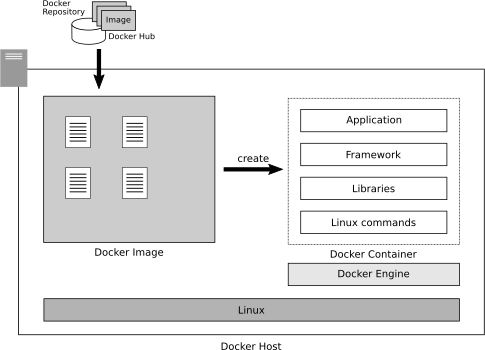

# 1. コンテナの仕組みと利点
- コンテナは隔離した環境でプログラム一式を仕組み．
- 最も使われているコンテナ技術は"Docker"．

## 1.1 隔離された実行環境を提供する
コンテナは，「互いに影響しない隔離された実行環境を提供する技術」
### 1.1.1 複数のシステムが同居するときの問題
1つのサーバで複数のシステムを実行する際，互いに影響し合うことがある
- ディレクトリの競合
    - システムAを "/usr/share/myapp" というディレクトリにインストールしたとき，別のシステムBを "/usr/share/myapp" ディレクトリにインストールできない．
- フレームワーク
    - システムAとシステムBが共通のフレームワークMを使っているとする．A側の都合でMのアップデートをしたことにより，Bが動かなくなる恐れがある．
### 1.1.2 環境の隔離で解決するコンテナ
上記の競合を解決するのが「コンテナ」という考え方．
#### コンテナ
- システムの実行環境を隔離した空間
- それぞれのコンテナは独自のディレクトリツリーを持ち，互いに影響を及ぼさない
    - 互いに中身が見えることもないので，セキュリティ面でも優れる
### 1.1.3 コンテナにはポータビリティ性がある

コンテナを使えば，それぞれの環境を隔離して互いに影響を与えないようにできる
- 1台のサーバに複数のシステムを同居させても，競合が起こらない．
- コンテナは「独立」している．
    - 独立: コンテナがそれ自体で完結している
        - ライブラリやフレームワーク，コマンドなどのすべてがコンテナの中にある
        - ポータビリティ性 (持ち出し可能)
    - コンテナを別のサーバにコピーして動かすのも容易．

## 1.2 Dockerを構成する要素
コンテナを実現するソフトの代表が"Docker"
### 1.2.1. Dockerコンテナを実行するためのDocker Engine
- Docker: Linux上で動作するソフト
- Linuxに"Docker Engine"をインストールすると，Dockerコンテナを実行できるようになる．
- Dockerホスト: Docker Engineをインストールしたホスト
- Dockerホストが動作するために必要なライブラリやLinux基本コマンドがあるが，Dockerコマンドから参照されない (これらはDockerホストが動くためだけに必要)
#### Dockerを操作するdockerコマンド
- Dockerコマンド
    - 外部からDockerコンテナを起動・停止したり，Dockerコンテナにログインしたりするためのインタフェースの標準コマンド
    - Dockerの利用者 (管理者) は，dockerコマンドを使ってコンテナを操作する
#### 統合的な操作をするDocker Composeコマンド
- dockerコマンド
    - コンテナを1つひとつ操作
- Docker Compose
    - 複数のコンテナを同時に操作．連携設定．
### 1.2.2. DockerコンテナとDockerイメージ
#### 「コンテナの元」となるDockerイメージ
- Dockerコンテナは，それぞれが独立したシステム実行環境．
    - コンテナを使うならば，システムの実行に必要なライブラリ，フレームワーク，基本コマンドが全て含まれる．
- Dockerでは，コンテナ作りを支援するために，基本的なソフトやアプリケーションをインストールしたコンテナの元 (Dockerイメージ) が提供されている．
    - Dockerイメージは，必要なファイルをすべてまとめたアーカイブパッケージ．
#### Dockerイメージを提供するレジストリ
- Dockerイメージは，Docker社が運営するDocker Hubで公開されている
- Dockerレジストリ
    - Dockerイメージを管理しているサーバ
    - Dockerリポジトリという単位でイメージを管理する
- Dockerでは，Dockerレジストリ上で管理されているDockerリポジトリに登録されているDockerイメージをダウンロードし，ダウンロードしたDockerイメージからDockerコンテナを作成する．

- Dockerイメージのダウンロードはdockerコマンドっで実行できる．事前に別途ダウンロードしておく必要はない．
#### アプリケーション入りのDockerイメージ
- Dockerイメージには2種類ある
    1. 基本的なLinuxディストリビューションだけのDockerイメージ
    2. アプリケーション入りDockerイメージ
- 1について．
    - UbuntuやCentOSなど，Linuxディストリビューションだけで構成されている
    - Linuxシステムしか入っておらず，ここに必要なものを追加でインストールするなどして使う
    - 独自のコンテナを自由に作る場合には，LinuxのみのDockerイメージからコンテナを作成する
- 2について．
    - すでにアプリケーションが入っているので，すぐに使える
        - Webサーバ (ApacheやNginxがインストールされ，設定済み)
        - データベースサーバ (MySQLやMariaDB，PostgreSQLなど)
    - 自分でソフトをインストールする必要がなく，すぐに活用できる
- Dockerコンテナは，「なんでもひとまとめにし，Docker Engineさえあればすぐに実行できる」という特徴がある．
    - 利用者はDocker EngineをインストールしたPCを用意し，それを基にコンテナを作るだけでよい．
    - 1つひとつをインストールする手間がなく，環境の違いによって動かないということもなくなる．
### 1.2.3 カスタムのDockerイメージを作る
- Dockerは，コンテナを起動してから内部でコマンドを実行したり，外部からファイルをコピーしたりできるので，Dockerコンテナに手を加えられる．
- コンテナに手を加えたあとに「カスタムDockerイメージ」に変換することで，そのDockerイメージからコンテナをまとめて作ることができる
    - Dockerfileに一連の設定を記述し，そのファイルを適用して作るのが一般的．
- カスタムDockerイメージは，Dockerレジストリに登録できる
    - 登録すれば，ほかのコンピュータからもそのDockerイメージを使えるようになる
### 1.2.4 クライアント環境のDocker
- WindowsやMacでも利用できる．
#### Docker Desktop
- Docker Desktop
    - WindowsやmacOSにおいて，Dockerを動かすためのソフトウェア
    - 内部にLinuxカーネルが含まれている．
        - WindowsやMacの上にLinuxサブシステムがあり，その上にDocker Engineがあるイメージ
    - WindowsやmacOSのアプリケーションが動くわけではない
- Windows10 ver 2004 以降では，WSL2になったので，Home editionでもDocker Desktopが使えるようになった．
#### サーバと同じコンテナを実行できる
- Docker Desktopの利点は，サーバで動かすのと同じDockerコンテナを実行できる点．
    - 自分のPCにサーバ環境を作ることができるのと同義．
    - 本来ならばネットワーク越しにサーバ開発をしなければならない場合でも，自分のPCにサーバ環境を構築してローカルに開発することが可能
- Docker Desktopは，Docker EngineをインストールしたLinux環境と完全互換
### 1.2.5 Dockerを構成する要素のまとめ
1. Docker EngineをインストールしたLinux環境で動作する
    - この環境をDockerホストという．
2. DockerコンテナはDockerイメージから作る
    - Dockerイメージは，Docker HubなどのDockerレジストリに登録されていて，ダウンロードして使う
3. Dockerイメージには基本的なディストリビューションとアプリケーション入りのものがある
    - カスタマイズするなら前者を使う
4. カスタマイズしたDockerイメージはDockerレジストリに登録できる
    - 登録すると，ほかのPC (サーバ) でも使えるようになる
5. Docker Desktopを使うとPCで動かせる
    - WindowsやMacでも使える

## 1.3 Dockerの利点と活用例
### 1.3.1 Dockerの利点
1. 隔離して実行されるので，ほかのシステムと同居しやすい
    - 1台のサーバに複数システムを構築できる
2. アプリケーション入りDockerイメージを使えば，システム構築がかんたん
    - 複雑なインストールや設定をすることなく簡単にシステムを構築できる
3. 複製を作りやすい
    - カスタムDockerイメージを作っておけば，それをもとにいくつでも同じコンテナを作ることができる
    - 複製を作る場合に同じ設定作業をしなくて済む
### 1.3.2 Dockerの欠点
1. Linuxシステムでしか動かない
    - Linux以外の環境で動かすことができない
2. 完全な分離ではない
    - 隔離した空間でプログラムを実行する技術にすぎない
    - ハードウェアをエミュレートしているわけではない
    - もしDocker Engineにセキュリティホールがあれば，隔離した部分に抜け穴が生じてしまう恐れも (原理的には) ある
- これらの欠点は，Dockerの導入理由が「1つのサーバに互いに影響なく，さまざまなアプリケーションを載せたい」ということであれば，大きな障害にはならないはず．
#### 仮想サーバとコンテナの違い
- 仮想サーバ
    - 1台の物理的なサーバの中に複数の仮想的なサーバを作り，物理的なサーバを仮想的なサーバが分割して使う
    - それぞれの仮想サーバにはOSがインストールされ，そこにシステムが構成される
- コンテナ
    - サーバは1台で，その中にたくさんのアプリケーションが隔離して実行されているにすぎない
    - 制御するOSは1つしかなく，複数のプログラムがDocker Engineの下で動いている
    - プログラムを実行しているのはDockerホスト
### 1.3.3 Dockerの活用例
1. 試作・実験・運用ツールのインストール
    - Docker Hubでは，たくさんのDockerイメージが提供されている
    - WebサーバやDBサーバなどを構築する際に，Dockerイメージを使えば手早く簡単に始められる
2. 開発環境での利用
    - 開発環境の構築にかかる手間を省く活用
3. 本番環境での利用
    - 多くの場合，開発成果物は検証機でテストし，動作確認が済んでから本番機で動作させる
        - 検証機の実行環境と同じ環境を本番機に用意する必要がある
        - ライブラリやフレームワークの依存関係を間違えてしまうと，環境の違いから本番機では動かないという事故が起こる
    - Dockerを使っていれば，このような事故が起こりにくくなる
        - 検証機で確認した内容をDockerイメージにしておけば，本番機ではそれを展開するだけで済む
        - 万一サーバが故障したときでも，Docker Engineをインストールした別のサーバを用意すればすぐに復旧できる
## 1.4 Dockerの本格運用
- コンテナを本番機に使う場合，「不具合や過剰負荷でも停止しない」ことが求められる
### 1.4.1 堅牢なDockerホストを検討する
- Dockerコンテナを実行するのは，Docker EngineをインストールしたDockerホスト
    - 安定運用には，Dockerホストの安定稼働が必要
    - Dockerホストは，サーバ (AWSではEC2) を使って自分で作ると，そのDockerホスト自体の保守運用・管理が手間
- 本番機の運用では，Dockerホストをマネージドサービス (運用管理をクラウドに任せることができるサービス) にして，ある程度任せてしまうのが無難
    - AWSにはAmazon ECSというコンテナを運用するマネージドサービスがある
    - ECSには負荷分散機能もあり，必要に応じてスケーリングされる
### 1.4.2 クラスタを構成するKubernetes
- Kubernetes
    - Googleが開発したオープンソースの分散Dockerホスト環境
    - 複数台のサーバでクラスタを構成し，負荷に応じて必要なだけのコンテナを自動生成できる
- Amazon EKS
    - AWSにあるKubernetes互換のマネージドサービス
### 1.4.3 コンテナの作り方は変わらない
- Amazon ECSやAmazon EKSは，コンテナを実行する環境 (= Docker Engineをインストールしたホスト) の代わりにすぎない
