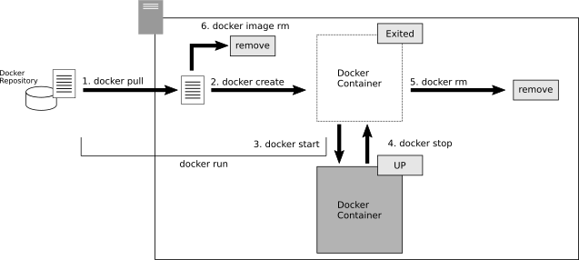

# 4. Dockerの基本操作
## 4.1 Dockerの基本コマンド
- Dockerはdockerコマンドで操作する．
    ```
    docker [commands] [operations] [option]
    ```
    - コマンド
        - ```run```, ```start```, ```stop```など
    - オプション
        - コマンドに対するオプション
- 参考
    - https://docs.docker.com/engine/reference/commandline/docker/
- 基本的なコマンド

    | コマンド | 操作 |
    | ---- | ---- |
    | ```attach``` | ターミナルをアタッチする |
    | ```build``` | Dockerfileからイメージをビルドする |
    | ```container``` | コンテナに対する操作をする |
    | ```cp``` | ファイルコピーする |
    | ```create``` | 新しいコンテナを作成する |
    | ```exec``` | コンテナ内でコマンドを実行する |
    | ```history``` | Dockerイメージの履歴を確認する |
    | ```image``` | イメージに対する操作をする |
    | ```inspect``` | Dockerオブジェクトに関する詳細情報を得る |
    | ```kill``` | コンテナを強制終了する |
    | ```load``` | exportしたイメージを読み込む |
    | ```login``` | Dockerレジストリにログインする |
    | ```logout``` | Dockerレジストリからログアウトする |
    | ```logs``` | コンテナのログを取得する |
    | ```network``` | ネットワークを管理する |
    | ```pause``` | コンテナを一時停止する |
    | ```port``` | ポートのマッピングを管理する |
    | ```ps``` | コンテナ一覧を参照する |
    | ```pull``` | Dockerリポジトリからイメージを取得する |
    | ```push``` | Dockerリポジトリにイメージを登録する |
    | ```rename``` | コンテナ名を変更する |
    | ```save``` | コンテナのイメージをtar形式にアーカイブしてイメージ化する |
    | ```start``` | コンテナを起動する |
    | ```stop``` | コンテナを停止する |
    | ```tag``` | タグを作成する |
    | ```top``` | コンテナで実行中のプロセス一覧を確認する |
    | ```unpause``` | pauseで一時停止したコンテナを再開する |
    | ```version``` | Dockerエンジンのバージョンを取得する |
    | ```volume``` | ボリュームを管理する |
    | ```wait``` | コンテナが停止するまで待つ |

## 4.2 コンテナ起動から終了までの流れ
- 3章では```docker run```コマンドを実行することで，コンテナを起動した．
    ```
    docker run -dit --name my-apache-app -p 8080:80 -v "$PWD":/usr/local/apache2/htdocs/ httpd:2.4
    ```
- ```docker run```は，```docker pull```, ```docker create```, ```docker start```という3つの一連のコマンドをまとめて実行する利便性を重視したコマンドである．
    ```
    docker pull httpd:2.4
    docker create --name my-apache-app -p 8080:80 -v "$PWD":/usr/local/apache2/htdocs/ httpd:2.4
    docker start my-apache-app
    ```

- コンテナ起動から終了までの流れ

### 4.2.1 Dockerイメージの取得
- Dockerコンテナを起動するには，元となるイメージが必要．
    - イメージは```docker pull```コマンドを使うことで，Dockerリポジトリから取得する
#### イメージ名とタグ
```
docker pull [imange name or image ID]
```
- イメージ名
    - Docker Hubで検索
    - タグを指定することもできる
        - Dockerイメージの製作者が名付けた分類名
        - リリース版，開発版，バージョン番号などを示すのに使われる．
        - タグ名を指定するときは，半角のコロン ":" で区切る
#### 最新版を示す"latest"
- タグ名を省略したときは，最新版を表す"latest"という特殊なタグが指定されたものとみなされる．
- 本番環境では，明示的にタグを指定するのが好ましい．
#### ダウンロードしたイメージの保存と破棄
- ```docker pull```で入手したイメージは，Dockerホストに保存される．
    - もう一度同じイメージを```docker pull```しても，ダウンロードし直されることはない．
    - 保持しているイメージは，```docker image ls```で確認できる．
- 保持しているイメージを削除するには，```docker image rm```コマンドを使う．
#### イメージIDでの指定
- イメージには，一意の"イメージID"もついている．
    - イメージを作るたびに更新されるユニークな値
    - ```docker image ls```で確認できる
    - イメージIDでイメージを指定することも可能
        - タグ名が明示的につけられていないバージョンを使いたいとき
### 4.2.2 Dockerコンテナの作成
- ```docker create```コマンドを使う
    - 指定するもの
        - 元となるイメージ名 (タグ名含) / イメージID
        - 各種オプション
        - 実行したいコマンド名
            - 省略可．省略したときは，イメージの製作者が設定した既定のコマンドが実行される．
#### 起動オプション
- 参考
    - https://docs.docker.com/engine/reference/commandline/create/

| オプション | 意味 |
| ---- | ---- |
| ```--add-host``` | ネットワーク通信するためのカスタムホストを設定する |
| ```--attach```, ```-a``` | 標準入出力，標準エラー出力をアタッチする |
| ```--dns``` | カスタムDNSサーバを設定する |
| ```--entrypoint``` | Dockerイメージの既定のENTRYPOINTを上書きする |
| ```--env```, ```-e``` | 環境変数を設定する |
| ```--env-file``` | 環境変数をファイルから読み込んで設定する |
| ```--hostname```, ```-h``` | コンテナのホスト名を設定する |
| ```--interactive```, ```-i``` | インタラクティブモードで実行する．アタッチされていなくても標準入力を開いたままにする |
| ```--ip``` | IPv4アドレスを設定する |
| ```--ip6``` | IPv6アドレスを設定する |
| ```--link``` | 他のコンテナへのリンクを設定する |
| ```--mac-address``` | MACアドレスを設定する |
| ```--mount``` | ファイルシステムをマウントする |
| ```--name``` | コンテナ名を付ける |
| ```--net``` | Dockerネットワークを明示的に指定する |
| ```--net-alias``` | ネットワークのエイリアス (別名) を付ける |
| ```--publish```, ```-p``` | ポートマッピングを設定する |
| ```--publish-all```, ```-P``` | コンテナが指定するすべてのポートをそのままDockerホストにマッピングする． |
| ```--read-only``` | コンテナのルートファイルシステムを読み取り専用にする |
| ```--rm``` | コンテナが終了したとき，自動的に削除する |
| ```--tmpfs``` | 一時ファイルシステムをマウントする |
| ```--tty```, ```-t``` | 疑似端末 (pseudo-tty) を割り当てる |
| ```--user```, ```-u``` | 指定したUID (もしくはuid:gid) で実行する |
| ```--volume```, ```-v``` | ボリュームをマウントする |
| ```--volumes-from``` | コンテナが使っているボリュームをそのままマウントする |
| ```--workdir```, ```-w``` | コンテナ内部の作業ディレクトリを変更する |

#### nameオプションによる名前付け
- ```--name```オプション
    - ほぼ間違いなく指定する
    - 指定しないとランダムなコンテナ名が付けられるので，管理がしづらくなる
#### pオプションによるポート設定
- ```-p```オプション
    - ポート番号をマッピング
- 書式
    ```
    -p [port number (host)]:[port number (container)]
    ```
- 例
    ```
    -p 8080:80
    ```
    - DockerホストのTCPポート8080番をコンテナの80番に結びつける
        - ポート8080に接続すると，Dockerコンテナの80につながる．
        - そこではApacheが待ち受けていて，公開されているWebコンテンツを参照できる．
- 補足
    - UDPを指定するには，ポート番号を"ポート番号/udp"のように記述する
- Dockerではpオプションを指定しない限り，DockerホストとDockerコンテナとの通信はつながらない．
    - Dockerホストを通じてDockerコンテナ内で動いているプログラムと通信するには，明示的なpオプションの設定が必要．
#### vオプションによるマウント設定
- ```-v```オプション
    - コンテナの特定のディレクトリにホストのディレクトリをマウントする設定
- 書式
    ```
    -v [host directory]:[container directory]
    ```
- 例
    ```
    -v "$PWD":/usr/local/apache2/htdocs/
    ```
    - ```$PWD``` の値をコンテナの```/usr/local/apache2/htdocs/``` に割り当てる
        - ```$PWD```
            - dockerコマンドを入力した瞬間の，ホスト側のカレントディレクトリを示す環境変数
        - ```/usr/local/apache2/htdocs/```
            - コンテナ側のマウント先のディレクトリ
            - httpdイメージの制作者はこのディレクトリをWebコンテンツ (ドキュメントルート) として公開するように構成している．
    - マウントによって，```/usr/local/apache2/htdocs/``` からはホストの```$PWD``` が見える．
    - ```$PWD``` にindex.htmlを置けば，それがApacheから公開される．
### 4.2.3 Dockerコンテナの開始と停止
- ```docker create```はコンテナを作成するのみで，まだ停止している．
- ```docker start```
    - コンテナを開始する
    - イメージの制作者が設定した既定のコマンド，もしくは，```docker create```の引数で明示的に指定したコマンドが実行される．
    - コマンドの実行が完了すると，Dockerコンテナは停止する．
        - httpdコンテナの既定のコマンドは終了することがないように作られている．
- ```docker stop```
    - 実行中のコマンドを停止する．
- 補足
    - コンテナが暴走しているときは，```docker stop```が効かないことがある．
        - ```docker kill```を使うことで強制停止できる．
### 4.2.4 pull, create, runをまとめて実行するdocker run
- ```docker run```
    - コンテナを作って実行する
- 別々に実行したい，いくつかの場面
    - ```docker run```は"```docker create``` + ```docker start```の機能であり，イメージがなければ```docker pull```する"というニュアンス
    - ```docker create```を単体で使いたい理由
        - 複数のコンテナを連携して起動したい場合
        - 別のコンテナに対して，コンテナ実行前にそのコンテナIDを渡したいとき (停止状態のコンテナを作りたいとき)

## 4.3 デタッチとアタッチ
- 稼働中のコンテナは何かのコマンドが実行したまま
    - 終了するまでコマンドをさらに入力できない
- コンテナがバックグラウンドで動くときは，次のコマンドの入力ができる
### 4.3.1 -ditオプションの指定をせずに実行する
- ```-dit```
    - バックグラウンドで動かすためのオプション
    - 指定しなければ，コンテナがフォアグラウンド (前面) で実行されてしまう
    - httpdコンテナのように，ずっとバックグラウンドで動かしっぱなしにしたいときは，```-dit```オプションが必須．
### 4.3.2 -ditオプションの役割
- ```-dit```は，```-d```, ```-i```, ```-t```の3つのオプションの組み合わせ．
    - 順不同．1つずつ記述してもまとめて記述しても同じ．
- ```-d```
    - 端末から切り離してバックグラウンドで実行することを指定するオプション
- ```-i```, ```-t```
    - コンテナを端末 (キーボード，ディスプレイ) から操作するためのオプション

| オプション | 意味 |
| ---- | ---- |
| ```-d``` | デタッチモード．端末と切り離した状態でバックグラウンドで実行する． |
| ```-i``` | インタラクティブモード．標準入出力および標準エラー出力をコンテナに連結する． |
| ```-t``` | 疑似端末 (pseudo-tty) を割り当てる．疑似端末とは，カーソルの移動や文字の削除などの文字入力をサポートする端末のこと． |

### 4.3.3 デタッチとアタッチの切り替え
- ```-d```
    - 端末と切り離した状態で実行するためのオプション
    - この状態をデタッチ (detach) という．
    - ```-d```を省略し，端末と接続した状態で実行することをアタッチ (attach) という．
- アタッチ
    - 端末と接続された状態
    - 端末からの操作は，コンテナ内で実行の既定のコマンドに渡される
        - ctrl + cでコマンドが終了する
- デタッチ
    - 端末と切り離された状態
    - コンテナ内で実行されているコマンドに対して，キー操作することはできない．
- デタッチの状態とアタッチの状態は実行中に切り替えることができる．
    - デタッチへの切り替え
        - アタッチ状態からctrl + p，ctrl + qを順に押す
    - アタッチへの切り替え
        - docker attachコマンドを入力する
- アタッチとデタッチの切り替えは，コンテナを操作中に，一時的にコンテナを切り離してホスト側の操作をしたいときに使われる．
    - メンテナンスをしたい場合の操作

### 4.3.4 -i オプションと-t オプションの意味
- ```-i```, ```-t```
    - コンテナに対して，端末から操作する際の指定
    - ctrl + p, ctrl + qが機能するのは，```-i```オプションと```-t```オプションを指定しているから．
- ```-i```オプション
    - 標準入出力およびエラー出力をコンテナに対して結びつける
    - キー入力した文字はコンテナに渡され，コンテナからの出力が画面に表示されるようになる．
- ```-t```
    - pseudo-ttyと呼ばれる疑似端末を有効にする設定
    - 疑似端末
        - カーソルキーやエスケープキー，ctrlキーなどで操作するためのもの
- コンテナを端末から操作する必要がない場合は，```-i```や```-t```のオプションは必要ない．
## 4.4 コンテナをメンテナンスする
- 動作中もしくは停止中のコンテナに入り込んで，ファイルの確認，編集をする場合やソフトのインストールをする場合がある．
### 4.4.1 シェルで操作する
- コンテナに入り込んでなにか操作したいとき
    - 「コンテナの中でシェルを実行し，そのシェルを通じて，さまざまな操作をする」というのが基本的な考え方
- 停止中もしくはまだ作られていないとき
    - ```docker run```の引数に，```/bin/sh```や```/bin/bash```などのシェルプログラムを指定．
        - 本来実行される既定のコマンドの代わりに，これらのシェルが起動されるようにする．
        - キー操作をするので，```-it```オプションを忘れずに指定する．
- 動作中のとき
    - ```docker exec```を使う．
    - ```docker exec --it [container name] /bin/bash```とすると，現在コンテナ内で実行されているコマンドとは別にシェルが起動する
### 4.4.2 停止中のコンテナでシェルを実行する
- httpdイメージで試す
#### 停止中のコンテナでシェルを実行する
1. ```/bin/bash```を実行する
    ```
    ubuntu@ip-xxx-xxx-xxx-xxx:~$ docker run --name my-apache-app -it httpd:2.4 /bin/bash
    root@d82a23eec10a:/usr/local/apache2# 
    ```
    - コンテナ内に入れる
2. 任意のコマンドを入力する
    ```
    root@d82a23eec10a:/usr/local/apache2# ls
    bin  build  cgi-bin  conf  error  htdocs  icons  include  logs	modules
    ```
3. コンテナの中と外を行き来する
    - この状態でctrl + p, ctrl + qを押してデタッチする
        ```
        root@d82a23eec10a:/usr/local/apache2# ubuntu@ip-xxx-xxx-xxx-xxx:~$ 
        ```
    - コンテナの状態の確認
        ```
        ubuntu@ip-172-31-39-72:~$ docker ps
        CONTAINER ID   IMAGE       COMMAND       CREATED         STATUS         PORTS     NAMES
        d82a23eec10a   httpd:2.4   "/bin/bash"   3 minutes ago   Up 3 minutes   80/tcp    my-apache-app
        ```
        - STATUSはUP (稼働中)
    - 再度アタッチする
        ```
        ubuntu@ip-xxx-xxx-xxx-xxx:~$ docker attach my-apache-app 
        root@d82a23eec10a:/usr/local/apache2# 
        ```
4. シェルを終了する
    ```
    root@d82a23eec10a:/usr/local/apache2# exit
    exit
    ubuntu@ip-xxx-xxx-xxx-xxx:~$ 
    ```
    - ```/bin/bash```の終了．コンテナの外に戻る
5. コンテナが終了したことを確認する
    ```
    ubuntu@ip-xxx-xxx-xxx-xxx:~$ docker ps -a
    CONTAINER ID   IMAGE       COMMAND       CREATED         STATUS                          PORTS     NAMES
    d82a23eec10a   httpd:2.4   "/bin/bash"   7 minutes ago   Exited (0) About a minute ago             my-apache-app
    ```
    - Dockerでは，```docker run``` or ```docker create```で指定したプログラムが終了したときは，コンテナ自体が停止状態になる．
        - STATUSがExitedになっている．
6. 後始末
    - ```docker rm```でmy-apache-app コンテナを削除

### 4.4.3 実行中のコンテナでシェルを実行する
- ```-d```オプションで指定してデタッチ状態で動作しているコンテナに対してシェル操作する．
#### 実行中のコンテナでシェルを実行する
1. コンテナをデタッチモードで起動する
    ```
    ubuntu@ip-xxx-xxx-xxx-xxx:~$ docker run --name my-apache-app -dit -p 8080:80 -v "$PWD":/usr/local/apache2/htdocs/ httpd:2.4
    ```
2. コンテナの状態を確認する
    ```
    ubuntu@ip-xxx-xxx-xxx-xxx:~$ docker ps
    CONTAINER ID   IMAGE       COMMAND              CREATED          STATUS          PORTS                  NAMES
    ff667d021681   httpd:2.4   "httpd-foreground"   33 seconds ago   Up 32 seconds   0.0.0.0:8080->80/tcp   my-apache-app
    ```
    - httpd-foreground
        - httpdイメージの制作者が設定した既定の実行コマンド
3. シェルを起動する
    ```
    ubuntu@ip-xxx-xxx-xxx-xxx:~$ docker exec -it my-apache-app /bin/bash
    root@ff667d021681:/usr/local/apache2# 
    ```
4. シェルを終了する
    - ```exit```コマンドを実行する
5. コンテナの状態を確認する
    ```
    ubuntu@ip-172-31-39-72:~$ docker ps
    CONTAINER ID   IMAGE       COMMAND              CREATED         STATUS         PORTS                  NAMES
    ff667d021681   httpd:2.4   "httpd-foreground"   3 minutes ago   Up 3 minutes   0.0.0.0:8080->80/tcp   my-apache-app
    ```
    - STATUSはUpのまま
    - 終了したのは，```docker exec```で実行した```/bin/bash```であり，```docker run```で (暗黙的に実行されている) http-foreground が終了したわけではないから．
6. 後始末
    - ```docker stop```と```docker rm```を実行する．

### 4.4.4 docker runとdocker execとの違い
- ```docker exec```は，稼働中のコンテナに対して影響を与えることなく中に入り込んで作業できる

    | コマンド | コンテナの状態 | シェル終了時 |
    | ---- | ---- | ---- |
    | ```docker run``` | 停止時 | コンテナ終了 |
    | ```docker exec``` | 稼働時 | 稼働のまま |

- ほとんどの場合，```docker exec```を使う

## 4.5 1回限り動かすコンテナの使い方
- httpdコンテナ
    - Webサーバ機能を提供
    - 動かしっぱなしで利用することを前提としたもの
- 1回限り動かす使い方もある
    - コンパイラや画像変換ライブラリなどのツールを使ってDockerホストのファイルを処理したいケース
### 4.5.1 Go言語をコンパイルする
- プログラミング言語の環境を構築するのは面倒
    - インストールが複雑
    - 一度インストールしてしまうとアンインストールが困難
    - ほかの環境に影響を与えることもある
- Dockerコンテナを使えば手軽に試せる
    - コンテナを破棄してしまえば，元の状態にすぐ戻せる
#### Go言語をコンパイルする
1. ソースコードを用意する
    - hello.goをDockerホストの適当なディレクトリに保存する
        ```go
        package main

        import "fmt"

        func main() {
            fmt.Printf("Hello World\n")
        }
        ```
2. Go言語のコンテナを起動して実行する
    - hello.goのあるディレクトリに移動する
    - golang
        - https://hub.docker.com/_/golang
    ```
    ubuntu@ip-xxx-xxx-xxx-xxx:~/golang$ docker run --rm -v "$PWD":/usr/src/myapp -w /usr/src/myapp golang:1.14 go build -v
    Status: Downloaded newer image for golang:1.14
    _/usr/src/myapp
    ```
    - イメージ
        - golang:1.14
    - 実行するコマンド
        - ```go build -v```
            - Go言語のビルドをする
            - ビルドあとのバイナリが作成される
    - オプション
        - ```--rm```
            - 実行が完了したとき，このコンテナを破棄する
        - ```-v "$PWD":/usr/src/myapp```
            - カレントディレクトリをコンテナ内の```/usr/src/myapp```に割り当てる
        - ```-w /usr/src/myapp```
            - ```-w```
                - コンテナ内のプログラムを実行するときの作業ディレクトリ
            - Dockerホストのカレントディレクトリに対してGo言語のビルドが実行される
3. ファイルができる
    - ビルドが完了するとコンテナは終了する．
    - ビルド後のプログラムがmyappという名前で生成される．
        - rootユーザの権限で作られる
        - 削除にはsudo権限が必要
    ```
    ubuntu@ip-xxx-xxx-xxx-xxx:~/golang$ ls -l
    total 2044
    -rw-rw-r-- 1 ubuntu ubuntu      72 Apr  3 12:19 hello.go
    -rwxr-xr-x 1 root   root   2085150 Apr  3 12:22 myapp
    ```
4. 実行する
    ```
    ubuntu@ip-xxx-xxx-xxx-xxx:~/golang$ ./myapp 
    Hello World
    ```
5. コンテナの状態を確認
    ```
    ubuntu@ip-172-31-39-72:~/golang$ docker ps -a
    CONTAINER ID   IMAGE     COMMAND   CREATED   STATUS    PORTS     NAMES
    ```
    - ```docker run```のときに```--rm```オプションを付けているので，コマンドの実行が終わったときにコンテナが破棄される．
### 4.5.2 コンテナがたくさん作られないように注意する
- Dockerコンテナはさまざまな用途で使われる
- ```docker run```するときに```--rm```オプションを指定しない場合はコンテナが残り続ける
    - 不要なコンテナが残らないように注意する
- ```docker container prune```
    - 停止しているコンテナをすべてまとめて削除できる
- ```docker image prune```
    - どのコンテナも使っていないすべてのイメージを削除できる
## 4.6 Dockerのまとめ
1. バックグラウンドで実行するときは```-d```，キーボード操作するなら```-it```
    - まとめて```-dit```を指定すると両方できる
2. ログは標準出力に表示される
    - アタッチ中: 画面に出力
    - デタッチ中: ```docker logs```で確認できる
3. ```-v```でディレクトリをマウント
    - コンテナは制作者によって「あるディレクトリにコンテンツを置く」ことや「あるディレクトリを基準にコンパイルする」ことが決まっている (ドキュメントに記載されている)
    - ```-v```オプションを指定して，そのディレクトリにDockerホストのディレクトリを割り当てて処理する．
4. ```-p```でポートを設定する
    - コンテナは制作者によってどのポート番号を使うかが決まっている．
    - ```-p```オプションを指定して，そのポートをDockerホストのポートに割り当てて処理するようにする．
5. コンテナの既定のプログラムが終了したらコンテナも終了する
6. 実行中のコンテナ内を操作したいときは```docker exec```
7. コンテナは既定では，終了しても削除されない
    - 終了と同時に削除したいなら，```--rm```オプションを指定する．

- 上記に加え，環境変数の設定を理解すれば，Dockerの操作はほぼ足りる．