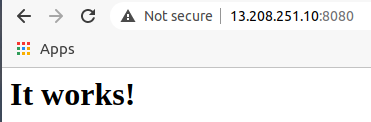
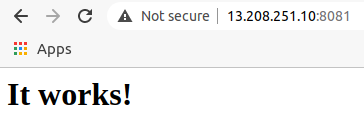
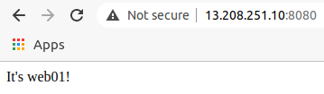
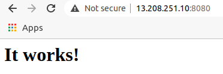
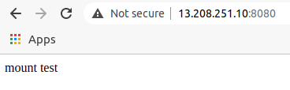

# 5. コンテナ内のファイルと永続化
- コンテナを破棄してもファイルを残すための方法，バックアップの方法
## 5.1 コンテナとファイルの独立性
- ここでは，2つのhttpdコンテナを扱う
    - コンテナは互いに独立した実行環境
    - いくつ起動してもそれらが互いに影響を受けることはない
### 5.1.1 2つのhttpdコンテナを起動する
- これまでのhttpdコンテナの実行コマンド
    ```
    docker run -dit -name my-apache-app -p 8080:80 -v "$PWD":/usr/local/apache2/htdocs/ httpd:2.4
    ```
    - ポート8080をポート80にマッピングする
    - Dockerホストのカレントディレクトリをコンテナの/usr/local/apache2/htdocs にマウントする
- 今回のhtppdコンテナの作り方
    - 名前: web01, web02
    - どちらも```-v```オプションは指定せず，```/usr/local/apache2/htdocs```のマウントはしない
        - 2つのコンテナは完全に互いに独立する
#### 2つのhttpdコンテナを起動する
1. 1つ目のhttpdコンテナを起動する
    ```
    ubuntu@ip-xxx-xxx-xxx-xxx:~$ docker run -dit --name web01 -p 8080:80 httpd:2.4
    ```
2. 2つ目のhttpdコンテナを起動する
    ```
    ubuntu@ip-xxx-xxx-xxx-xxx:~$ docker run -dit --name web02 -p 8081:80 httpd:2.4
    ```
3. コンテナの実行を確認する
    ```
    ubuntu@ip-xxx-xxx-xxx-xxx:~$ docker ps
    CONTAINER ID   IMAGE       COMMAND              CREATED              STATUS              PORTS                  NAMES
    657dde19f1f4   httpd:2.4   "httpd-foreground"   About a minute ago   Up About a minute   0.0.0.0:8081->80/tcp   web02
    036ab19cecf8   httpd:2.4   "httpd-foreground"   4 minutes ago        Up 4 minutes        0.0.0.0:8080->80/tcp   web01
    ```
4. ブラウザで接続する


- どちらにも接続でき，"It works!"と表示される．

### 5.1.2 コンテナの中にファイルをコピーする
- どちらもまだコンテンツファイルを置いていないので，区別が付かない
    - コンテンツを配置する．
- それぞれのコンテナは独立しており，コンテナ内の```/usr/local/apache2/htdocs```にindex.htmlを配置すれば目的を達せられる．
#### ファイルをコピーするdocker cpコマンド
- 1つは```docker exec```コマンドで```/bin/bash```を起動し，コンテナの内部に入る方法．エディタを起動して，```/usr/local/apache2/htdocs/index.html```を編集する．
    - httpdイメージはファイルサイズを小さくするため，エディタが含まれていない．
- DockerホストとDockerコンテナ間でファイルをコピーする```docker cp```コマンドを使う
    - コンテナが稼働中でも停止中でもファイルコピーできる
        ```
        docker cp [option] [path of copy source] [container name or container ID]:[path of copy destination]
        ```
        - ホストからコンテナの向きにコピーする場合
        ```
        docker cp [option] [container ID or container name]:[path of copy source] [path of copy destination]
        ```
        - コンテナからホストの向きにコピーする場合
- コンテナを対象にする場合，```[container name or container ID]:[path]```と表記する．
- ```docker cp```コマンド
    - パーミッションをそのままコピーする
    - ディレクトリも再帰的にコピーする

| オプション | 意味 |
| ---- | ---- |
| ```-a```, ```--archive``` | ユーザIDとグループIDを保ったままコピーする |
| ```-L```, ```--follow-link``` | コピー元のシンボリックリンクをたどる |
- これらのオプションを使うことはあまりない
- 注意点
    - ```docker cp```では，```/proc```, ```/sys```, ```/dev```, ```tmps```配下のようなシステムファイルはコピーできない．
    - こうしたファイルをコピーしたいときは，標準入出力経由でコピーする
    - 参考: http://docs.docker.jp/engine/reference/commandline/cp.html

#### docker cpコマンドでファイルをコピーする例
##### index.htmlをコピーする
1. ```/tmp```ディレクトリにindex.htmlファイルを作る
    - index.htmlをコンテナの```/tmp```ディレクトリに作る
    - ```/tmp```ディレクトリにカレントディレクトリを移動する
    - あとで現在のカレントディレクトリに戻れるよう，```push```コマンドを使ってディレクトリを移動する．
        - シェルにおいて，現在のカレントディレクトリの状態を保存した上で，別の場所にカレントディレクトリを移動する．
        - 保存したカレントディレクトリの位置まで戻るには，```popd```と入力する．
    ```
    pushd /tmp
    ```
2. index.htmlファイルを作る
    - カレントディレクトリを```/tmp```に移動している．
    - ここにindex.htmlを作る
        ```
        <html>
            <body>
                <div>It's web01!</div>
            </body>
        </html>
        ```
3. ファイルをコンテナにコピーする
- index.htmlファイルをコンテナweb01の```/usr/local/apache2/htdocs/```にコピーする．
    ```
    ubuntu@ip-xxx-xxx-xxx-xxx:/tmp$ docker cp /tmp/index.html web01:/usr/local/apache2/htdocs/
    ```
4. ブラウザでアクセスして確認する


5. コンテナの内部に入って確認する
    - ```docker exec```コマンドを使ってコンテナの内部に入る
        ```
        ubuntu@ip-xxx-xxx-xxx-xxx:/tmp$ docker exec -it web01 /bin/bash
        root@036ab19cecf8:/usr/local/apache2# 
        ```

6. index.htmlを確認する
    - ```/usr/local/apache2/htdocs```ディレクトリの内容を確認する
        ```
        root@036ab19cecf8:/usr/local/apache2# ls -al /usr/local/apache2/htdocs
        total 16
        drwxr-xr-x 1 root     root     4096 Apr  4 02:31 .
        drwxr-xr-x 1 www-data www-data 4096 Mar 31 04:18 ..
        -rw-rw-r-- 1     1000     1000   57 Apr  4 02:23 index.html
        ```
        - ファイルが存在することがわかる
        ```
        root@036ab19cecf8:/usr/local/apache2# cat /usr/local/apache2/htdocs/index.html 
        <html>
            <body>
                <div>It's web01!</div>
            </body>
        </html>
        ```
        - ```docker cp```でコピーした内容と合致することがわかる
        - 確認したら```exit```してコンテナから出る

7. コンテナweb02に対しても，同様に確認する
    - コンテナweb02に対しても同様に確認する．
    - ```/tmp/index02.html```として，コンテナweb02にindex.htmlという名前でコピーする．
        ```
        <html>
            <body>
                <div>It's web02!</div>
            </body>
        </html>
        ```
    - ブラウザで"It's web02!"と表示されることを確認する．

8. カレントディレクトリを戻しておく．
    ```
    popd
    ```

### 5.1.3 コンテナを破棄して作り直すとファイルが失われる
- コンテナを停止したり破棄したりすると，コピーしたファイルがどのようになるか確認する．
#### コンテナを作り直す
1. 現在の状態を確認する
    ```
    ubuntu@ip-172-31-39-72:~$ docker ps
    CONTAINER ID   IMAGE       COMMAND              CREATED             STATUS             PORTS                  NAMES
    657dde19f1f4   httpd:2.4   "httpd-foreground"   About an hour ago   Up About an hour   0.0.0.0:8081->80/tcp   web02
    036ab19cecf8   httpd:2.4   "httpd-foreground"   About an hour ago   Up About an hour   0.0.0.0:8080->80/tcp   web01
    ```
2. コンテナを停止する
    ```
    docker stop web01
    ```
    - ブラウザから接続しようとするとタイムアウトになる．
3. コンテナを再開する
    ```
    docker start web01
    ```
    - ブラウザで接続すると，"It's web01!"と表示される．
4. コンテナを破棄する
    ```
    docker stop web01
    docker rm web01
    ```
    - ```docker stop```で停止し，それから```docker rm```で削除する．
    ```
    ubuntu@ip-172-31-39-72:~$ docker ps -a
    CONTAINER ID   IMAGE       COMMAND              CREATED             STATUS             PORTS                  NAMES
    657dde19f1f4   httpd:2.4   "httpd-foreground"   About an hour ago   Up About an hour   0.0.0.0:8081->80/tcp   web02
    ```
    - ```docker ps -a```で確認．
    - ブラウザから接続しようとするとタイムアウトになる．
5. コンテナを作り直す
    ```
    ubuntu@ip-172-31-39-72:~$ docker run -dit --name web01 -p 8080:80 httpd:2.4
    ubuntu@ip-172-31-39-72:~$ docker ps
    CONTAINER ID   IMAGE       COMMAND              CREATED             STATUS             PORTS                  NAMES
    55996624faaf   httpd:2.4   "httpd-foreground"   6 seconds ago       Up 4 seconds       0.0.0.0:8080->80/tcp   web01
    657dde19f1f4   httpd:2.4   "httpd-foreground"   About an hour ago   Up About an hour   0.0.0.0:8081->80/tcp   web02
    ```
    - ブラウザから接続すると，"It works!"と表示される．
    
6. index.htmlファイルがなくなっていることを確認する
    - このコンテナの中に入って，```/usr/local/apache2/htdocs```を確認する．
    ```
    ubuntu@ip-xxx-xxx-xxx-xxx:~$ docker exec -it web01 /bin/bash
    root@55996624faaf:/usr/local/apache2# ls -al /usr/local/apache2/htdocs/
    total 16
    drwxr-xr-x 2 root     root     4096 Mar 31 04:18 .
    drwxr-xr-x 1 www-data www-data 4096 Mar 31 04:18 ..
    -rw-r--r-- 1 root     src        45 Jun 11  2007 index.html
    root@55996624faaf:/usr/local/apache2# cat /usr/local/apache2/htdocs/index.html 
    <html><body><h1>It works!</h1></body></html>
    ```
    - 既定のファイルであり，先ほど置いたファイルではない．
#### コンテナを起動し直すとファイルが失われる
- コンテナがそれぞれ独立しており，コンテナを破棄すると，その内容が失われる．
- 最初に作ったweb01と破棄してから作り直したweb01は別物
    - コンテナIDは違う
    - コンテナを破棄する操作は注意深く操作する必要がある．
## 5.2 データを独立させる
- ```docker rm```してコンテナを破棄すると，そのコンテナの中にあるデータは失われる．
- コンテナは，失ってはならないデータは，外に出すように設計する．
### 5.2.1 マウントすれば失われない
- コンテナでは，「実行するシステム」と「扱うデータ」は別に管理することが推奨される．
- ```-v```オプションを使ったときのようにマウントすれば，コンテナがなくなっても失われることはない．
    - データをコンテナの外に出す
- ```/home/ubuntu```ディレクトリに```web01data```というディレクトリを作って実験する．
#### ボリュームのマウントを試す
1. web01コンテナを破棄する
    ```
    docker stop web01
    docker rm web01
    ```
2. マウントするディレクトリを作る
    ```
    mkdir web01data
    ```
3. 仮のindex.htmlファイルを作る
    ```
    <html>
        <body>
            <div>mount test</div>
        </body>
    </html>
    ```
4. 3のディレクトリをマウントしてweb01コンテナを起動する
    ```
    ubuntu@ip-xxx-xxx-xxx-xxx:~/web01data$ docker run -dit --name web01 -v /home/ubuntu/web01data:/usr/local/apache2/htdocs -p 8080:80 httpd:2.4
    ```
    - 起動したら```docker ps```でコンテナIDを確認しておく
        ```
        ubuntu@ip-172-31-39-72:~/web01data$ docker ps
        CONTAINER ID   IMAGE       COMMAND              CREATED              STATUS              PORTS                  NAMES
        0cf98b1725f0   httpd:2.4   "httpd-foreground"   About a minute ago   Up About a minute   0.0.0.0:8080->80/tcp   web01
        657dde19f1f4   httpd:2.4   "httpd-foreground"   2 hours ago          Up 2 hours          0.0.0.0:8081->80/tcp   web02
        ```
5. ブラウザで確認する

6. 破棄して作り直す
    ```
    docker stop web01
    docker rm web01
    docker run -dit --name web01 -v /home/ubuntu/web01data/:/usr/local/apache2/htdocs -p 8080:80 httpd:2.4
    ```
    - このときブラウザで確認すると，同じようにコンテンツが表示される．
        - index.htmlは失われない

### 5.2.2 データを分ければコンテナのアップデートがしやすくなる
- 破棄したコンテナと新しく作ったコンテナは別のコンテナだが，どちらもDockerホストの```/home/ubuntu/web01data```ディレクトリをマウントしている
- ```/home/ubuntu/web01data```ディレクトリはDockerホスト側にあるので，コンテナが破棄されても失われることはない
    - コンテナが違っても同じデータが見える
- コンテナ側からマウントしたファイルを書き換えることもできる
    - 書き換えると，書き換えたデータはそのまま残る
- データをDockerホスト側に持ち，それをマウントするようにすれば，失われることがない
    - コンテナのアップデートや差し替えが容易になる
### 5.2.3 コンテナ間のデータ共有にも利用できる
- マウントは，コンテナ間のデータ共有に利用できる
- 1つの場所を2つ以上のコンテナで同時にマウントすることもできる
    - マウントした場所を通じて，コンテナ間でファイル共有できる
### 5.2.4 設定ファイルの受け渡しや作業フォルダを受け渡す
- コンテナ内の設定ファイルを書き換えるために，あるフォルダもしくは設定ファイルの1つだけをマウントするという使い方もできる．
    - これまで使ってきているhttpdコンテナは，```/usr/local/apache2/conf```ディレクトリにApacheに設定ファイルが入っており，設定を変更したいときはこのファイルを書き換える必要がある．
        - 必要なファイルを```docker cp```でコピーする方法
        - ```docker exec``` (```docker run```) でシェルを起動し，コンテナ内に入り込んで設定ファイルを変更する方法
- コピーする方法
    - 手順
        - 一度```docker create```しておく
        - ```docker cp```などでファイルを書き換える
        - それから```docker start```で起動する
- マウントする方法
    - 手順
        - Dockerホスト上の適当なディレクトリにコンテナ内の```/usr/local/apache2/conf```と同じ内容のものを容易
        - そのファイルを書き換えておき，```docker run```するときに，そのディレクトリを```/usr/local/apache2/conf```ディレクトリにマウントする
    - Dockerホストに設定ファイルが残るので，設定のバックアップが容易．
        - コンテナを破棄しても設定がDockerホストに残るので，設定そのままでコンテナの差し替えも実施できる

## 5.3 バインドマウントとボリュームマウント