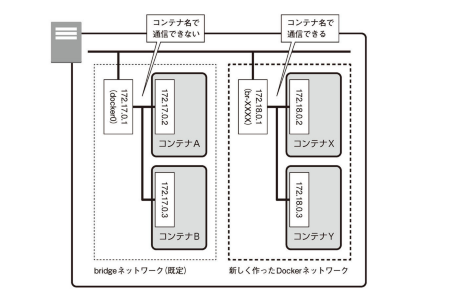
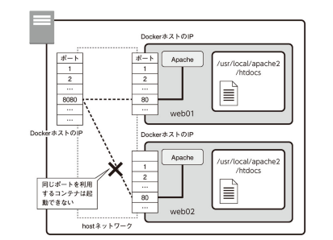

# 6. コンテナのネットワーク
- コンテナ間の通信
## 6.1 3つのネットワーク
- Dockerでは，仮想的なネットワークを作り，Dockerホストとコンテナ，もしくはコンテナ間で通信できるように構成できる．
    - ```docker network ls```コマンドで確認できる．
        ```
        ubuntu@ip-172-31-39-72:~$ docker network ls
        NETWORK ID     NAME      DRIVER    SCOPE
        0470037995b8   bridge    bridge    local
        eea371a81d9a   host      host      local
        ecb1fa9b5b68   none      null      local
        ```
        - よく使われるのがbridgeネットワーク
## 6.2 bridgeネットワーク
- 既定のネットワーク
- ```docker run```するときにネットワークのオプションを指定しない場合，これが使われる．
- bridgeネットワークにおいては，それぞれのコンテナのネットワークは独立している．```-p```オプションで，どのコンテナと通信するのかを決める
- 例
    - 2つのhttpdコンテナを利用する場合
        ```
        docker run -dit --name web01 -p 8080:80 httpd:2.4
        docker run -dit --name web02 -p 8081:80 httpd:2.4
        ```
        - 片方をポート8080，もう片方をポート8081に割り当てた
### 6.2.1 コンテナに割り当てられるIPアドレスを確認する
- DockerホストやDockerコンテナは，1つの仮想的なbridgeネットワークで接続される
    - DockerホストやDockerコンテナにはIPアドレスが割り当てられる．
#### 2つのコンテナを起動する
1. 1つ目のコンテナを起動する
    ```
    docker run -dit --name web01 -p 8080:80 httpd:2.4
    ```
2. 2つ目のコンテナを起動する
    ```
    docker run -dit --name web02 -p 8081:80 httpd:2.4
    ```
#### コンテナのIPアドレスを確認する
- 方法
    1. コンテナ内で```ip```コマンドや```ifconfig```コマンドなどを実行して確認する
        - ```docker exec```を使ってコンテナ内でIPアドレスを調べるコマンドを実行する方法
        - httpdコンテナには```ip```コマンドも```ifconfig```コマンドも入っていない
    2. ```docker container inspect```コマンドを使う方法
        - コンテナに対する詳細な情報を調べるコマンド
        - NetworkSettings の部分にIPアドレスが記載されている
            ```
            ubuntu@ip-xxx-xxx-xxx-xxx:~$ docker container inspect --format="{{.NetworkSettings.IPAddress}}" web01
            172.17.0.2
            ```
            - ```--format```オプションで指定する
                - Go言語のtemplateパッケージの書式で指定する
#### DockerホストのIPアドレス
- Docker EngineをインストールしたLinux環境には，docker0というネットワークインターフェースが作られる
    - このインターフェイスを通じてbridgeネットワークに接続している
        ```
        ubuntu@ip-172-31-39-72:~$ ifconfig
        docker0: flags=4163<UP,BROADCAST,RUNNING,MULTICAST>  mtu 1500
                inet 172.17.0.1  netmask 255.255.0.0  broadcast 172.17.255.255
                inet6 fe80::42:d1ff:fefc:c0ab  prefixlen 64  scopeid 0x20<link>
                ether 02:42:d1:fc:c0:ab  txqueuelen 0  (Ethernet)
                RX packets 3  bytes 100 (100.0 B)
                RX errors 0  dropped 0  overruns 0  frame 0
                TX packets 10  bytes 772 (772.0 B)
                TX errors 0  dropped 0 overruns 0  carrier 0  collisions 0
        ```
### 6.2.2 bridgeネットワークの招待
- IPマスカレードを使って構成
    - IPアドレスを変換することで，1つのIpアドレスで通信できるようにする技術
- ```-p```オプションは，IPマスカレードのポート転送設定をしている
### 6.2.3 Dockerホスト同士の通信
- コンテナはIPアドレスを持ち，bridgeネットワークに接続されている
    - コンテナ同士はネットワークを通じて互いに自由に通信できる
    - ```-p```オプションが設定されていなくても可能
        - Dockerホスト側で受信したデータをそれぞれのDockerコンテナの特定のポートに転送する設定
        - Dockerコンテナ間の通信では，Dockerホストを経由せず直接やり取りする

#### コンテナ同士の疎通を確認する
1. 第3のコンテナを作る
    - ubuntuのイメージから，疎通確認用の第3のコンテナを作ってシェルを起動する
        - ```curl```コマンドを使うから
        ```
        ubuntu@ip-172-31-39-72:~$ docker run --rm -it ubuntu /bin/bash
        Unable to find image 'ubuntu:latest' locally
        latest: Pulling from library/ubuntu
        a70d879fa598: Pull complete 
        c4394a92d1f8: Pull complete 
        10e6159c56c0: Pull complete 
        Digest: sha256:3c9c713e0979e9bd6061ed52ac1e9e1f246c9495aa063619d9d695fb8039aa1f
        Status: Downloaded newer image for ubuntu:latest
        root@0de66f1a5531:/# 
        ```
2. 実験に必要なソフトをインストールする
    - ```ip```，```ping```，```curl```を使う
        ```
        root@0de66f1a5531:/# apt update
        root@0de66f1a5531:/# apt -y upgrade
        root@0de66f1a5531:/# apt install -y iproute2 iputils-ping curl
        ```
3. 自身のIPアドレスを確認する
    ```
    root@0de66f1a5531:/# ip addr
    1: lo: <LOOPBACK,UP,LOWER_UP> mtu 65536 qdisc noqueue state UNKNOWN group default qlen 1000
        link/loopback 00:00:00:00:00:00 brd 00:00:00:00:00:00
        inet 127.0.0.1/8 scope host lo
        valid_lft forever preferred_lft forever
    8: eth0@if9: <BROADCAST,MULTICAST,UP,LOWER_UP> mtu 1500 qdisc noqueue state UP group default 
        link/ether 02:42:ac:11:00:04 brd ff:ff:ff:ff:ff:ff link-netnsid 0
        inet 172.17.0.4/16 brd 172.17.255.255 scope global eth0
        valid_lft forever preferred_lft forever
    ```
4. ```ping```で疎通確認する
    - web01 (172.17.0.2) に対して
        ```
        root@0de66f1a5531:/# ping -c 4 172.17.0.2
        PING 172.17.0.2 (172.17.0.2) 56(84) bytes of data.
        64 bytes from 172.17.0.2: icmp_seq=1 ttl=64 time=0.092 ms
        64 bytes from 172.17.0.2: icmp_seq=2 ttl=64 time=0.057 ms
        64 bytes from 172.17.0.2: icmp_seq=3 ttl=64 time=0.056 ms
        64 bytes from 172.17.0.2: icmp_seq=4 ttl=64 time=0.054 ms

        --- 172.17.0.2 ping statistics ---
        4 packets transmitted, 4 received, 0% packet loss, time 3068ms
        rtt min/avg/max/mdev = 0.054/0.064/0.092/0.015 ms
        ```
    - web02 (172.17.0.3) に対して
        ```
        root@0de66f1a5531:/# ping -c 4 172.17.0.3
        PING 172.17.0.3 (172.17.0.3) 56(84) bytes of data.
        64 bytes from 172.17.0.3: icmp_seq=1 ttl=64 time=0.076 ms
        64 bytes from 172.17.0.3: icmp_seq=2 ttl=64 time=0.061 ms
        64 bytes from 172.17.0.3: icmp_seq=3 ttl=64 time=0.054 ms
        64 bytes from 172.17.0.3: icmp_seq=4 ttl=64 time=0.067 ms

        --- 172.17.0.3 ping statistics ---
        4 packets transmitted, 4 received, 0% packet loss, time 3063ms
        rtt min/avg/max/mdev = 0.054/0.064/0.076/0.008 ms
        ```
5. コンテンツを取得する
    - web01 (172.17.0.2) に対して
        ```
        root@0de66f1a5531:/# curl http://172.17.0.2/
        <html><body><h1>It works!</h1></body></html>
        ```
    - web02 (172.17.0.3) に対して
        ```
        root@0de66f1a5531:/# curl http://172.17.0.3/
        <html><body><h1>It works!</h1></body></html>
        ```
6. IPアドレス以外では接続できないことを確認する
    ```
    root@0de66f1a5531:/# ping -c 4 web01     
    ping: web01: Name or service not known
    ```
7. 後始末
    - ```exit```で終了

## 6.3 ネットワークを新規に作成して通信を分ける
- それぞれのコンテナは割り当てられたIPアドレスを介して互いに通信できる
- IPアドレスの代わりにコンテナ名を使って通信することはできない
    - コンテナに対してどのようなIPアドレスが割り当てられるかはコンテナを起動するまでわからない
    - コンテナを破棄して作り直せばIPアドレスが変わる恐れがある
- IPアドレスではなくてコンテナ名で通信相手を特定できるほうが望ましい
    - Dockerネットワークを新規に作成する方法
    - ```--link```オプションを指定する方法 (非推奨)
### 6.3.1 Dockerネットワーク
- Dockerでは任意のネットワークを作ることができる
    - ネットワークを作ることで，別々のネットワークに接続することもできる
    - ネットワークを作ると，その数だけDockerホスト上にはbr-XXXXXX (XXXXXX: DockerのネットワークIDの先頭) という名前のネットワークインタフェースが作られる



- 新たにDockerネットワークを作ってそこにコンテナを参加させる場合は，```--name```で指定したコンテナ名で互いに通信できる

### 6.3.2 Dockerネットワークを作る
- Dockerネットワークは，```docker network create```コマンドを使って作る
    ```
    docker network create [network name]
    ```
    - IPアドレス範囲を明示的に指定したいときは```--subnet```や```--iprange```などのオプションを指定することもできる (必須ではない)．
        - 省略したときは，既存のネットワークと重複しない適当なIPアドレス範囲が使われる．

#### Dockerネットワークを作成する
1. Dockerネットワークを作成する
    ```
    docker network create mydockernet
    ```
2. 作成されたネットワークを確認する
    ```
    ubuntu@ip-xxx-xxx-xxx-xxx:~$ docker network ls
    NETWORK ID     NAME          DRIVER    SCOPE
    470a2dc530d0   bridge        bridge    local
    eea371a81d9a   host          host      local
    8eefa9b57e17   mydockernet   bridge    local
    ecb1fa9b5b68   none          null      local
    ```
3. IPアドレスの設定を確認しておく
    ```
    ubuntu@ip-xxx-xxx-xxx-xxx:~$ docker network inspect mydockernet
    [
        {
            "Name": "mydockernet",
            "Id": "8eefa9b57e1704d08020ae06e6fac97555d4513fa271f97edeb0e388fddaf462",
            "Created": "2021-04-17T05:58:30.946953053Z",
            "Scope": "local",
            "Driver": "bridge",
            "EnableIPv6": false,
            "IPAM": {
                "Driver": "default",
                "Options": {},
                "Config": [
                    {
                        "Subnet": "172.18.0.0/16",
                        "Gateway": "172.18.0.1"
                    }
                ]
            },
            "Internal": false,
            "Attachable": false,
            "Ingress": false,
            "ConfigFrom": {
                "Network": ""
            },
            "ConfigOnly": false,
            "Containers": {},
            "Options": {},
            "Labels": {}
        }
    ]
    ```

### 6.3.3 Dockerネットワークにコンテナを作る
- 可動しているweb01コンテナ，web02コンテナを一旦破棄し，今作成したmydockernetに接続するようにして新たに作り直す．
- ネットワークに参加させるには，```docker run```するときに，```--net```オプションを指定する．

#### 接続先のネットワークを指定してコンテナを起動する
1. 現在のコンテナを停止・破棄する
    ```
    docker stop web01 web02
    docker rm web01 web02
    ```
2. mydockernetに接続してコンテナを作成
    ```
    docker run -dit --name web01 -p 8080:80 --net mydockernet httpd:2.4
    docker run -dit --name web02 -p 8081:80 --net mydockernet httpd:2.4
    ```
3. ネットワーク接続を確認する
    ```
    ubuntu@ip-xxx-xxx-xxx-xxx:~$ docker network inspect mydockernet
    [
        {
            "Name": "mydockernet",
            "Id": "8eefa9b57e1704d08020ae06e6fac97555d4513fa271f97edeb0e388fddaf462",
            "Created": "2021-04-17T05:58:30.946953053Z",
            "Scope": "local",
            "Driver": "bridge",
            "EnableIPv6": false,
            "IPAM": {
                "Driver": "default",
                "Options": {},
                "Config": [
                    {
                        "Subnet": "172.18.0.0/16",
                        "Gateway": "172.18.0.1"
                    }
                ]
            },
            "Internal": false,
            "Attachable": false,
            "Ingress": false,
            "ConfigFrom": {
                "Network": ""
            },
            "ConfigOnly": false,
            "Containers": {
                "114c87c0a8fdb7fcc25d33e9398b2d1eb54204fc2f0796945ca5ad258635fdff": {
                    "Name": "web01",
                    "EndpointID": "c25ef6ebd64de0eac2aa80b2bb4ae2436c68764d5cce57faa1326046a1704500",
                    "MacAddress": "02:42:ac:12:00:02",
                    "IPv4Address": "172.18.0.2/16",
                    "IPv6Address": ""
                },
                "21755ec6f7220dcbdb2f953afaab9a6a762fc3f376aece04267b83ee3a1799a7": {
                    "Name": "web02",
                    "EndpointID": "d1009d823369c18571abe85c9a29bc7620390d8711a863c63cf60a1791225499",
                    "MacAddress": "02:42:ac:12:00:03",
                    "IPv4Address": "172.18.0.3/16",
                    "IPv6Address": ""
                }
            },
            "Options": {},
            "Labels": {}
        }
    ]
    ```

### 6.3.4 名前を使った通信ができることを確認する
#### 名前を使った通信ができることを確認する
1. 第3のコンテナを作る
    - ```--net mydockernet```を付けて，mydockernetに接続する
        ```
        ubuntu@ip-xxx-xxx-xxx-xxx:~$ docker run --rm -it --net mydockernet ubuntu /bin/bash
        root@fb973493aa8b:/# 
        ```
2. 必要なソフトのインストール
    ```
    root@fb973493aa8b:/# apt update
    root@fb973493aa8b:/# apt -y upgrade
    root@fb973493aa8b:/# apt -y install iproute2 iputils-ping curl
    ```
3. 名前で疎通確認する
    ```
    root@fb973493aa8b:/# ping -c 4 web01
    PING web01 (172.18.0.2) 56(84) bytes of data.
    64 bytes from web01.mydockernet (172.18.0.2): icmp_seq=1 ttl=64 time=0.090 ms
    64 bytes from web01.mydockernet (172.18.0.2): icmp_seq=2 ttl=64 time=0.065 ms
    64 bytes from web01.mydockernet (172.18.0.2): icmp_seq=3 ttl=64 time=0.061 ms
    64 bytes from web01.mydockernet (172.18.0.2): icmp_seq=4 ttl=64 time=0.070 ms

    --- web01 ping statistics ---
    4 packets transmitted, 4 received, 0% packet loss, time 3080ms
    rtt min/avg/max/mdev = 0.061/0.071/0.090/0.011 ms
    ```
4. コンテンツが取得できることを確認する
    ```
    root@fb973493aa8b:/# curl http://web01/
    <html><body><h1>It works!</h1></body></html>
    ```
5. DNSサーバの確認
    ```
    root@fb973493aa8b:/# cat /etc/resolv.conf
    search ap-northeast-3.compute.internal
    nameserver 127.0.0.11
    options edns0 ndots:0
    ```
6. 終了
    - ```exit```コマンド

### 6.3.5 Dockerネットワークの削除
- 利用中のコンテナが存在するときは，ネットワークを削除できない
    - コンテナを破棄せずにネットワークを削除することもできる
        - ```docker network disconnect```コマンド
#### Dockerネットワークの削除
1. ネットワークを利用しているコンテナを停止・破棄する
    ```
    docker stop web01 web02
    docker rm web01 web02
    ```
2. ネットワークを削除する
    ```
    docker network rm mydockernet
    ```
3. 削除されたことを確認する
    ```
    ubuntu@ip-172-31-39-72:~$ docker network ls
    NETWORK ID     NAME      DRIVER    SCOPE
    470a2dc530d0   bridge    bridge    local
    eea371a81d9a   host      host      local
    ecb1fa9b5b68   none      null      local
    ```

## 6.4 hostネットワークとnoneネットワーク
### 6.4.1 hostネットワーク
- hostネットワーク
    - IPマスカレードを使わずにコンテナがホストのIPアドレスを共有する
    - ```-p```オプションを指定することはできず，すべてのポートがDockerコンテナに流れる．
    - hostネットワークを指定するには，```docker run```の後に```--net host```を指定する．
        - もしくは，あとから```docker network connect```でhostネットワークを指定する
    - Dockerコンテナは個別のIPアドレスを持たない
        - 同じポート番号を使う複数のコンテナを利用することはできない．
        - 全通信ポートを転送する高々1個もしくは数個のDockerコンテナを起動するときに使われる



### 6.4.2 noneネットワーク
- noneネットワーク
    - コンテナをネットワークに接続しない設定
    - ```docker run```の際に```--net none```を指定する．
        - もしくは```docker network disconnect```でネットワークから切断
    - セキュリティを高めたいなどの理由で，ネットワーク通信からコンテナを完全に隔離したいとき

## 6.5 まとめ
1. Dockerホスト同士はIPアドレスで通信できる
2. 名前で通信したいときはDockerネットワークを作る
3. コンテナ間の通信では```-p```オプションは関係ない
4. hostネットワークとnoneネットワーク