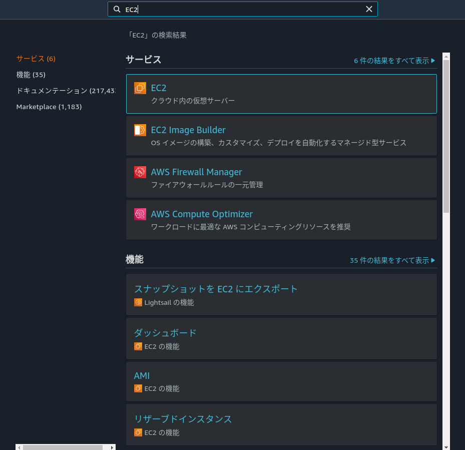
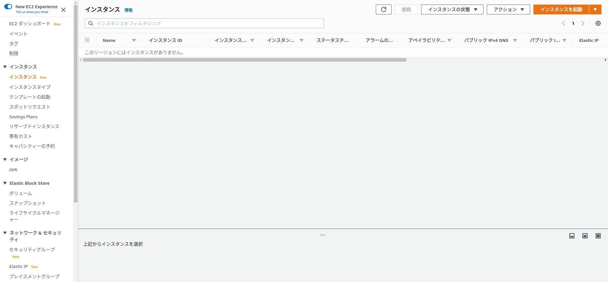
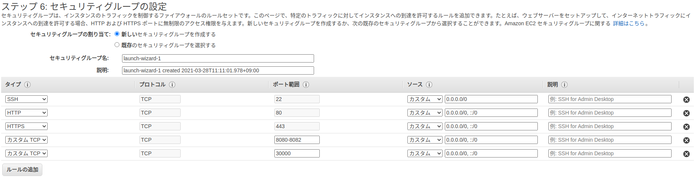

# 2. Dockerを利用できるサーバーを作る
- AWS上にDockerを利用できる環境を整備して，実際に手を動かしながら，Dockerの使い方を習得する．
## 2.1 Dockerを使うための構成
- Dockerを利用するためには，Linuxをインストールしたコンピュータを用意し，そこにDocker Engineをインストールする
### 2.1.1 DockerをサポートするLinux
| ディストリビューション | バージョン |
| ---- | ---- |
| CentOS | CentOS 7 以降 |
| Debian | Debian 9 (stretch) 以降 |
| Fedora | Fedora 30 以降 |
| Ubuntu | Ubuntu 16.04 以降 |
#### Dockerの無償版と有償版
- Docker Engine には，無償版のCommunity Edition (Docker CE) と，有償版のEnterprise Edition (Docker EE) の2種類がある．
- Docker CE
    - さまざまなLinuxにインストールして利用できる無償版
- Docker EE
    - 認証済みのインフラやプラグインの提供，セキュリティ検査機能などを提供する商用版
    - 有償のクラウドサービスやOracle Linux，Red Hat Enterprise Linux，Windows Serverなどの有償のLinuxにおいても提供
        - Windows ServerではHyper-V機能を使ってLinuxのサブセットを動かし，その上で実行
### 2.1.2 ディストリビューション付属のパッケージとDocker提供のパッケージ
- Docker Engineはディストリビューションに含まれている
    - yumコマンドやaptコマンドでインストール可能
- Docker社もDocker Engineのパッケージを提供している
- ディストリビューション付属のものを利用する場合
    - メリット
        - yumコマンドやaptコマンドなどで簡単にインストールできる
        - アップデートも容易
    - デメリット
        - ディストリビューションによって，インストールされているDockerのバージョンがまちまちであること
- Docker提供のパッケージを利用する場合
    - メリット
        - 常に最新版を利用できること
    - デメリット
        - ディストリビューションの一部ではないので，アップデートは自分で追わなければならない
- 本番運用では，ディストリビューション付属のものを利用するのが好ましい
    - 保証やセキュリティアップデートなどの運用上の問題
## 2.2 AWS上でEC2を使ったDocker環境を用意する
### 2.2.1 Amazon EC2にLinux環境を用意する
- AWS上には，Amazon EC2 (Amazon Elastic Compute Cloud) という仮想サーバサービスがある．
- AWSでは，EC2を使った仮想サーバのことをEC2インスタンスと呼ぶ
### 2.2.2 EC2をSSHで操作する
- EC2インスタンスを操作するには，SSHを使って通信する
### 2.2.3 EC2とファイアウォール
- EC2には望ましくない通信を遮断するファイアウォール機能がある
    - セキュリティグループという．
- デフォルトではすべての入力方向の通信 (インバウンド，インターネット → EC2の方向) が通らないように構成されている
    - SSHで操作するには，SSHの通信ポートである「ポート22」の許可設定が必要．
- 追加で，必要な通信を許可する設定をする．
    - Webサーバ(http: 80，https: 443)
- 今回は，以下のように通信を許可するポートを設定する

| ポート番号 | 用途 |
| ---- | ---- |
| 22 | SSH．リモートから操作するのに使う |
| 80 | Webの通信用ポート (http://)．今回は，Docker上でWebサーバを動かす例を扱うので，その確認用． |
| 443 | Webの通信用ポート (https://) |
| 30000 | Kubernetes実験用 |
### 2.2.4 Dockerが使えるEC2インスタンスを作るまでの流れ
1. EC2インスタンスの準備
    - UbuntuがインストールされたEC2インスタンスを用意する．
    - ファイアウォールも合わせて設定する．
2. EC2インスタンスへのSSH接続
3. Docker Engineのインストール
## 2.3 EC2インスタンスを起動する
#### [手順] UbuntuをインストールしたEC2インスタンスを起動する
1. EC2コンソールを起動する
    - EC2と検索して選択
    
2. インスタンスを起動する
    - インスタンスメニューから「インスタンス」を選択．右上の「インスタンスを起動」をクリック．
    
3. UbuntuのAMIを選択する
    - ここでは，Ubuntu Server 18.04 LTS を使う
4. インスタンスタイプの選択
    - 無料利用枠のt2.microを選択する
    - 次のステップの「インスタンスの詳細の設定」は特に変えなくても今回は問題ない
5. ストレージの追加
    - 既定では8GBのストレージが追加されるが，少ないので20GBに変更する．
    - タグの追加は特に変えなくても今回は問題ない．
6. セキュリティグループの編集
    - デフォルトでは，SSHが通るように構成されている
    - ルールの追加から，2.2.3の表のポートを開けるように設定する．
    
7. 起動のためのキーペアの作成
    - 今回は「新しいキーペアを作成」を選択し，キーペアをダウンロードする．
        - ダウンロードしたファイルをなくしてしまうと，このEC2インスタンスにアクセスできなくなる．一度作成されたファイルは再度ダウンロードできない．
        - ダウンロードしたキーペアは第三者に漏洩しない
            - キーペアファイルを持っていれば，このEC2インスタンスにログインし，すべての操作ができてしまう．
        - すでにEC2インスタンスを使うのが2台目以降のときは，「既存のキーペアを選択」を選ぶと，すでに持っているキーペアファイルを使うことができる．
    - キーペアファイルのダウンロードが完了したら，「インスタンスの作成」を選択．
8. インスタンスの起動
    - インスタンスの起動には数分かかる．
    - 「インスタンスの表示」をクリックし，インスタンスの一覧画面に移動する．
## 2.4 EC2インスタンスにSSH接続する
1. 鍵ファイルのパーミッションを変更する
    ```
    chmod 400 [pem file].pem
    ```
2. 接続する
    - 以下のコマンドを実行
        ```
        ssh -i [pem file path] ubuntu@[IPv4 address]
        ```

- config fileに書いたら楽．ただ，停止するとIPアドレスが変わるので，その都度HostNameを書き換える必要がある．
#### 課金を抑えるには
- AWSのEC2インスタンスは，起動している間課金される
    - 課金を抑えるには，利用している間停止すると良い
- 再開したとき，IPv4パブリックIPが変わるので，再度SSH接続する際は，値を再確認する．

## 2.5 Docker Engineをインストールする
- 2.4の操作でクラウド上にUbuntuのサーバができ，操作できるようになった．
- このサーバ上にDocker Engineをインストールする．
### 2.5.1 Docker Engine インストールの手順
- ここでは，Docker公式から提供されている最新版を用いる．
    - Docker Engine のインストール概要: https://docs.docker.com/get-docker/
#### [手順] Ubuntu環境にDocker Engineをインストールする
- シェルを"install_docker_AWS.sh"を作った．
- シェルスクリプトを実行
    ```
    chmod 755 install_docker_AWS.sh
    ./install_docker_AWS.sh
    ```
- ログオフ
    ```
    exit
    ```
### 2.5.3 Dockerの確認
```
ubuntu@ip-xxx-xxx-xxx-xxx:~$ docker --version
Docker version 20.10.5, build 55c4c88
```

ここまででEC2上にDockerをインストールするのは完了．

## 補足
- ノートPC (Ubuntu 18.04) にDocker Engine をインストールした．
    - 参考: https://www.kkaneko.jp/tools/docker/ubuntu_docker.html
- install_docker.shに処理を記載
