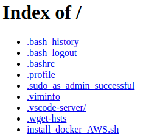

# 3. 5分でWebサーバを起動する
- Apacheがインストールされたコンテナを実行し，Webサーバを動かす．
## 3.1 DockerでWebサーバを作る
- ここでは，WebサーバソフトであるApacheがインストールされたコンテナを実行する．
    - コンテナを実行するのは，2. で作成したEC2インスタンス
- コンテナを起動することで，EC2インスタンスがWebサーバとして機能するようになる．
    - コンテナを破棄してしまえば，Webサーバは完全になくなる

### 3.1.1 Docker操作の基本的な流れ
1. イメージを探す
    - Docker Hubから，目的のコンテナの元となるイメージを探す
2. 起動する
    - dockerコマンドを入力して起動する．これでWebサーバが起動する．
3. コンテンツを作る
    - Webサーバで見せたいコンテンツとしてindex.htmlを作る．
4. コンテナの停止と再開
    - コンテナはいつでも停止することができ，また，再開できる．
5. ログの確認
    - 運用する上では，ログを確認することも必要．
6. コンテナを破棄する
    - 実験が終わったらコンテナを破棄する．
7. イメージを破棄する
    - ディスクを消費するので，最後に，ダウンロードしたイメージを削除する．

### 3.2 Dockerイメージを探す
- Dockerイメージの大多数は，Docker社が運用しているDockerレジストリであるDocker Hubにある．
    - https://hub.docker.com/
- Official Images
    - Docker公式が作ったイメージ
### 3.3 Dockerコンテナを起動する
- Dockerを操作するにはdockerコマンドを使う
    ```
    docker [command] [operation] [option]
    ```
#### 3.3.1 docker runで起動する
- Apacheで検索して出てきた"httpd"のドキュメントに以下のような記述がある．
    > If you don't want to include a Dockerfile in your project, it is sufficient to do the following:
        ```
        $ docker run -dit --name my-apache-app -p 8080:80 -v "$PWD":/usr/local/apache2/htdocs/ httpd:2.4
        ```
- 実際に実行する
    ```
    ubuntu@ip-xxx-xxx-xxx-xxx:~$ docker run -dit --name my-apache-app -p 8080:80 -v "$PWD":/usr/local/apache2/htdocs/ httpd:2.4
    Unable to find image 'httpd:2.4' locally
    2.4: Pulling from library/httpd
    ac2522cc7269: Pull complete 
    ea331039465c: Pull complete 
    fa84f6b23622: Pull complete 
    375e8fe6c4f6: Pull complete 
    bba002695c79: Pull complete 
    Digest: sha256:3769da9c8d8207503611bf86b60daf3754d84dcad2e32d333935c6c7777fd6bc
    Status: Downloaded newer image for httpd:2.4
    eacbbe229456431dbf8c7cd5a8347c6f5cb92bb0d3c285b47714ee5c17f09576
    ```

#### 3.3.2 実行状態の確認
- 実行されているかどうかは，```docker ps``` コマンドで確認できる．
    - 実行中のコンテナの一覧が表示される
        ```
        ubuntu@ip-xxx-xxx-xxx-xxx:~$ docker ps
        CONTAINER ID   IMAGE       COMMAND              CREATED         STATUS         PORTS                  NAMES
        eacbbe229456   httpd:2.4   "httpd-foreground"   2 minutes ago   Up 2 minutes   0.0.0.0:8080->80/tcp   my-apache-app
        ```

#### 3.3.3 ブラウザで確認する
- ブラウザで以下を参照
    - http://[IP address]:8080/
- このとき，ApacheのWebページが表示されるはず．Webページでは，docker runを実行したときのディレクトリの内容が表示されるはず．

- 本番ではカレントディレクトリの公開はご法度
    - カレントディレクトリの内容がインターネットに漏洩してしまう
    - 正しく使うには，Webで公開する専用ディレクトリを作り，そこをWebサーバが公開するように構成すべき (マウント機能を使う)．

### 3.4 index.htmlを作る
- 以下のindex.htmlを追加
    ```
    <html>
        <body>
            <div>Hello Container</div>
        </body>
    </html>
    ```
- ブラウザでindex.htmlの内容が表示されるはず．

### 3.5 コンテナの停止と再開
#### 3.5.1 コンテナの停止
- 停止するには，```docker stop``` コマンドを使う
    - 引数: コンテナ名 / コンテナID
        1. コンテナ名
            - ```docker run``` するときに```--name```で指定した値 (今回はmy-apache-app)
        2. コンテナID
            - コンテナを識別するID
            - ```docker ps``` で調べられる
            - コンテナIDは長く，全部記述するのは煩雑なので，ほかと重複しない先頭何文字かを入力すればよいことになっている．
    ```
    docker stop my-apache-app
    ```
    - 停止するとブラウザからアクセスできなくなる
- ```docker ps -a```で状態を確認すると，Exitedで終了している．
    ```
    ubuntu@ip-xxx-xxx-xxx-xxx:~$ docker ps -a
    CONTAINER ID   IMAGE       COMMAND              CREATED          STATUS                          PORTS     NAMES
    eacbbe229456   httpd:2.4   "httpd-foreground"   18 minutes ago   Exited (0) About a minute ago             my-apache-app
    ```
#### 3.5.2 コンテナの再開
- 止まっているコンテナを再度実行するには，```docker start```コマンドを実行する．
    ```
    ubuntu@ip-xxx-xxx-xxx-xxx:~$ docker start my-apache-app 
    my-apache-app
    ```
### 3.6 ログの確認
- ログを確認するには，```docker logs```コマンドを使う．
    ```
    ubuntu@ip-xxx-xxx-xxx-xxx:~$ docker logs my-apache-app 
    AH00558: httpd: Could not reliably determine the server's fully qualified domain name, using 172.17.0.2. Set the 'ServerName' directive globally to suppress this message
    AH00558: httpd: Could not reliably determine the server's fully qualified domain name, using 172.17.0.2. Set the 'ServerName' directive globally to suppress this message
    ...
    ```
### 3.7 コンテナの破棄
- ```docker stop```してもコンテナは残り続けている
    - もう使わないコンテナは停止ではなく，明示的に破棄するのが良い．
- コンテナを破棄するには，コンテナの停止後に```docker rm```コマンドを使う
    ```
    ubuntu@ip-xxx-xxx-xxx-xxx:~$ docker rm my-apache-app 
    my-apache-app
    ubuntu@ip-xxx-xxx-xxx-xxx:~$ docker ps -a
    CONTAINER ID   IMAGE     COMMAND   CREATED   STATUS    PORTS     NAMES
    ```
    - 完全に削除されたことがわかる
### 3.8 イメージの破棄
- ```docker run```のとき，"httpd:2.4"というDockerイメージをダウンロードしていた．
- ダウンロードしたイメージは```docker image ls```コマンドで確認できる
    ```
    ubuntu@ip-xxx-xxx-xxx-xxx:~$ docker image ls
    REPOSITORY   TAG       IMAGE ID       CREATED      SIZE
    httpd        2.4       4ede4372e89b   2 days ago   138MB
    ```
- Dockerイメージを削除するには，```docker image rm```コマンドを使う．
    - 削除したいイメージ名 (REPOSITORY + ":" + TAG) を指定．
    ```
    ubuntu@ip-xxx-xxx-xxx-xxx:~$ docker image rm httpd:2.4
    Untagged: httpd:2.4
    Untagged: httpd@sha256:3769da9c8d8207503611bf86b60daf3754d84dcad2e32d333935c6c7777fd6bc
    Deleted: sha256:4ede4372e89be2def611d4e8164570aaa4ab1b7dee84e708fd76ab2cdd0171e3
    Deleted: sha256:f7b74d9bfe81c5ef0198171d821f3c843880aaef21a8e49c79b280ced4415ac3
    Deleted: sha256:d2bbe399820f73ea23454739965902d8eda88e326a4c136da075110716df9553
    Deleted: sha256:1e118fcbf6f6f917cf5270727b5a5f581918c12b2986ca28fb7c68d12cc3b0a3
    Deleted: sha256:43dd29c95b894fd2594e412a152b1adf64e0f998730774e4456a302bfbe8a8b7
    Deleted: sha256:0270c2d5ad7267d4e20b234f5252bae2aa22b5fa0742b35a286d70532106269a
    ubuntu@ip-xxx-xxx-xxx-xxx:~$ docker image ls
    REPOSITORY   TAG       IMAGE ID   CREATED   SIZE
    ```
## 3.9 コンテナ操作のまとめ
- ```docker run```
    - コンテナの実行
- ```docker stop```
    - コンテナの停止
- ```docker start```
    - コンテナの再開
- ```docker ps -a```
    - コンテナの状態の確認
- ```docker logs```
    - ログの確認
- ```docker rm```
    - コンテナの破棄
- ```docker image ls```
    - 保有しているDockerイメージの確認
- ```docker image rm```
    - イメージの削除
