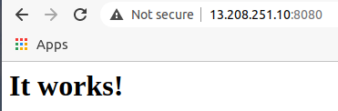
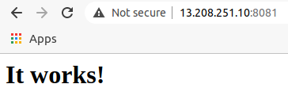
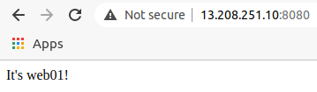
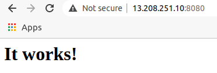
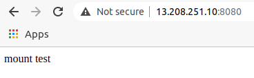
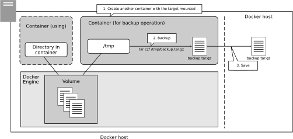

# 5. コンテナ内のファイルと永続化
- コンテナを破棄してもファイルを残すための方法，バックアップの方法
## 5.1 コンテナとファイルの独立性
- ここでは，2つのhttpdコンテナを扱う
    - コンテナは互いに独立した実行環境
    - いくつ起動してもそれらが互いに影響を受けることはない
### 5.1.1 2つのhttpdコンテナを起動する
- これまでのhttpdコンテナの実行コマンド
    ```
    docker run -dit -name my-apache-app -p 8080:80 -v "$PWD":/usr/local/apache2/htdocs/ httpd:2.4
    ```
    - ポート8080をポート80にマッピングする
    - Dockerホストのカレントディレクトリをコンテナの/usr/local/apache2/htdocs にマウントする
- 今回のhtppdコンテナの作り方
    - 名前: web01, web02
    - どちらも```-v```オプションは指定せず，```/usr/local/apache2/htdocs```のマウントはしない
        - 2つのコンテナは完全に互いに独立する
#### 2つのhttpdコンテナを起動する
1. 1つ目のhttpdコンテナを起動する
    ```
    ubuntu@ip-xxx-xxx-xxx-xxx:~$ docker run -dit --name web01 -p 8080:80 httpd:2.4
    ```
2. 2つ目のhttpdコンテナを起動する
    ```
    ubuntu@ip-xxx-xxx-xxx-xxx:~$ docker run -dit --name web02 -p 8081:80 httpd:2.4
    ```
3. コンテナの実行を確認する
    ```
    ubuntu@ip-xxx-xxx-xxx-xxx:~$ docker ps
    CONTAINER ID   IMAGE       COMMAND              CREATED              STATUS              PORTS                  NAMES
    657dde19f1f4   httpd:2.4   "httpd-foreground"   About a minute ago   Up About a minute   0.0.0.0:8081->80/tcp   web02
    036ab19cecf8   httpd:2.4   "httpd-foreground"   4 minutes ago        Up 4 minutes        0.0.0.0:8080->80/tcp   web01
    ```
4. ブラウザで接続する


- どちらにも接続でき，"It works!"と表示される．

### 5.1.2 コンテナの中にファイルをコピーする
- どちらもまだコンテンツファイルを置いていないので，区別が付かない
    - コンテンツを配置する．
- それぞれのコンテナは独立しており，コンテナ内の```/usr/local/apache2/htdocs```にindex.htmlを配置すれば目的を達せられる．
#### ファイルをコピーするdocker cpコマンド
- 1つは```docker exec```コマンドで```/bin/bash```を起動し，コンテナの内部に入る方法．エディタを起動して，```/usr/local/apache2/htdocs/index.html```を編集する．
    - httpdイメージはファイルサイズを小さくするため，エディタが含まれていない．
- DockerホストとDockerコンテナ間でファイルをコピーする```docker cp```コマンドを使う
    - コンテナが稼働中でも停止中でもファイルコピーできる
        ```
        docker cp [option] [path of copy source] [container name or container ID]:[path of copy destination]
        ```
        - ホストからコンテナの向きにコピーする場合
        ```
        docker cp [option] [container ID or container name]:[path of copy source] [path of copy destination]
        ```
        - コンテナからホストの向きにコピーする場合
- コンテナを対象にする場合，```[container name or container ID]:[path]```と表記する．
- ```docker cp```コマンド
    - パーミッションをそのままコピーする
    - ディレクトリも再帰的にコピーする

| オプション | 意味 |
| ---- | ---- |
| ```-a```, ```--archive``` | ユーザIDとグループIDを保ったままコピーする |
| ```-L```, ```--follow-link``` | コピー元のシンボリックリンクをたどる |
- これらのオプションを使うことはあまりない
- 注意点
    - ```docker cp```では，```/proc```, ```/sys```, ```/dev```, ```tmps```配下のようなシステムファイルはコピーできない．
    - こうしたファイルをコピーしたいときは，標準入出力経由でコピーする
    - 参考: http://docs.docker.jp/engine/reference/commandline/cp.html

#### docker cpコマンドでファイルをコピーする例
##### index.htmlをコピーする
1. ```/tmp```ディレクトリにindex.htmlファイルを作る
    - index.htmlをコンテナの```/tmp```ディレクトリに作る
    - ```/tmp```ディレクトリにカレントディレクトリを移動する
    - あとで現在のカレントディレクトリに戻れるよう，```push```コマンドを使ってディレクトリを移動する．
        - シェルにおいて，現在のカレントディレクトリの状態を保存した上で，別の場所にカレントディレクトリを移動する．
        - 保存したカレントディレクトリの位置まで戻るには，```popd```と入力する．
    ```
    pushd /tmp
    ```
2. index.htmlファイルを作る
    - カレントディレクトリを```/tmp```に移動している．
    - ここにindex.htmlを作る
        ```
        <html>
            <body>
                <div>It's web01!</div>
            </body>
        </html>
        ```
3. ファイルをコンテナにコピーする
- index.htmlファイルをコンテナweb01の```/usr/local/apache2/htdocs/```にコピーする．
    ```
    ubuntu@ip-xxx-xxx-xxx-xxx:/tmp$ docker cp /tmp/index.html web01:/usr/local/apache2/htdocs/
    ```
4. ブラウザでアクセスして確認する


5. コンテナの内部に入って確認する
    - ```docker exec```コマンドを使ってコンテナの内部に入る
        ```
        ubuntu@ip-xxx-xxx-xxx-xxx:/tmp$ docker exec -it web01 /bin/bash
        root@036ab19cecf8:/usr/local/apache2# 
        ```

6. index.htmlを確認する
    - ```/usr/local/apache2/htdocs```ディレクトリの内容を確認する
        ```
        root@036ab19cecf8:/usr/local/apache2# ls -al /usr/local/apache2/htdocs
        total 16
        drwxr-xr-x 1 root     root     4096 Apr  4 02:31 .
        drwxr-xr-x 1 www-data www-data 4096 Mar 31 04:18 ..
        -rw-rw-r-- 1     1000     1000   57 Apr  4 02:23 index.html
        ```
        - ファイルが存在することがわかる
        ```
        root@036ab19cecf8:/usr/local/apache2# cat /usr/local/apache2/htdocs/index.html 
        <html>
            <body>
                <div>It's web01!</div>
            </body>
        </html>
        ```
        - ```docker cp```でコピーした内容と合致することがわかる
        - 確認したら```exit```してコンテナから出る

7. コンテナweb02に対しても，同様に確認する
    - コンテナweb02に対しても同様に確認する．
    - ```/tmp/index02.html```として，コンテナweb02にindex.htmlという名前でコピーする．
        ```
        <html>
            <body>
                <div>It's web02!</div>
            </body>
        </html>
        ```
    - ブラウザで"It's web02!"と表示されることを確認する．

8. カレントディレクトリを戻しておく．
    ```
    popd
    ```

### 5.1.3 コンテナを破棄して作り直すとファイルが失われる
- コンテナを停止したり破棄したりすると，コピーしたファイルがどのようになるか確認する．
#### コンテナを作り直す
1. 現在の状態を確認する
    ```
    ubuntu@ip-172-31-39-72:~$ docker ps
    CONTAINER ID   IMAGE       COMMAND              CREATED             STATUS             PORTS                  NAMES
    657dde19f1f4   httpd:2.4   "httpd-foreground"   About an hour ago   Up About an hour   0.0.0.0:8081->80/tcp   web02
    036ab19cecf8   httpd:2.4   "httpd-foreground"   About an hour ago   Up About an hour   0.0.0.0:8080->80/tcp   web01
    ```
2. コンテナを停止する
    ```
    docker stop web01
    ```
    - ブラウザから接続しようとするとタイムアウトになる．
3. コンテナを再開する
    ```
    docker start web01
    ```
    - ブラウザで接続すると，"It's web01!"と表示される．
4. コンテナを破棄する
    ```
    docker stop web01
    docker rm web01
    ```
    - ```docker stop```で停止し，それから```docker rm```で削除する．
    ```
    ubuntu@ip-172-31-39-72:~$ docker ps -a
    CONTAINER ID   IMAGE       COMMAND              CREATED             STATUS             PORTS                  NAMES
    657dde19f1f4   httpd:2.4   "httpd-foreground"   About an hour ago   Up About an hour   0.0.0.0:8081->80/tcp   web02
    ```
    - ```docker ps -a```で確認．
    - ブラウザから接続しようとするとタイムアウトになる．
5. コンテナを作り直す
    ```
    ubuntu@ip-172-31-39-72:~$ docker run -dit --name web01 -p 8080:80 httpd:2.4
    ubuntu@ip-172-31-39-72:~$ docker ps
    CONTAINER ID   IMAGE       COMMAND              CREATED             STATUS             PORTS                  NAMES
    55996624faaf   httpd:2.4   "httpd-foreground"   6 seconds ago       Up 4 seconds       0.0.0.0:8080->80/tcp   web01
    657dde19f1f4   httpd:2.4   "httpd-foreground"   About an hour ago   Up About an hour   0.0.0.0:8081->80/tcp   web02
    ```
    - ブラウザから接続すると，"It works!"と表示される．
    
6. index.htmlファイルがなくなっていることを確認する
    - このコンテナの中に入って，```/usr/local/apache2/htdocs```を確認する．
    ```
    ubuntu@ip-xxx-xxx-xxx-xxx:~$ docker exec -it web01 /bin/bash
    root@55996624faaf:/usr/local/apache2# ls -al /usr/local/apache2/htdocs/
    total 16
    drwxr-xr-x 2 root     root     4096 Mar 31 04:18 .
    drwxr-xr-x 1 www-data www-data 4096 Mar 31 04:18 ..
    -rw-r--r-- 1 root     src        45 Jun 11  2007 index.html
    root@55996624faaf:/usr/local/apache2# cat /usr/local/apache2/htdocs/index.html 
    <html><body><h1>It works!</h1></body></html>
    ```
    - 既定のファイルであり，先ほど置いたファイルではない．
#### コンテナを起動し直すとファイルが失われる
- コンテナがそれぞれ独立しており，コンテナを破棄すると，その内容が失われる．
- 最初に作ったweb01と破棄してから作り直したweb01は別物
    - コンテナIDは違う
    - コンテナを破棄する操作は注意深く操作する必要がある．
## 5.2 データを独立させる
- ```docker rm```してコンテナを破棄すると，そのコンテナの中にあるデータは失われる．
- コンテナは，失ってはならないデータは，外に出すように設計する．
### 5.2.1 マウントすれば失われない
- コンテナでは，「実行するシステム」と「扱うデータ」は別に管理することが推奨される．
- ```-v```オプションを使ったときのようにマウントすれば，コンテナがなくなっても失われることはない．
    - データをコンテナの外に出す
- ```/home/ubuntu```ディレクトリに```web01data```というディレクトリを作って実験する．
#### ボリュームのマウントを試す
1. web01コンテナを破棄する
    ```
    docker stop web01
    docker rm web01
    ```
2. マウントするディレクトリを作る
    ```
    mkdir web01data
    ```
3. 仮のindex.htmlファイルを作る
    ```
    <html>
        <body>
            <div>mount test</div>
        </body>
    </html>
    ```
4. 3のディレクトリをマウントしてweb01コンテナを起動する
    ```
    ubuntu@ip-xxx-xxx-xxx-xxx:~/web01data$ docker run -dit --name web01 -v /home/ubuntu/web01data:/usr/local/apache2/htdocs -p 8080:80 httpd:2.4
    ```
    - 起動したら```docker ps```でコンテナIDを確認しておく
        ```
        ubuntu@ip-172-31-39-72:~/web01data$ docker ps
        CONTAINER ID   IMAGE       COMMAND              CREATED              STATUS              PORTS                  NAMES
        0cf98b1725f0   httpd:2.4   "httpd-foreground"   About a minute ago   Up About a minute   0.0.0.0:8080->80/tcp   web01
        657dde19f1f4   httpd:2.4   "httpd-foreground"   2 hours ago          Up 2 hours          0.0.0.0:8081->80/tcp   web02
        ```
5. ブラウザで確認する

6. 破棄して作り直す
    ```
    docker stop web01
    docker rm web01
    docker run -dit --name web01 -v /home/ubuntu/web01data/:/usr/local/apache2/htdocs -p 8080:80 httpd:2.4
    ```
    - このときブラウザで確認すると，同じようにコンテンツが表示される．
        - index.htmlは失われない

### 5.2.2 データを分ければコンテナのアップデートがしやすくなる
- 破棄したコンテナと新しく作ったコンテナは別のコンテナだが，どちらもDockerホストの```/home/ubuntu/web01data```ディレクトリをマウントしている
- ```/home/ubuntu/web01data```ディレクトリはDockerホスト側にあるので，コンテナが破棄されても失われることはない
    - コンテナが違っても同じデータが見える
- コンテナ側からマウントしたファイルを書き換えることもできる
    - 書き換えると，書き換えたデータはそのまま残る
- データをDockerホスト側に持ち，それをマウントするようにすれば，失われることがない
    - コンテナのアップデートや差し替えが容易になる
### 5.2.3 コンテナ間のデータ共有にも利用できる
- マウントは，コンテナ間のデータ共有に利用できる
- 1つの場所を2つ以上のコンテナで同時にマウントすることもできる
    - マウントした場所を通じて，コンテナ間でファイル共有できる
### 5.2.4 設定ファイルの受け渡しや作業フォルダを受け渡す
- コンテナ内の設定ファイルを書き換えるために，あるフォルダもしくは設定ファイルの1つだけをマウントするという使い方もできる．
    - これまで使ってきているhttpdコンテナは，```/usr/local/apache2/conf```ディレクトリにApacheに設定ファイルが入っており，設定を変更したいときはこのファイルを書き換える必要がある．
        - 必要なファイルを```docker cp```でコピーする方法
        - ```docker exec``` (```docker run```) でシェルを起動し，コンテナ内に入り込んで設定ファイルを変更する方法
- コピーする方法
    - 手順
        - 一度```docker create```しておく
        - ```docker cp```などでファイルを書き換える
        - それから```docker start```で起動する
- マウントする方法
    - 手順
        - Dockerホスト上の適当なディレクトリにコンテナ内の```/usr/local/apache2/conf```と同じ内容のものを容易
        - そのファイルを書き換えておき，```docker run```するときに，そのディレクトリを```/usr/local/apache2/conf```ディレクトリにマウントする
    - Dockerホストに設定ファイルが残るので，設定のバックアップが容易．
        - コンテナを破棄しても設定がDockerホストに残るので，設定そのままでコンテナの差し替えも実施できる

## 5.3 バインドマウントとボリュームマウント
- バインドマウント
    - Dockerホストにあらかじめディレクトリを作っておき，それをマウントする方法
### 5.3.1 ボリュームマウント
- ボリュームマウント
    - Docker Engine上で確保した領域をマウントする方法
    - 確保した場所を「(データ)ボリューム」という．
    - ボリュームは，あらかじめ```docker volume create```コマンドを使って作成する．

        |サブコマンド|意味|
        | ---- | ----|
        |```create```| ボリュームを作成する |
        | ```inspect``` | ボリュームの詳細情報を確認する |
        | ```ls``` | ボリューム一覧を参照する |
        | ```prune``` | コンテナからマウントされていないボリュームをすべて削除する |
        | ```rm``` | ボリュームを削除する |

#### ボリュームマウントの利点
- ボリュームの保存場所がDocker Engineで管理されるので，物理的な位置を意識する必要がなくなる

### 5.3.2 バインドマウントとボリュームマウントの使い分け
#### バインドマウントのほうが良い場面
- バインドマウントの利点
    - Dockerホストの物理的な位置にマウントできる
        - Dockerホストのファイルをコンテナに見せたいときはバウンドマウントを使う．

1. 設定ファイルの受け渡し
    - Dockerホスト上に設定ファイルを置いたディレクトリを用意して，それをコンテナに渡したい場合
2. 作業ディレクトリの変更を即座にDockerコンテナから参照したいとき
    - Dockerホスト上のエディタからDockerコンテナ内のファイルを直接編集できる
#### ボリュームマウントのほうがよい場面
- Dockerコンテナが扱うデータをブラックボックスとして扱い，コンテナを破棄してもデータが残るようにしたいだけの場面
    - 例: データベースを構成するコンテナにおいて，データベースのデータを保存する場所
        - データベースのデータは通常，ひとまとめのブラックボックスとして扱い，それぞれのファイルをDockerホストから編集することはない．
            - そうしたらデータベースが壊れる
        - Dockerホストから不用意にデータを書き換えたくない場面

- 各自のPCでDockerを使う場合はバインドマウントが便利
### 5.3.3 MySQLコンテナを使った例
- データベースコンテナとしてMySQL5.7を取り上げる
    - バージョン名: mysql:5.7
    - MySQLのバージョン8以降は，デフォルトの認証方式が変わっているため，別のコンテナと組み合わせたときに，デフォルトの設定だとうまく利用できないことがある．
    - https://hub.docker.com/_/mysql
#### マウントすべきディレクトリ
- データベースのデータは，```/var/lib/mysql```ディレクトリに保存される
    - ここをボリュームマウント (or バインドマウント) することで，コンテナを破壊しても，データベースの内容が失われないようにする．
#### rootユーザのユーザ名，パスワード，既定のデータベース名などの指定方法
- データベースにアクセスする際のrootユーザのユーザ名，パスワード，既定のデータベースなどは，環境変数として引き渡す

    | 環境変数名 | 意味 |
    | ---- |  ---- |
    | ```MYSQL_ROOT_PASSWORD``` | MySQLのrootユーザのパスワード |
    | ```MYSQL_DATABASE``` | デフォルトのデータベース名 |
    | ```MYSQL_USER``` | データベースにアクセスできる一般ユーザ名．このユーザは```MYSQL_DATABASE```に指定したデータベースを利用できる． |
    | ```MYSQL_PASSWORD``` | 上記ユーザのパスワード |
    | ```MYSQL_ALLOW_EMPTY_PASSWORD``` | rootパスワードを空欄にできるかどうか．yesを設定すると空にする． |
    | ```MYSQL_RANDOM_ROOT_PASSWORD``` | yesに設定するとランダムなパスワードを設定する |
    | ```MYSQL_ONETIME_PASSWORD``` | yesに設定すると，rootユーザが初回ログインしたときにパスワードの変更を要求される |
    - ```MYSQL_ROOT_PASSWORD``` (もしくは```MYSQL_ALLOW_EMPTY_PASSWORD```か```MYSQL_RANDOM_ROOT_PASSWORD```) のみ必須で，残りはオプション．
        - ```docker run```するときに，```-e```オプションで指定．

### 5.3.4 ボリュームを作成する
- ボリュームの作成
    ```
    docker volume create --name [volume name]
    ```
    - ボリューム名に```/```から始まる名前を付けることはできない．
#### ボリュームを作成する
1. ボリュームを作成する
    ```
    docker volume create mysqlvolume
    ```
2. 作成したボリュームを確認する
    ```
    ubuntu@ip-xxx-xxx-xxx-xxx:~$ docker volume ls
    DRIVER    VOLUME NAME
    local     mysqlvolume
    ```
    - DRIVERは，ボリュームを構成するドライバ
### 5.3.5 ボリュームマウントしたコンテナを作成する
#### MySQL5.7のコンテナを起動する
1. MySQL5.7のコンテナを起動する
    - ```docker run```コマンドを使って，MySQL5.7のコンテナを起動する．
    - このとき，今作成したボリュームを```/var/lib/mysql```ディレクトリにマウントする
        ```
        docker run --name db01 -dit -v mysqlvolume:/var/lib/mysql -e MYSQL_ROOT_PASSWORD=mypassword mysql:5.7
        ```
2. 起動を確認する
    ```
    ubuntu@ip-172-31-39-72:~$ docker ps
    CONTAINER ID   IMAGE       COMMAND                  CREATED          STATUS          PORTS                 NAMES
    432af1986c58   mysql:5.7   "docker-entrypoint.s…"   26 seconds ago   Up 24 seconds   3306/tcp, 33060/tcp   db01
    ```
### 5.3.6 データベースに書き込んだ内容が破棄されないことを確認する
#### データベースに書き込んだ内容が破棄されないことを確認する
1. コンテナ内に入る
    - ```docker exec```コマンドを使ってシェルを起動し，コンテナ内に入る．
        ```
        ubuntu@ip-xxx-xxx-xxx-xxx:~$ docker exec -it db01 /bin/bash
        root@432af1986c58:/# 
        ```
2. mysqlコマンドを実行する
    - パスワードを入力するために，```-p```オプションをつけて```mysql```コマンドを実行
        ```
        root@432af1986c58:/# mysql -p
        Enter password: 
        Welcome to the MySQL monitor.  Commands end with ; or \g.
        Your MySQL connection id is 2
        Server version: 5.7.33 MySQL Community Server (GPL)

        Copyright (c) 2000, 2021, Oracle and/or its affiliates.

        Oracle is a registered trademark of Oracle Corporation and/or its
        affiliates. Other names may be trademarks of their respective
        owners.

        Type 'help;' or '\h' for help. Type '\c' to clear the current input statement.

        mysql> 
        ```
3. データベースを作成する
    - exampledbというデータベースを作成する
        ```
        mysql> CREATE DATABASE exampledb;
        Query OK, 1 row affected (0.00 sec)
        ```
4. テーブルを作成する
    - exampletableというテーブルを作成する
        ```
        mysql> use exampledb;
        Database changed
        mysql> CREATE TABLE exampletable (id INT NOT NULL AUTO_INCREMENT, name VARCHAR(50), PRIMARY KEY(id));
        Query OK, 0 rows affected (0.02 sec)
        ```
5. データを挿入する
    ```
    mysql> INSERT INTO exampletable (name) VALUES ('user01');
    Query OK, 1 row affected (0.01 sec)

    mysql> INSERT INTO exampletable (name) VALUES ('user02');
    Query OK, 1 row affected (0.00 sec)
    ```
6. データを確認する
    ```
    mysql> SELECT * FROM exampletable;
    +----+--------+
    | id | name   |
    +----+--------+
    |  1 | user01 |
    |  2 | user02 |
    +----+--------+
    2 rows in set (0.00 sec)
    ```
7. mysqlコマンドを終了する
    ```
    mysql> \q
    Bye
    root@432af1986c58:/# 
    ```
8. コンテナから出る
    - ```exit```
9. コンテナを破棄する
    - コンテナを停止して破棄する
10. マウントせずに新しいコンテナを作って確認する
    - ```-v```オプションを指定せず，マウントせずに新しいコンテナを作って確認する．
        ```
        docker run --name db01 -dit -e MYSQL_ROOT_PASSWORD=mypassword mysql:5.7
        ```
    - シェルに入り，```mysql```コマンドを実行する
        ```
        ubuntu@ip-172-31-39-72:~$ docker exec -it db01 /bin/bash
        root@c1ec52473cc5:/# mysql -p
        Enter password: 
        Welcome to the MySQL monitor.  Commands end with ; or \g.
        ...
        mysql> 
        ```
    - ```use```で```exampledb```に切り替えようとするとエラーが出る
        ```
        mysql> use exampledb
        ERROR 1049 (42000): Unknown database 'exampledb'
        ```
    - ```-q```で終了し，```exit```でコンテナを抜ける
11. コンテナを破棄してマウントした新しいコンテナを作る
    - いまのコンテナを破棄して，```-v```オプションを付けてマウントする
        ```
        ubuntu@ip-xxx-xxx-xxx-xxx:~$ docker stop db01
        db01
        ubuntu@ip-xxx-xxx-xxx-xxx:~$ docker rm db01
        db01
        ubuntu@ip-xxx-xxx-xxx-xxx:~$ docker run --name db01 -dit -v mysqlvolume:/var/lib/mysql -e MYSQL_ROOT_PASSWORD=mypassword mysql:5.7
        ```
    - ```use exampledb```で切り替えられる
        ```
        ubuntu@ip-xxx-xxx-xxx-xxx:~$ docker exec -it db01 /bin/bash
        root@bdba10f4271c:/# mysql -p
        Enter password: 
        Welcome to the MySQL monitor.  Commands end with ; or \g.
        ...

        mysql> use exampledb;
        Reading table information for completion of table and column names
        You can turn off this feature to get a quicker startup with -A

        Database changed
        mysql> 
        ```
    - SERECT文を実行すると，先ほど追加したレコードが存在することも確認できる．
        ```
        mysql> SELECT * FROM exampletable;
        +----+--------+
        | id | name   |
        +----+--------+
        |  1 | user01 |
        |  2 | user02 |
        +----+--------+
        2 rows in set (0.01 sec)
        ```
    - ```-q```で終了し，```exit```でコンテナを抜ける．
12. 後始末
    - コンテナから出て終了し，破棄．
### 5.3.7 mountオプションを使ったマウントの設定
- これまでは```-v```オプションを用いたが，```--mount```オプションを使う方法もある．
    ```
    --mount type=[type of the mount],src=[mount source],dst=[destination of the mount]
    ```
    - マウントの種類
        - バインドマウント: ```bind```
            ```
            -v /home/ubuntuweb01data:/usr/local/apache2/htdocs:/usr/local/apache2/htdocs
            ```
            は
            ```
            --mount type=bind,src=/home/ubuntu/web01data,dst=/usr/local/apache2/htdocs
            ```
            と等価
        - ボリュームマウント: ```volume```
            ```
            -v mysqlvolume:/var/lib/mysql
            ```
            は
            ```
            --mount type=volume,src=mysqlvolume,dst=/var/lib/mysql
            ```
    - Dockerバージョン17.06からサポート
        - ```--mount```の方が推奨
1. バインドマウントかボリュームマウントかわかりにくい
    - マウント元が```/```から始まるときはバインドマウント
    - そうでないときはボリュームマウント
2. ボリュームが存在しないときに新規に作成される
    - ボリューム名をタイプミスしたときに致命的な問題になりがち

##  5.4 データのバックアップ
- バインドマウントの場合
    - Dockerホスト上のファイルなので，Dockerホストからアクセスできるので，バックアップが容易．
- ボリュームマウントの場合
    - ボリュームが失われると，データベースのデータは失われた．
### 5.4.1 ボリュームの場所
- ボリュームの詳細情報は，```docker volume inspect```コマンドで確認できる．
    ```
    docker volume inspect [volume name or volume ID]
    ```
- 実行例
    ```
    ubuntu@ip-xxx-xxx-xxx-xxx:~$ docker volume inspect mysqlvolume
    [
        {
            "CreatedAt": "2021-04-06T12:44:15Z",
            "Driver": "local",
            "Labels": {},
            "Mountpoint": "/var/lib/docker/volumes/mysqlvolume/_data",
            "Name": "mysqlvolume",
            "Options": {},
            "Scope": "local"
        }
    ]
    ```
    - Mountpointの場所が実際にマウントされている場所
        - 今回は```/var/lib/docker/volumes/```以下．
        - ここはDocker Engineのシステム領域．仮にここをバックアップしてリストアしても元に戻るとは限らない．

### 5.4.2 ボリュームバックアップの考え方
- Dockerでボリュームをバックアップするときは，適当なコンテナに割り当てて，そのコンテナを使ってバックアップを取るようにする．
    - 適当なLinuxシステムが入ったコンテナを1つ別に起動する．
    - その```/tmp```などのディレクトリにバックアップ対象のコンテナをマウントし，```tar```でバックアップを作る．
    - バックアップをDockerホストで取り出す．
    - リストアはその逆の手順．

- 1つのボリュームは複数のコンテナから同時にマウントできる．
    - バックアップに際して，利用中のコンテナのマウントを外す必要はない．
    - バックアップ中はコンテナを停止しておくのが望ましい
        - データの整合性がとれなくなる可能性

### 5.4.3 ボリュームをバックアップする
#### ボリュームをバックアップする
1. ボリュームを利用中のコンテナが停止中もしくは存在しないかどうかを確認する
    - ```docker ps -a```で調査．
        ```
        ubuntu@ip-172-31-39-72:~$ docker ps -a
        CONTAINER ID   IMAGE     COMMAND   CREATED   STATUS    PORTS     NAMES
        ```
2. 軽量Linuxシステムのbusyboxを起動してtarコマンドでバックアップする
    - Linuxシステムが入ったコンテナを，mysqlvolumeをマウントして起動する．
        ```
        docker run --rm -v mysqlvolume:/src -v "$PWD":/dest busybox tar czvf /dest/backup.tar.gz -C /src .
        ```
        - このコマンドを入力すると，実行したディレクトリに```backup.tar.gz```としてバックアップが作られる．
        - ```tar```コマンドで中身を確認する．
            ```
            ubuntu@ip-xxx-xxx-xxx-xxx:~$ tar tzvf backup.tar.gz 
            drwxrwxrwt 999/999           0 2021-04-06 12:44 ./
            -rw-r--r-- 999/999        1112 2021-04-06 12:20 ./ca.pem
            -rw-r----- 999/999    79691776 2021-04-06 12:44 ./ibdata1
            -rw------- 999/999        1676 2021-04-06 12:20 ./ca-key.pem
            ...
            ```
##### ボリュームバックアップの慣例的なコマンド
```
docker run --rm -v mysqlvolume:/src -v "$PWD":/dest busybox tar czvf /dest/backup.tar.gz -C /src .
```
の意味は？(ボリュームマウントとバインドマウントを組み合わせている)

1. 軽量なLinuxシステムbusyboxの起動
    - busybox
        - 基本的なLinuxコマンドが格納された軽量Linux．
2. バックアップ対象を```/src```にボリュームマウント
    - 1つ目の```-v```オプションでは，バックアップ対象であるmysqlvolumeを```/src```にボリュームマウント
        - このコンテナの中からは，バックアップ対象が```/src```から見える．
3. Dockerホストのカレントディレクトリを```/dest```にバインドマウント
    - 2つ目の```-v```オプションでは，```"$PWD"```を```/dest```にバインドマウントしている．
4. ```tar```でバックアップを取る
    - 実行するコマンドは，```tar czf /dest/backup.tar.gz -C /src .```
        - ```/src```ディレクトリの全ファイルが```/dest/backup.tar.gz```にバックアップされる．
            - このファイルはDockerホストのカレントディレクトリに現れる．
5. ```--rm```で破棄する
    - 起動したコンテナは，```tar```コマンドの実行が終われば自動的に削除される．

### 5.4.4 ボリュームをリストアする
- ボリュームを削除して新しく作り直す．
    - 作成した```backup.tar.gz```からリストアする．
#### ボリュームを削除する
1. ボリュームを削除する
    ```
    docker volume rm mysqlvolume
    ```
    - このコマンドはボリュームを完全に削除する．
    - 保存していた内容は失われる．
2. ボリュームが削除されたことを確認する
    ```
    ubuntu@ip-172-31-39-72:~$ docker volume ls
    DRIVER    VOLUME NAME
    local     5ca92502e80ccdf9e566dbd137e9a6e7d1d9b5b00b3e4e4098b0557a66bef338
    ```
    - mysqlvolumeは削除されている

#### ボリュームの作成とリストア
1. ボリュームの作成
    ```
    docker volume create mysqlvolume
    ```
2. リストアする
    - バックアップしておいた```backup.tar.gz```をカレントディレクトリに置いた状態で，以下のコマンドを入力．
        ```
        docker run --rm -v mysqlvolume:/dest -v "$PWD":/src busybox tar xzf /src/backup.tar.gz -C /dest
        ```
        - バックアップのときと逆向き．

- 本当にリストアされたかどうかは，5.3.6と同様の手順で確認できる．

### 5.4.5 コンテナのマウント指定を引き継ぐ
- バックアップする際，```-v```オプションには，バックアップ対象のボリューム名を指定．
    - コンテナがどんなボリュームを使っているのかを知っていなければならない．
    - どのボリュームを使っているのかを洗い出してバックアップするのは，手間がかかり，漏れが生じる可能性もある．
#### ```volume-from```オプションを用いたバックアップ
- ```--volume-from```
    - マウント先のボリュームを意識しないようにするために用意されている．
    - コンテナを起動する際，別のコンテナのマウント情報を引き継ぎ，それとまったく同じ設定でマウントする．
- 例: db01コンテナの起動
    ```
    docker run --name db01 -dit -v mysqlvolume:/var/lib/mysql -e MYSQL_ROOT_PASSWORD=mypassword mysql:5.7
    ```
    - このとき，別のコンテナを起動するときに，```--volumes-from db01```を指定すると，db01コンテナと全く同じ状態のマウント情報が設定されて起動する．
        - この場合は，mysqlvolumeが```/var/lib/mysql```にマウントされる．

#### ```--volumes-from```を使って対象を指定する
1. コンテナを停止する
    - バックアップ中にデータが書き換わらないようにするため，一旦コンテナを停止する
        ```
        docker stop db01
        ```
2. バックアップする
    - ```--volumes-from```を指定してbusyboxを起動し，コンテナをバックアップする
        ```
        docker run --rm --volumes-from db01 -v "$PWD":/dest busybox tar czf /dest/backup.tar.gz -C /var/lib/mysql .
        ```
3. コンテナを再開する
    - バックアップが終わったら，コンテナを再開する
        ```
        docker start db01
        ```
#### ```volumes-from```オプションの利点
- バックアップ対象をボリューム名ではなく，そのコンテナのディレクトリ名で指定できる．
    - コンテナのディレクトリがどのボリュームにマウントされているかを意識する必要がない
    - ```--volumes-from```では，すべてのマウント情報が引き継がれる．
        - 複数のボリュームをマウントしている場面では，一括マウントできる．

#### データボリュームコンテナ
- ボリュームを利用する際，データボリュームコンテナという考え方が採用されることがある．
    - 自身は何もせず，必要なディレクトリだけをマウントしただけのコンテナ．
        - いくつかのボリュームをマウントしておき，ほかのコンテナから```--volumes-from```で間接的にマウント先を指定する目的で使われるコンテナ
        - ```docker create```だけしておけば十分
- データボリュームコンテナを利用する利点
    1. コンテナが実際のボリュームのマウント先を意識しないで済む
    2. どのボリュームを使っているのかわかりやすく，バックアップが取りやすい
    3. ```docker volume prune```で削除されにくくなる
        - ボリュームを直接マウントしている場合は，たまたまそのコンテナを破棄していたときに間違って```docker volume prune```を実行すると，ボリュームが削除されてしまう恐れがある．
        - データボリュームコンテナを利用している場合は，データボリュームコンテナを破棄しない限りは，そのデータボリュームがマウントしている状態になるので，```docker volume prune```で削除されてしまう心配がない．

## 5.5 まとめ
1. コンテナを破棄するとデータもなくなる
    - コンテナは隔離された実行環境にすぎない．
    - ```docker rm```でコンテナを削除すると，データは失われる．
2. 永続化したい場合はマウントする
    - コンテナを破棄してもデータを残したい場合は，保存作をDockerホストのディレクトリの外に出してマウントすることで，失われないようにする．
3. バインドマウントとボリュームマウント
    - バインドマウント
        - Dockerホストのディレクトリをマウントする方法．
    - ボリュームマウント
        - Docker Engineで管理されている領域にマウントするもの．
4. バックアップ
    - データのバックアップは，マウント先を```tar.gz```などでアーカイブする．
    - ボリュームマウントのときは，対象をマウントするコンテナを作り，そのコンテナ内で```tar```コマンドなどを実行してバックアップをとって取り出す．