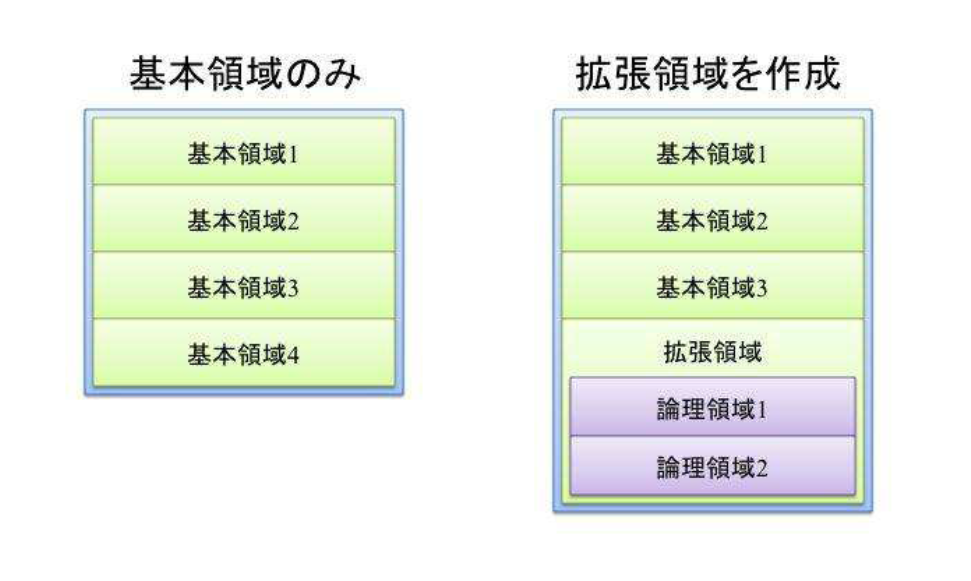
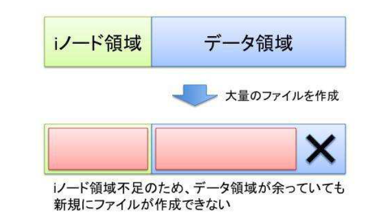

# 12. ファイル管理
## 12.1 Linux のファイル管理
### ファイルシステムとは
- ファイルシステム
    - ファイル名・更新日時などの属性データ・ファイルデータ本体を効率よく管理するための仕組み．
    - いくつか種類があり，利用するファイルシステムによってファイルをアクセスしたときに得られる効率や安全性が変わる．

### パーティションとは
- パーティション
    - ハードディスクを利用するために，ハードディスクを区切った単位．
    - ディスクの中身を複数のパーティション (領域) に区切る作業が必要になる．
- パーティショニング
    - パーティションを分割する作業

### Linux のディレクトリ構造
- ディレクトリ
    - ファイル管理の効率化を図るために用意されている入れ物
    - 利用目的ごとにファイルをまとめたり，いくつかのディレクトリをディレクトリに入れて管理することができる．
    - `/` ディレクトリが大元になるツリー状となっている．

##### `/` ディレクトリ
大元になるディレクトリで，ルートディレクトリという．`/` ディレクトリにディレクトリやファイルが入る．

##### マウント
- ディスクを利用するためには1つ目を `/` ディレクトリに必ずマウントする．
- 複数のディスクを利用する場合は，2つ目以降のディスクを既にマウントされているディスクの中のディレクトリにマウントする．
    - 既に中身があるディレクトリにディスクをマウントすると，マウントされたディレクトリが `/` ディレクトリであっても中身が置き換わり，今まであったディレクトリの中身は読み書きできなくなる．

##### FHS (Filesystem Hierarchy Standard)
Linux システムは FHS と呼ばれる規格に基づいてディレクトリの構成が定められている．

- `/bin/`: 一般ユーザ用プログラム
- `/sbin/`: システム管理用プログラム
- `/etc/`: 設定ファイル
- `/lib/`: 複数のプログラムで共通に使われるライブラリ
- `/var/`: 可変的なデータ (ログ・データベース・ウェブサイトなど)
- `/boot/`: 起動関連のファイルが格納
- `/dev/`: デバイスファイルが格納
- `/home/`: ユーザの作業領域が格納
- `/tmp/`: 一時ファイルが格納

### ファイルシステムの作成方法
ハードディスクを利用するには，以下の手順で作成して利用できる．

- パーティションの作成: `fdisk` コマンド
- ファイルシステムの作成: `mkfs` コマンド
- マウント: `mount` コマンド

<div style="page-break-before:always"></div>

## 12.2 ディスクのパーティション
### パーティション分割する理由
- システムとデータのバックアップ頻度を差別化する
- 障害発生時の影響範囲を狭める
- ファイルアクセスの速度向上

書式:
```
fdisk [option] [デバイスファイル]
ディスクの構造の表示．
ディスクのパーティション分割．
```

option:
```
-l
デバイスのパーティション情報を表示する．
```

実行例:
```
ai@ai-VirtualBox:~$ sudo fdisk -l
[sudo] password for ai: 
Disk /dev/loop0: 4 KiB, 4096 bytes, 8 sectors
Units: sectors of 1 * 512 = 512 bytes
Sector size (logical/physical): 512 bytes / 512 bytes
I/O size (minimum/optimal): 512 bytes / 512 bytes
(略)

Device     Boot   Start      End  Sectors  Size Id Type
/dev/sda1  *       2048  1050623  1048576  512M  b W95 FAT32
/dev/sda2       1052670 20969471 19916802  9.5G  5 Extended
/dev/sda5       1052672 20969471 19916800  9.5G 83 Linux


Disk /dev/loop8: 32.45 MiB, 34017280 bytes, 66440 sectors
Units: sectors of 1 * 512 = 512 bytes
Sector size (logical/physical): 512 bytes / 512 bytes
I/O size (minimum/optimal): 512 bytes / 512 bytes
```

### パーティションの分割
- ハードディスクは，1つのパーティションとして使うか，2 - 4 つまでのパーティションに分割できる．
- 各パーティションは，基本パーティションまたは拡張パーティションとなる．
    - 拡張パーティションは1台のハードディスクに1つだけ作ることができる．
    - 拡張パーティションの中にはさらに論理パーティションを作ることができる．
        - 論理パーティションは，基本パーティションと同様に，ファイルシステムを作成してファイルやディレクトリを補完できる．
        - 拡張パーティションは論理パーティションを格納する役割となっており，ファイルシステムを作成することはできない．



パーティションの最大数:

- IDE: 63 (基本 3 + 論理 60)
- SATA: 15 (基本 3 + 論理 12)
- SCSI: 15 (基本 3 + 論理 12)

### ハードディスクを増設して利用可能にする
- 新しいハードディスクには，データ用の領域とスワップ領域 (Linux がメモリの代わりにプログラムを置いておく領域) の2つを作成する．
- 利用可能にするには，`fdisk` コマンドで2つに分割する．
    - パーティションは分割した後からのサイズ変更が難しいので，あらかじめどのようにパーティションを分割するのかを計画してから行う．
    - 既に使用しているハードディスクのパーティションを操作するとデータが消えてしまうので，細心の注意を払う．
- パーティションの操作は root ユーザのみ可能．

##### ハードディスクを利用するまでの手順
1. 増設前のデバイス構成の確認
1. ハードディスクを増設
1. 増設後のデバイス構成の確認
1. パーティション情報の確認
1. パーティションの作成
1. パーティションの種類の変更
1. パーティション情報の保存
1. 再起動 (警告が表示されて，再起動が必要な場合)
1. ファイルシステムの作成
1. マウント
1. スワップパーティションの作成
1. スワップの追加
1. 自動マウントの設定

デバイスの構成の確認:
ディスク増設前のデバイスの構成を確認するために，以下のコマンドを実行．
```
ai@ai-VirtualBox:~$ ls -l /dev/sd*
brw-rw---- 1 root disk 8, 0 11月 18 06:56 /dev/sda
brw-rw---- 1 root disk 8, 1 11月 18 06:56 /dev/sda1
brw-rw---- 1 root disk 8, 2 11月 18 06:56 /dev/sda2
brw-rw---- 1 root disk 8, 5 11月 18 06:56 /dev/sda5
```

- `/dev` ディレクトリは Linux が認識するすべてのデバイスが置かれている．
    - `sd*` または `hd*` がハードディスクドライブ．
- 数字なしのデバイスはディスクドライブ自体を指す．
- 数字付きのデバイスは，ハードディスクドライブが認識するファイルシステム．

<div style="page-break-before:always"></div>

## 12.3 ファイルシステム
- ファイルシステム
    - ディレクトリやファイルの情報やデータをディスクのどこに保存してあるかを管理するためのシステム (仕組み)
    - ディレクトリやファイルのファイル名やファイル作成時間，ファイルの所有権限などの情報を管理している．また，ディスクのデータが書いてある場所とデータが書いていない場所なども管理している．
    - OS によって利用されるファイルシステムが異なる．
        - Linux では多くの場合は ext3 または ext4 が利用される．
        - Windows の場合は NTFS が利用される．
    
Linux で利用できるファイルシステムの一例:
|FS名|内容|最大サイズ|最大ファイルサイズ|
|---|---|---|---|
|ext2|Berkeley Fast File System を参考にした16ビット構造|16TB|2TB|
|ext3|ext2 + ジャーナル機能，機能拡張|2 - 32TB|16GB - 2TB|
|ext4|ジャーナリングファイルシステム．ファイルの断片化防止など，様々な機能拡張によりパフォーマンスが向上．|1EB|16TB|
|ReiserFS|小さなファイルの扱いに向いている．ジャーナリングファイルシステム|8TB|16TB|
|XFS|SGI社が提供．ジャーナリングファイルシステム．|8EB|8EB|
|JFS|IBM社が提供．ジャーナリングファイルシステム．|512TB|4PB - 8EB|

Windows で利用できるファイルシステムの一例:
|FS名|内容|最大サイズ|最大ファイルサイズ|
|---|---|---|---|
|FAT16|セクタという領域を1次元配列で管理する．現在は使われない．|2GB (NT: 4GB)|2GB(NT: 4GB)|
|FAT32|セクタという領域を1次元配列で管理する．Windows以外でも利用可能．|2TB (2KB セクタ: 8TB)|4GB|
|NTFS|NT/XP/Vista 用ジャーナリングファイルシステム．|256TB|16TB (16EB)|
|exFAT|フラッシュメディア向けファイルシステム．|8ZB (512B セクタ時)|16TB (16EB)|

CD/DVD のファイルシステム:
|FS名|内容|
|---|---|
|ISO9660|ISO で標準化されたファイルシステム．規格拡張が存在．CD や DVD に利用される．|

### ジャーナリング機能
- ジャーナリング
    - ファイルシステムに対する書き換え処理のコマンドをファイルシステムに逐一記録する機能．
    - コンピュータの急停止などの障害時に有効．
        - コンピュータが急停止し，ファイルのデータがシステムファイルに書き込み途中である場合，処理されていないコマンドを対処する．
            - ファイルの書き込み途中の場合，書き込み終わっていないデータがなくて書き込みを終われないので，途中までディスクに保存されているファイルの管理情報を消し，書き込み途中のファイルが作られなかった状態にする．

### マウント状態の表示
`df` コマンドで，現在マウントされているファイルシステムのリストを表示できる．

実行例 (ハードディスクの確認):
```
ai@ai-VirtualBox:~$ df
Filesystem     1K-blocks    Used Available Use% Mounted on
udev              981296       0    981296   0% /dev
tmpfs             202808    1356    201452   1% /run
/dev/sda5        9736500 6259252   2962944  68% /
(略)
```

### ファイルシステムの作成
ハードディスクを利用するためには，パーティションに分割した後ファイルシステムを作成する．
ファイルシステムの作成には `mkfs` コマンドを使用する．

書式:
```
mkfs option
```

option:
```
-t
作成するファイルシステムの種類を指定する．

-c
ハードディスクの壊れている箇所を検出して，利用しない．
```

### ラベル
ラベルとは，ハードディスクなどのパーティションを認識するための名前．基本パーティションや論理パーティションにファイルシステムを作る時にラベルを指定するか，または `e2label` コマンドでラベルを付けられる．

書式:
```
e2label デバイス [label]
パーティションのラベルを表示．
パーティションのラベルを付ける．
```


<div style="page-break-before:always"></div>

### マウント
ハードディスクはパーティション分割してファイルシステムを作ってからマウントすると読み書きできる．

##### マウントポイント
ハードディスクや CD-ROM などを利用する場合は，**存在しているディレクトリにマウントする必要があり**，マウントするために使われるディレクトリをマウントポイントと呼ぶ．
ファイルシステムはどこかのディレクトリにマウントして初めて利用できる．

##### `mount` コマンド
ハードディスクやリムーバブルメディアなどをマウントポイントにマウントする．

書式:
```
mount -t タイプ -o オプション デバイスファイル マウントポイント
ハードディスクやリムーバブルメディアをマウントする．
```

option:
```
-t タイプ
ファイルシステムの ext3 や Windows の msdos，CDと DVD の iso9660 など

-o オプション
読み書きの rw や読み取り専用の ro など

デバイスファイル
ファイルシステムにアクセスするためのデバイスファイル

マウントポイント
マウントするディレクトリ
```

実行例:
```
mount -t ext3 -o rw /dev/sdc2 /opt <- /dev/sdc2 を /opt ディレクトリに ext3 形式でマウント
```

##### `umount` コマンド
マウントされたハードディスクやリムーバブルメディアを利用しなくなると，アンマウントする．
アンマウントするために，`umount` コマンドを使う．

書式:
```
umount マウントポイント
ハードディスクやリムーバブルメディアをアンマウントする
```

実行例:
```
umount /opt
```

<div style="page-break-before:always"></div>

## 12.5 スワップ領域の作成
- Linux カーネルは，ハードディスクからプログラムやデータをメモリ領域へ読み込んで実行する．
    - プログラムやデータを新たに読み込むための空きメモリ領域がなくなると，Linux カーネルは今利用していないメモリ上のプログラムやデータをスワップ領域へ一時的に対比する．
- スワップパーティション
    - Linux のカーネルシステムがメモリの代わりとして一時的に使うハードディスクのパーティション領域．
    - メモリサイズに対応したパーティションを確保し，スワップファイルシステムをパーティションに作成する必要がある．

### スワップファイルシステムの作成
スワップするためのパーティション確保とファイルシステムの作成は，インストールするときや，新しくハードディスクを増設するときに実行する．
スワップ領域を作るには `mkswap` コマンドを使う

書式:
```
mkswap デバイスファイル
スワップファイルシステムを作る
```

option:
```
-c
不良な部分を探して利用しない

デバイスファイル
ファイルシステムにアクセスするためのデバイスファイル
```

### スワップの領域作成と利用
スワップ領域は作成後，`swapon` コマンドを実行すると有効化できるようになる．

書式:
```
swapon [device file]
```

option:
```
-s
現在利用しているスワップ領域を表示
```

利用中のスワップ領域は，`swapoff` コマンドで無効化できる．

書式:
```
swapoff [device file]
```

option:
```
-v
指定したスワップを無効化

-a
すべてのスワップを無効化
```

スワップ領域の作成と有効化の手順:

1. `mkswap` コマンドでスワップ領域を作る
1. `mkswap` コマンドで Id が 82 (スワップ用) であるパーティションにスワップファイルシステムを作る
1. `swapon` コマンドに `-s` オプションを付けて，現在のスワップ領域の状況を表示する
1. `swapon` コマンドでスワップ領域を有効化する

スワップ領域の無効化の手順:

1. `swapon` コマンドに `-s` オプションを付けて，現在のスワップ領域の状況を表示する
1. `swapoff` コマンドでスワップ領域を無効化する
1. `swapon` コマンドに `-s` オプションを付けて，スワップ領域が1つなくなっていることを確認する

<div style="page-break-before:always"></div>

## 12.6 自動マウント
- インストール時に作られたパーティションは，コンピュータの起動時に自動マウントされる．
- 起動時に自動マウントされる設定を記述するファイルは，`/etc/fstab` というパスにある設定ファイルである．
- 自動マウントには，`mount` コマンドが使われる．

`/etc/fstab` ファイルには，以下の項目が記述される．

- ブロックスペシャルデバイス
- マウントポイント
- ファイルシステムのタイプ (e.g. ext3, swap)
- オプション (カンマで区切る)
- `dump` コマンドがダンプ (バックアップするか否か)
    - 0: ダンプ不要，1: ダンプ
- ブート時にチェックする順番

書式:
```
mount -a
デバイスをマウントする
```

option:
```
-a
/etc/fstab ファイルに指定された swap 以外のパーティションをマウント
```

<div style="page-break-before:always"></div>

## 12.7 CD/DVD/USB メモリ (リムーバブルメディア) の利用
- リムーバルメディアを使用する場合，手動でマウントする必要がある
- リムーバルメディアのマウントポイントとして，`/mnt` ディレクトリや `/media` ディレクトリの下に作られたディレクトリが使われる

### CD/DVD のマウント
`mount` コマンドでマウントを行う．さらに，オプションとして，タイプに iso9660，モードに ro を指定する．

実行例:
```
mkdir /media/cdrom <- マウントするためのディレクトリを作成

mount -t iso9660 -o ro /dev/cdrom /media/cdrom
```

### CD/DVD のアンマウントと取り出し
`umount` コマンドでアンマウントを行ってから取り出す

実行例
```
umount /media/cdrom
```

### アンマウントできない場合
- マウントポイントが使用中であったり参照中の場合
    - e.g. マウントポイント以下がカレントディレクトリの場合，リムーバルメディアに含まれるファイルを参照している場合

<div style="page-break-before:always"></div>

## 12.8 i ノード
- ext3 (ext2) ファイルシステムは，ファイルやディレクトリに対し，i ノード番号というユニークな番号を割り振って管理している．
    - ファイルシステムを作成したときに i ノード領域という場所が確保される
    - i ノード領域には，ファイルがディスク上にある位置やアクセス権限などの情報が保持されている
- ファイルシステムに作れるファイル数は，i ノード領域の大きさに左右される
    - ファイルが多く作られて i ノード領域が足りなくなると，そのファイルシステムにデータを書き込める空き領域があっても新規ファイルが作成できなくなる



### i ノード情報の確認
- ext3 ファイルシステムの i ノード領域の使用状況を確認するには，`df` コマンドに `-i` オプションを付けて実行する．
    - i ノード情報として，全体の数，使用している数，残りの数，使用量 (%) が表示される．

書式:
```
df -i
ファイルシステムの情報を表示する
```

option:
```
-i
i ノード情報の表示をする
```

<div style="page-break-before:always"></div>

## 12.9 ハードリンクトシンボリックリンク
- リンク機能
    - ファイルをコピーしたり移動したりせずに，別のディレクトリにあるように扱うことのできる機能
    - ハードリンクとシンボリックリンクがある

- ハードリンク
    - ファイルの実体を直接指し示して共有する
    - ハードリンクを削除しても，元ファイルは削除されない
    - ハードリンクは i ノード番号を共有することで実現しているので，別ファイルシステム (別パーティション) には作成することができない

- シンボリックリンク
    - 元ファイルが保管されている位置 (パス) を示す擬似的なファイルを作る
    - シンボリックリンクを消しても元ファイルには影響がない
    - 元ファイルを消すとシンボリックリンクからのアクセスがエラーになる
    - シンボリックリンクは別ファイルシステムの間で作成することが可能

書式:
```
ln 元ファイル名 リンク名
```

option:
```
-s
シンボリックリンクを作成する．-s を付けない場合はハードリンクを作成する．
```

実行例 (ハードリンクの作成):
```
ai@ai-VirtualBox:~/Documents/12_link_workspace$ sudo cp -p /usr/bin/file .
[sudo] password for ai: 
ai@ai-VirtualBox:~/Documents/12_link_workspace$ sudo ln file file2
ai@ai-VirtualBox:~/Documents/12_link_workspace$ ls -il file*
266410 -rwxr-xr-x 2 root root 27104  1月 17  2020 file
266410 -rwxr-xr-x 2 root root 27104  1月 17  2020 file2
ai@ai-VirtualBox:~/Documents/12_link_workspace$ sudo rm file
ai@ai-VirtualBox:~/Documents/12_link_workspace$ sudo ./file2 
Usage: file2 [-bcCdEhikLlNnprsSvzZ0] [--apple] [--extension] [--mime-encoding]
            [--mime-type] [-e <testname>] [-F <separator>]  [-f <namefile>]
            [-m <magicfiles>] [-P <parameter=value>] <file> ...
       file2 -C [-m <magicfiles>]
       file2 [--help]
ai@ai-VirtualBox:~/Documents/12_link_workspace$ sudo rm file2
```

実行例 (シンボリックリンクの作成):
```
ai@ai-VirtualBox:~/Documents/12_link_workspace$ man less > man-less
ai@ai-VirtualBox:~/Documents/12_link_workspace$ ln -s man-less doc-less
ai@ai-VirtualBox:~/Documents/12_link_workspace$ ls -il *-less
266411 lrwxrwxrwx 1 ai ai     8 11月 19 00:52 doc-less -> man-less
266410 -rw-rw-r-- 1 ai ai 76144 11月 19 00:51 man-less
ai@ai-VirtualBox:~/Documents/12_link_workspace$ cat doc-less | grep Copyright
       Copyright (C) 1984-2019  Mark Nudelman
```

<div style="page-break-before:always"></div>

## 12.10 ディスクを管理するコマンド
`fsck` コマンド，`du` コマンド

### ファイルシステムのチェックと修復
- コンピュータが異常終了するなど，正常にシャットダウンが行われないと，ファイルシステムのファイル管理情報とハードディスクに書き込まれたデータとの間で辻褄が合わないことがある．
    - ファイルシステムが不整合に陥った場合は，`fsck` コマンドを使って整合性をチェックし，修復を行う必要がある．
    - `fsck` コマンドは，異常終了した後のシステム起動時に自動的に実行される．

書式:
```
fsck デバイス名
```

### `fsck` とジャーナリング機能
ジャーナリング機能を持つ ext3 ファイルシステムは素早く修復を行える．ext2 ファイルシステムはジャーナル機能がないので，全ての管理情報をチェックする必要があり，修復に時間がかかる．

### ディレクトリ使用量の確認
書式:
```
du [ディレクトリ]
du [ファイル]
ディレクトリの使用量を調べる
ファイルのサイズを調べる
```

option:
```
-s
指定ファイルや指定ディレクトリの総計を表示する
```

実行例:
```
ai@ai-VirtualBox:~$ du -s /home/ai/*
4       /home/ai/Desktop
424     /home/ai/Documents
4       /home/ai/Downloads
4       /home/ai/Music
132     /home/ai/Pictures
4       /home/ai/Public
4       /home/ai/Templates
4       /home/ai/Videos
```
