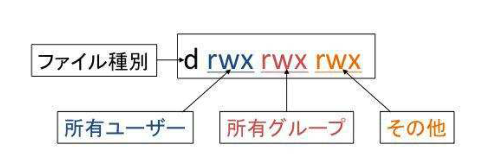

# 8. ユーザ権限とアクセス権

## 8.1 ファイルの所有者と所有グループ
- ファイルの所有者: ユーザID
- ファイルの所有グループ: グループID

### 所有者の変更
ファイルの所有者を変更するには，`chown` コマンドを使う (change owner)．

書式:
```
chown ユーザ [. グループ] ディレクトリ
chown ユーザ [. グループ] ファイル
```

- ユーザとグループを変更するには，root ユーザである必要がある．
- ディレクトリとファイルは区別なく変更できる．
- ユーザとグループの区別に `:` を使うことも可能．

option:
```
-R
ディレクトリを対象にする．
ディレクトリ内のディレクトリやファイルを再帰的にたどって変更する．
```

実行例 (一般ユーザによるファイル作成):
```
ai@ai-VirtualBox:~/Documents/8_owner_workspace$ touch test_file
ai@ai-VirtualBox:~/Documents/8_owner_workspace$ ls -l test_file
-rw-rw-r-- 1 ai ai 0 11月 17 11:21 test_file
```

この標準出力から，現在の所有は，`ai` グループのユーザ `ai` であることがわかる．
一般ユーザは所有者の変更をすることができないことがわかる．

```
ai@ai-VirtualBox:~/Documents/8_owner_workspace$ chown nobody test_file
chown: changing ownership of 'test_file': Operation not permitted
```

root ユーザに切り替えて実行する．
```
ai@ai-VirtualBox:~/Documents/8_owner_workspace$ sudo su
[sudo] password for ai: 
root@ai-VirtualBox:/home/ai/Documents/8_owner_workspace# chown nobody test_file
root@ai-VirtualBox:/home/ai/Documents/8_owner_workspace# ls -l test_file
-rw-rw-r-- 1 nobody ai 0 11月 17 11:21 test_file
```

### 所有グループの変更
ファイルの所有グループを変更するには，`chgrp` コマンドを用いる (change group)．

書式:
```
chgrp グループ ディレクトリ
chgrp グループ ファイル
```

option:
```
-R
ディレクトリを対象にする．ディレクトリ内のディレクトリやファイルを再帰的に変更する．
```

実行例 (テスト用のグループの作成):
```
ai@ai-VirtualBox:~/Documents/8_owner_workspace$ cat /etc/group | grep 1002
ai@ai-VirtualBox:~/Documents/8_owner_workspace$ sudo groupadd -g 1002 testgroup
[sudo] password for ai: 
ai@ai-VirtualBox:~/Documents/8_owner_workspace$ cat /etc/group | grep 1002
testgroup:x:1002:
```

ファイルの作成:
```
ai@ai-VirtualBox:~/Documents/8_owner_workspace$ touch test_group
ai@ai-VirtualBox:~/Documents/8_owner_workspace$ ls -l test_group 
-rw-rw-r-- 1 ai ai 0 11月 17 18:32 test_group
```

一般ユーザで所有グループの変更を試みる:
```
ai@ai-VirtualBox:~/Documents/8_owner_workspace$ chgrp testgroup test_group
chgrp: changing group of 'test_group': Operation not permitted
```

root user で所有グループの変更を試みる:
```
ai@ai-VirtualBox:~/Documents/8_owner_workspace$ sudo chgrp testgroup test_group
ai@ai-VirtualBox:~/Documents/8_owner_workspace$ ls -l test_group 
-rw-rw-r-- 1 ai testgroup 0 11月 17 18:32 test_group
```

<div style="page-break-before:always"></div>

## 8.2 ファイルとアクセス権
- ユーザの分類
    - ファイルを所有するユーザ
    - ファイル所有グループからファイル所有者を除いたユーザ
    - その他のユーザ

この3つのレベルで権限を設定できる．権限としては，

- 権限
    - 読み (read)
    - 書き (write)
    - 実行 (execute)

の3つがある．

ファイルのモードを変更するには，`chmod` コマンドを用いる．

### ファイルに設定できるアクセス
`ls -l` コマンドを実行した際の出力の1つ目のカラムは，ファイルのモードを示している．このカラムは次のような意味である．



また，`r,w,x` はそれぞれ以下のような意味である．

|項目|内容|
|----|----|
|`r`|読み込み|
|`w`|書き込み|
|`x`|実行またはディレクトリの移動|

- rwx は，ユーザとグループとその他の3つに対して指定できる．
    - `r`
        - ファイルの読み込みが可能
    - `w`
        - ファイルの書き込みが可能
    - `x`
        - ファイルをプログラムとして実行できるか，ディレクトリであればディレクトリに移動できる

実行例:
```
ai@ai-VirtualBox:~$ ls -l .bash*
-rw------- 1 ai ai 8939 11月 17 16:45 .bash_history
-rw-r--r-- 1 ai ai  220 11月 16 08:44 .bash_logout
-rw-r--r-- 1 ai ai 3771 11月 16 08:44 .bashrc
```

実行例:
```
ai@ai-VirtualBox:~$ ls -l /usr
total 104
drwxr-xr-x   2 root root 36864 11月 16 18:02 bin
drwxr-xr-x   2 root root  4096  8月 19 19:35 games
drwxr-xr-x  39 root root  4096 11月 16 18:02 include
drwxr-xr-x 110 root root  4096 11月 16 18:02 lib
drwxr-xr-x   2 root root  4096  8月 19 19:29 lib32
drwxr-xr-x   2 root root  4096  8月 19 19:30 lib64
drwxr-xr-x  10 root root  4096 11月 16 09:06 libexec
drwxr-xr-x   2 root root  4096  8月 19 19:29 libx32
drwxr-xr-x  10 root root  4096  8月 19 19:29 local
drwxr-xr-x   2 root root 20480 11月 16 09:22 sbin
drwxr-xr-x 228 root root 12288 11月 16 18:02 share
drwxr-xr-x   6 root root  4096 11月 16 09:07 src
```

### アクセス権の変更
ファイルのアクセス権の変更には，`chmod` コマンドを使用する．

書式:
```
chmod モード[,モード]... ディレクトリ
chmod モード[,モード]... ファイル
chmod 8進数表記のモード ディレクトリ
chmod 8進数表記のモード ディレクトリ
```

ファイルのモードを所有ユーザ，所有グループ，それ以外のユーザについて設定する．モード指定の書き方には次の2通りがある．

- モードの書式を複数書き，カンマで区切って指定．
- 8進数3桁で各ユーザのレベルを指定．

option:
```
-R
ディレクトリを対象にする．ディレクトリ内のディレクトリ，ファイルを再帰的に．
```


- モードは，`u` (所有ユーザ)，`g` (所有グループ)，`o` (その他のユーザ) に対して，`r` (読み)，`w` (書き)，`x` (実行またはディレクトリの変更) に対して
    - `=`: 設定する
    - `+`: 加える
    - `-`: 取り消す
- `u, g, o` の全てに同じ権限を指定するときは，`a` を指定する．

実行例 (ファイルの作成):
```
ai@ai-VirtualBox:~/Documents/8_owner_workspace$ ls -l chownfile
-rw-rw-r-- 1 ai ai 0 11月 17 19:23 chownfile
```

ファイルモードを `rw-r--r--` に変更するためには，以下を実行する:
```
ai@ai-VirtualBox:~/Documents/8_owner_workspace$ chmod u+rw-x,go+r-wx chownfile
ai@ai-VirtualBox:~/Documents/8_owner_workspace$ ls -l chownfile
-rw-r--r-- 1 ai ai 0 11月 17 19:23 chownfile
```

この状態で，グループに書き込み権限を与えるためには，以下を実行する:
```
ai@ai-VirtualBox:~/Documents/8_owner_workspace$ chmod g+w chownfile 
ai@ai-VirtualBox:~/Documents/8_owner_workspace$ ls -l chownfile 
-rw-rw-r-- 1 ai ai 0 11月 17 19:23 chownfile
```

この状態で，ファイルモードを `--w-rw-r--` に変更するためには，user から `r` を取り除き，group に `w` を加える:
```
ai@ai-VirtualBox:~/Documents/8_owner_workspace$ chmod u-r,g+w chownfile 
ai@ai-VirtualBox:~/Documents/8_owner_workspace$ ls -l chownfile 
--w-rw-r-- 1 ai ai 0 11月 17 19:23 chownfile
```

次に，8進数を用いた変更を試みる．

実行例 (ファイルの作成):
```
ai@ai-VirtualBox:~/Documents/8_owner_workspace$ touch chownfile_n
ai@ai-VirtualBox:~/Documents/8_owner_workspace$ ls -l chownfile_n 
-rw-rw-r-- 1 ai ai 0 11月 17 19:30 chownfile_n
```

ファイルモードを 755 に変更する:
```
ai@ai-VirtualBox:~/Documents/8_owner_workspace$ chmod 755 chownfile_n 
ai@ai-VirtualBox:~/Documents/8_owner_workspace$ ls -l chownfile_n 
-rwxr-xr-x 1 ai ai 0 11月 17 19:30 chownfile_n
```

モードの指定には，以下の特殊な属性がある．
- 属性
    - `setuid` ビット: user の属性
    - `setgid` ビット: group の属性
    - `sticky` ビット: others の属性

- `setuid` ビットまたは `setgid` ビットが付いたプログラムを実行すると，ファイル所有者あるいは所有グループの権限で実行される．
    - e.g. root ユーザ所有で `setuid` ビットがセットされたプログラムは，一般ユーザが実行した場合でも root ユーザが実行した場合と同じ動作をする．

- `sticky` ビットが付いたディレクトリ内のファイルは所有者以外が削除できなくなる．
    - Linux では一般的に `/tmp` ディレクトリに `sticky` ビットが付与されている．

実行例:
```
ai@ai-VirtualBox:~/Documents/8_owner_workspace$ ls -l idbitfile
-rw-rw-r-- 1 ai ai 0 11月 17 19:41 idbitfile
ai@ai-VirtualBox:~/Documents/8_owner_workspace$ chmod u+s,g-w idbitfile
ai@ai-VirtualBox:~/Documents/8_owner_workspace$ ls -l idbitfile
-rwSr--r-- 1 ai ai 0 11月 17 19:41 idbitfile

ai@ai-VirtualBox:~/Documents/8_owner_workspace$ chmod u-s,g+s idbitfile
ai@ai-VirtualBox:~/Documents/8_owner_workspace$ ls -l idbitfile
-rw-r-Sr-- 1 ai ai 0 11月 17 19:41 idbitfile

ai@ai-VirtualBox:~/Documents/8_owner_workspace$ chmod +t idbitfile 
ai@ai-VirtualBox:~/Documents/8_owner_workspace$ ls -l idbitfile 
-rw-r-Sr-T 1 ai ai 0 11月 17 19:41 idbitfile
```

### ファイル作成のモード
- ファイルを新規に作成すると，ユーザごとに規定されたパーミッションである `644` または `664` といったパーミッションが設定されて，ファイルが作成される．
- `umask` コマンドを使うことで，指定したパーミッションでファイルを作成するように制限できる．

書式:
```
umask [8進数のモードのマスク値]
```

- 現在のマスク値を表示
    - `umask` コマンドに続けてマスク値を指定しなかった場合，現在のマスク値を表示できる．

- マスク値を変更
    - `umask` コマンドに続けてマスク値を指定すると，コマンド実行後に作成されるファイルが指定したパーミッションで作成される．
        - `umask` コマンドは，許可しないビットを指定する．
        - マスク値は，デフォルトのモード (`666`) から 設定したいモードを各桁ごとに引いたものとして定義される．
            - 差をとって負になったものは，`---` としている．
            

実行例 (`umask` を変更してファイルを作成):
```
ai@ai-VirtualBox:~/Documents/8_owner_workspace$ umask
0002
ai@ai-VirtualBox:~/Documents/8_owner_workspace$ touch file_umask_0002
```

これより，現在のマスク値が `0002` であることがわかる．

マスク値を `0070` に変更してファイルを作成してみる．
```
ai@ai-VirtualBox:~/Documents/8_owner_workspace$ umask 0070
ai@ai-VirtualBox:~/Documents/8_owner_workspace$ touch file_umask_0070
```

次に，マスク値を `0026` に変更してファイルを作成してみる．
```
ai@ai-VirtualBox:~/Documents/8_owner_workspace$ umask 0026 
ai@ai-VirtualBox:~/Documents/8_owner_workspace$ touch file_umask_0026
```

ここまで作ったファイルのパーミッションを確認する．
```
ai@ai-VirtualBox:~/Documents/8_owner_workspace$ ls -l file_umask_0*
-rw-rw-r-- 1 ai ai 0 11月 17 19:53 file_umask_0002
-rw-r----- 1 ai ai 0 11月 17 19:56 file_umask_0026
-rw----rw- 1 ai ai 0 11月 17 19:54 file_umask_0070
```

マスク値が `0002` のとき，others のモードは `6 - 2 = 4` より， `r--` になる．
マスク値が `0070` のとき，group のモードは `---` となる．
マスク値が `0026` のとき，group のモードは `r--` となり，others のモードは `---` となる．

`umask` に `-S` オプションを付けると，モードの表示，設定の際に8進数ではなく，分かりやすい形式になる．
```
ai@ai-VirtualBox:~/Documents/8_owner_workspace$ umask -S
u=rwx,g=rwx,o=rx

ai@ai-VirtualBox:~/Documents/8_owner_workspace$ umask -S u=rw,g=,o=rw
u=rw,g=,o=rw
ai@ai-VirtualBox:~/Documents/8_owner_workspace$ umask
0171
```

ここで，`umask` コマンドによるモードの制限は，`umask` を実行したシェル内でしか有効でないことに注意する．
デフォルトのモードは，`~/.bashrc` 等のログインシェル内で設定することができる．