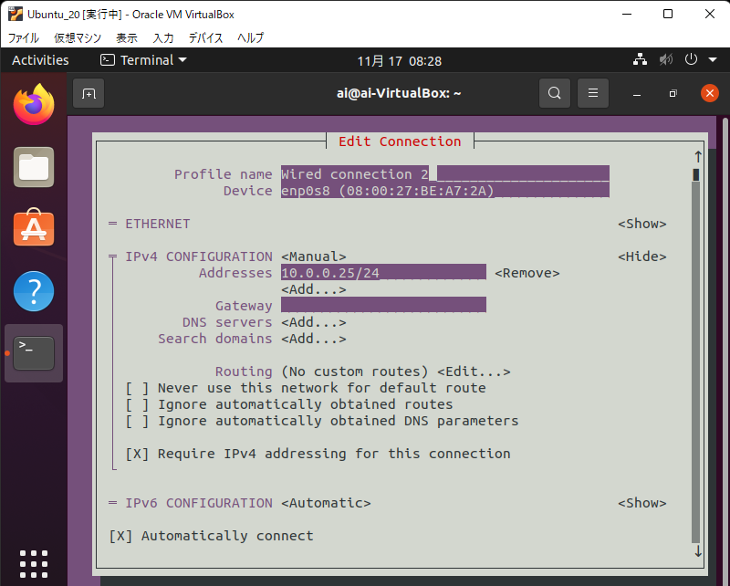

# Study_LPIC
Linux の試験 (LPIC) のために勉強した．

## 勉強のための準備
### 使用した環境
普段からデスクトップ環境として Ubuntu を使っているが，試験勉強に普段使っている Ubuntu を使いたくなかったので，自宅の Windows に仮想マシン (VirtualBox) で Ubuntu 20.04 と CentOS 7 を入れた．

WSL ではなく VirtualBox を使った理由:

- 別の用途で VirtualBox を使っていた
- GUI 環境を使いたかった
- 勉強用だからそれほどマシンスペックが必要ない
- 変なコマンド打って壊しても影響が出ないように隔離したかった

### インストール
ISO ファイルを [公式サイト](https://jp.ubuntu.com/download) から入手し，VirtualBox の仮想マシン作成時にこの ISO ファイルを指定し，あとは指示に従ってインストールする．

#### 名前解決の問題の解消
##### Ubuntu の場合
仮想マシンに入れた Ubuntu は名前解決の問題があることがたまにあり，例えばインストール後の `apt update` の際にエラーが出ることがある．

これは，DNS サーバを指定することで解決する．Linux サーバでよく用いられる DNS は `8.8.8.8` であるので，これを指定する (参考: [Ubuntu 18.04以降でDNSサーバーを変更する方法](https://thr3a.hatenablog.com/entry/20180711/1531285176))．

指定するには，`/etc/systemd/resolved.conf` の `[Resolve]` の `DNS` を
```
DNS=8.8.8.8
```
として，`systemd-resolved` を再起動する．
```
sudo systemctl restart systemd-resolved
```

##### CentOS の場合
CentOS の場合はそもそもネットワークに接続されないというところからスタートした．
具体的には，仮想マシンのネットワークデバイスが disconnected になっていた．まず，この解決から行う．

参考: [centos7のreboot時にネットワークがつながらなくてハマった話](https://qiita.com/hika7719/items/8c2ac1015837cb5b15c7)

```
su -
```
で root user になっておく．

```
nmcli device status
```
でデバイスの状況を見ると，ネットワークデバイス (私の場合 `enp0s3`) が disconnected になっていた．まず，このデバイスを接続する．

```
nmcli connection up enp0s3
```
を実行し，もう一度 `nmcli device status` を実行すると，`enp0s3` が connected になる．
しかし，これは一時的な解決にすぎず，`nmcli con show enp0s3` の connection.autoconnect は no になっているので，再起動した際に自動的に接続されない．

再起動した際も自動的に接続されるように，以下を実行する．
```
nmcli con mod enp0s3 connection.autoconnect "yes"
```

設定を反映させるために，デバイスの再起動を行う．
```
nmcli device disconnect enp0s3
nmcli device connect enp0s3
```

これで，再起動してもネットワークデバイスが接続される．

次に，名前解決の問題を解決する．

参考: [CentOS7 resolv.confの設定](https://www.unix-power.net/networking/post-896)

CentOS 7 のネットワーク周りの設定は NetworkManager が司っており，手動で DNS 関係の `resolv.conf` を編集しても再起動すると元に戻ってしまうということになるらしい．

`resolv.conf` を手動で編集するために，NetworkManager の設定を変更する．
以下のファイルを編集し，NetworkManager を再起動する．

```
vi /etc/NetworkManager/NetworkManager.conf

[main]
dns=none        <- 追記
```

```
systemctl restart NetworkManager
```

上記の変更後，`/etc/resolv.conf` に `nameserver 8.8.8.8` を追加しておく．

この変更後，一旦再起動して `yum update` したところ，うまくいった．

### ssh 接続
仮想マシンに ssh 接続できるようにすると学習効率が上がる．VirtualBox ではネットワークアダプタを複数設定できるので，これを有効活用することで，仮想マシンに ssh 接続する．

#### IP アドレスの設定
1つ目のネットワークアダプタに NAT を指定し，2つ目のネットワークアダプタに ホストオンリーアダプタを指定すると，インターネットと接続するための IP アドレスと，ホスト (ここでは VirtualBox を入れている Windows マシン) と接続するための IP アドレスの2つが割り振られる．

```
ai@ai-VirtualBox:~$ ifconfig
enp0s3: flags=4163<UP,BROADCAST,RUNNING,MULTICAST>  mtu 1500
        inet 10.0.2.15  netmask 255.255.255.0  broadcast 10.0.2.255
        inet6 fe80::f7b0:c511:dab7:abb3  prefixlen 64  scopeid 0x20<link>
        ether 08:00:27:5a:8a:63  txqueuelen 1000  (Ethernet)
        RX packets 804  bytes 880136 (880.1 KB)
        RX errors 0  dropped 0  overruns 0  frame 0
        TX packets 559  bytes 49944 (49.9 KB)
        TX errors 0  dropped 0 overruns 0  carrier 0  collisions 0

enp0s8: flags=4163<UP,BROADCAST,RUNNING,MULTICAST>  mtu 1500
        inet 10.0.0.25  netmask 255.255.255.0  broadcast 10.0.0.255
        inet6 fe80::b70e:186:6cb1:8744  prefixlen 64  scopeid 0x20<link>
        ether 08:00:27:be:a7:2a  txqueuelen 1000  (Ethernet)
        RX packets 2808  bytes 450777 (450.7 KB)
        RX errors 0  dropped 0  overruns 0  frame 0
        TX packets 640  bytes 82831 (82.8 KB)
        TX errors 0  dropped 0 overruns 0  carrier 0  collisions 0

lo: flags=73<UP,LOOPBACK,RUNNING>  mtu 65536
        inet 127.0.0.1  netmask 255.0.0.0
        inet6 ::1  prefixlen 128  scopeid 0x10<host>
        loop  txqueuelen 1000  (Local Loopback)
        RX packets 282  bytes 24798 (24.7 KB)
        RX errors 0  dropped 0  overruns 0  frame 0
        TX packets 282  bytes 24798 (24.7 KB)
        TX errors 0  dropped 0 overruns 0  carrier 0  collisions 0

```

参考までに私の仮想マシンのネットワーク環境を載せる．`enp0s3` が NAT に対応するインタフェースで，`enp0s8` がホストオンリーアダプタに対応するインタフェースである．特に設定しなければ DHCP で自動的に IP アドレスが割り振られるが，ssh 接続するときに便利になるようにホストオンリーアダプタに対応する IP アドレスを固定する．`nmtui` というコマンドを使う．

```
ai@ai-VirtualBox:~$ sudo nmtui
```

例えば，IP アドレスを `10.0.0.25/24` に固定するときは，Edit a connection -> 対応するケーブルを選択し，以下のように設定する．



ここで，`[]` にチェックを入れるためには，`[]` でスペースキーを押すとよい．

#### ssh の設定 (仮想マシン側)
OpenSSH Server をインストールする．
```
sudo apt update
sudo apt -y install openssh-server
```

そして，仮想マシンの電源を入れると常に OpenSSH Server が起動するように，以下の設定をする．
```
sudo systemctl enable ssh
sudo systemctl start ssh
```

公開鍵認証もできるが，勉強用なのでパスワード認証でも良いだろう．

#### ssh の設定 (Windows 側)
毎回 IP アドレスを入力して接続するのは面倒なので，Windows 側の ssh の設定ファイルを編集する．

設定ファイルは `C:Users\[username]\.ssh\config` などにある (VSCode の拡張機能で Remote SSH などを入れると，Open SSH Configure File からこのファイルを開くことができる)．

このファイルに設定を追記する．私の場合は以下を追加した．

```
Host ubuntu_vbox
    HostName 10.0.0.25  # IP address
    User ai     # your username
```

このように設定すると，
```
ssh ubuntu_vbox
```
で接続できる．