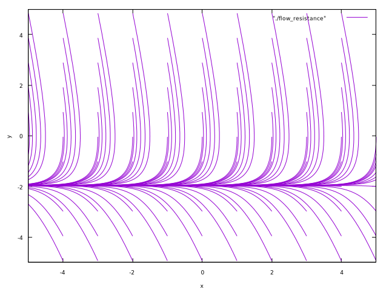
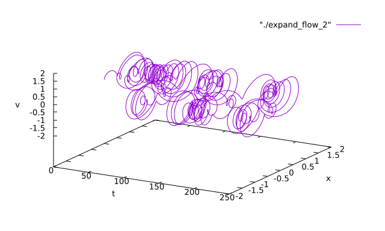

<!-- paginate: true -->

# 基礎からの力学系 (第3章)
#### 参考文献
- [小室，基礎からの力学系，サイエンス社，2002](https://www.saiensu.co.jp/book_support/sgc-17/)
#### Table of contents
- 物体の落下

---
### 物体の落下
原点$O$から鉛直上向きに$x$軸を取り，高さ$x_0$の点から初速度$v_0$で投げ上げた質量$m$の物体の運動
1. 空気抵抗を無視した場合
  $$
  m \frac{d^2x}{dt^2} = -mg \ \ (3.1)
  $$
  $\rightsquigarrow$ $dx/dt = v$とおくと，
  $$
  \begin{cases}
    \frac{dx}{dt} = v \\
    \frac{dv}{dt} = -g
  \end{cases} \ \ (3.2)
  $$
  $\rightsquigarrow$ 2次元自律ベクトル場

---
時刻$t = 0$のとき，$x = x_0, v = v_0$を通る軌道は，
$$
\begin{cases}
  x(t) = \frac{1}{2}gt^2 + v_0t + x_0 \\
  v(t) = -gt + v_0
\end{cases} \ \ (3.3)
$$
で与えられる．

2. 速度に比例する空気抵抗がある場合 (比例定数: $\gamma$)
  $$
  \begin{cases}
    \frac{dx}{dt} = v \\
    \frac{dv}{dt} = -g - \gamma v 
  \end{cases} \ \ (3.4)
  $$
  である．

---
<!--
_footer: '空気抵抗がない場合'
-->
 

---
<!--
_footer: '空気抵抗がある場合'
-->
 

---
### 単振動
質点の運動が一直線上にあり，加速度が常にその直線上の一定点に向かい，大きさがその定点からの距離に比例している運動．
- $L$: バネの自然長，$m$: おもりの質量，$O$: 原点(固定端)，$k$: ばね定数
- $L_0$: おもりに働く重力とばねの変形がつりあう位置
  $$
  k(L_0 - L) = mg \ \ (3.5)
  $$
- $y$: $L_0$からの変位
  $$
  y = x - L_0 \ \ (3.6)
  $$

---
1. バネの質量が無視でき，空気抵抗などによる減衰がないとき
  $$
  m \frac{d^2 x}{dt^2} = -k(x - L) + mg \ \ (3.7) \\
  \Longleftrightarrow m \frac{d^2y}{dt^2} = -ky \ \ (3.8) \\
  \Longleftrightarrow \begin{cases}
    \frac{dy}{dt} = v \\
    \frac{dv}{dt} = - \frac{k}{m}y
  \end{cases} \ \ (3.9)
  $$
  $\rightsquigarrow$ 2次元自律系．

---
ODEの一般解は，
  $$
  y = a \sin(\omega_0 t + \alpha), \ \omega_0 = \frac{k}{m}. \ \ (3.10)
  $$
ただし，$a, \alpha$は任意定数．

時刻$t = 0$で$y = y_0, v = v_0$を通る解の場合，$a, \alpha$は，
$$
\begin{cases}
y_0 = a \sin \alpha \\
v_0 = \frac{ak}{m} \cos \alpha
\end{cases} \ \ (3.11)
$$
から定まる．

---
2. 速さに比例する抵抗力 (粘性抵抗) が働く場合 ($c$: 比例定数)
  $$
  m \frac{d^2y}{dt^2} = -ky - c \frac{dy}{dt} \ \ (3.12) \\
  \Longleftrightarrow \begin{cases}
    \frac{dy}{dt} = v \\
    \frac{dv}{dt} = -\frac{k}{m}y - \frac{c}{m}v
  \end{cases} \ \ (3.13)
  $$

---
3. おもりに鉛直方向の周期的外力が働く場合

周期的外力が
  $$
  F_{\mathrm{ex}} = B \sin \Omega t \ \ (3.14)
  $$
  で与えられる場合，運動方程式は，
  $$
  m \frac{d^2y}{dt^2} = -ky + B \sin \Omega t \ \ (3.15) \\
  \Longleftrightarrow \begin{cases}
    \frac{dy}{dt} = v \\
    \frac{dv}{dt} = - \frac{k}{m}y + \frac{B}{m} \sin \Omega t
  \end{cases} \ \ (3.16)
  $$
  $\rightsquigarrow$ 2次元の非自律系ベクトル場

---
4. 鉛直方向の周期的外力に加え，さらに粘性抵抗も働く場合

$$
m \frac{d^2y}{dt^2} = -ky - c \frac{dy}{dt} + B \sin \Omega t \ \ (3.17) \\
  \Longleftrightarrow \begin{cases}
    \frac{dy}{dt} = v \\
    \frac{dv}{dt} = - \frac{k}{m}y - \frac{c}{m}v + \frac{B}{m} \sin \Omega t
  \end{cases} \ \ (3.18)
$$

5. 質点に直接外力は作用しないが，振動系の支台に周期的に変わる変位が加わる場合

ばねを支持する台が上下に
$$
x_1 = B \sin \Omega t \ \ (3.19)
$$
で振動するとする．

---
$y$: おもりのつりあいの位置からの変位
$\rightsquigarrow$ $y - x_1$: 支台に対するおもりの相対変位

運動方程式は，
$$
m \frac{d^2y}{dt^2} = -k(y - x_1) \ \ (3.20) \\
\Longleftrightarrow m\frac{d^2 y}{dt^2} = -k(y - B \sin \Omega t) \ \ (3.21) \\
  \Longleftrightarrow \begin{cases}
    \frac{dy}{dt} = v \\
    \frac{dv}{dt} = - \frac{k}{m}y + \frac{kB}{m} \sin \Omega t
  \end{cases} \ \ (3.22)
$$
$\rightsquigarrow$ おもりに鉛直方向の周期的外力
$$
F_{\mathrm{ex}} = kB \sin \Omega t \ \ (3.23)
$$
が働く場合と同じ．

---
<!--
_footer: '空気抵抗がない場合'
-->
 

---
<!--
_footer: '空気抵抗がある場合'
-->
 

---

<!--
_footer: '外力が働く場合'
-->
") 

---
### ダフィング (Duffing) 方程式
- 減衰的な駆動振動子のモデル
  $$
  \frac{d^2 x}{dt^2} + \delta \frac{dx}{dt} + \alpha x + \beta x^3 = \gamma \cos \Omega t  \ \ (3.24) \\
  \Longleftrightarrow \begin{cases}
  \frac{dx}{dt} = v \\
  \frac{dv}{dt} = -\alpha x - \beta x^3 - \delta v + \gamma \cos \Omega t 
  \end{cases} \ \ (3.25)
  $$
  - $\alpha$: 剛性の大きさ
  - $\beta$: 復元力に含まれる非線形性
  - $\gamma$: 周期駆動力の振幅
  - $\Omega$: 周期駆動力の周波数
  - $\delta$: 減衰の大きさ

---
Duffing方程式のパラメータを次のように設定する．
- $\alpha = -1, \beta = 1, \gamma = 1, \delta = 0.2, \Omega = 0.4\pi$

また，初期状態$x(0), v(0)$を次のようにする．
1. $x(0) = 0, v(0) = 0.05$
2. $x(0) = 0, v(0) = 0.06$

このとき，
- 状態$x$の時間応答
- $x-v$空間 (相空間) の軌道
- $t-x-v$空間 (拡大相空間) の軌道

を示す．

---
<!--
_footer: '時間応答．初期速度がわずかに異なると，状態の時間応答が大きく異なっている．'
-->
 

---
<!--
_footer: '相空間の軌道'
-->
 

---
<!--
_footer: '拡大相空間の軌道'
-->
 

---
### 1階微分方程式
$x$を独立変数，$y$を未知関数とする1階微分方程式が
$$
\frac{dy}{dx} = \frac{f(x, y)}{g(x, y)} \ \ (3.33)
$$
で与えられているとする．
$\rightsquigarrow$ $x \rightarrow t$とすると，1次元非自律ベクトル場が得られる．
$$
\frac{dy}{dt} = \frac{f(t, y)}{g(t, y)}
$$
$\rightsquigarrow$ 別の見方をする．

---

$x, y$が媒介変数$t$の関数であることを考えると，
$$
\frac{dy}{dx} = \frac{\frac{dy}{dt}}{\frac{dx}{dt}} \ \ (3.35)
$$
が成り立つ．
$\rightsquigarrow$ 2次元の自律ベクトル場
$$
\begin{cases}
  \frac{dx}{dt} = g(x, y) \\
  \frac{dy}{dt} = f(x, y)
\end{cases} \ \ (3.36)
$$
を考えると，解曲線$(x(t), y(t))$はODE (3.33) の解となる．

---
###### 変数分離形微分方程式
$$
\frac{dy}{dx} = \frac{f(x)}{g(y)} \ \ (3.37)
$$
を変数分離形という．一般解は
$$
\int g(y) dy = \int f(x) dx + c \ \ (3.38)
$$
で与えられる．

$$
\frac{dy}{dx} = \frac{-(1 - x)y}{(1 - y)x} \ \ (3.39)
$$
は変数分離形である．これは，次の2次元自律ベクトル場で表現される．
$$
\begin{cases}
  \frac{dx}{dt} = (1 - y)x \\
  \frac{dy}{dt} = -(1 - x)y
\end{cases} \ \ (3.40)
$$

---
<!--
_footer: '1. 変数分離形'
-->
 

---

###### 同次形微分方程式
$$
\frac{dy}{dx} = f\left( \frac{x}{y} \right) \ \ (3.41)
$$
変数変換
$$
\frac{y}{x} = v \ \ (3.42)
$$
で変数分離形になる．

$$
\frac{dy}{dx} = \frac{-y^2}{x(x - y)} \ \ (3.43)
$$
は同次形．これは次の2次元自律ベクトル場で表現される．
$$
\begin{cases}
  \frac{dx}{dt} = x(x - y) \\
  \frac{dy}{dt} = -y^2
\end{cases} \ \ (3.44)
$$

---
<!--
_footer: '2. 同次形'
-->
 

---

###### 線形微分方程式
$$
\frac{dy}{dx} + P(x)y = Q(x) \ \ (3.45)
$$
一般解は，
$$
y = e^{-\int P dx} \left(\int Q e^{\int P dx} dx + c \right) \ \ (3.46)
$$
$$
\frac{dy}{dx} = \frac{\cos^2 x + y \sin x}{\cos x} \ \ (3.47)
$$
は線形微分方程式．これは次の2次元自律ベクトル場で表現できる．
$$
\begin{cases}
  \frac{dx}{dt} = \cos x \\
  \frac{dy}{dt} = \cos^2 x + y \sin x
\end{cases} \ \ (3.48)
$$

---

<!--
_footer: '3. 線形微分方程式'
-->
 

---

###### ベルヌーイの微分方程式
$$
\frac{dy}{dx} + P(x)y = Q(x)y^n \ (n \neq 0, 1) \ \ (3.49)
$$
変数変換
$$
z = y^{1 - n} \ \ (3.50)
$$
によって線形微分方程式になる．
$$
\frac{dy}{dx} = \frac{-y + x^3 y^3}{x} \ \ (3.51)
$$
はベルヌーイの微分方程式．これは次の2次元自律ベクトル場として表現される．
$$
\begin{cases}
  \frac{dx}{dt} = x \\
  \frac{dy}{dt} = -y + x^3 y^3
\end{cases} \ \ (3.52)
$$

---

<!--
_footer: '4. ベルヌーイ'
-->
 

---
###### 完全微分方程式
$$
P(x, y)dx + Q(x, y)dy = 0 \ \ (3.53)
$$
の左辺がある関数$u(x, y)$の全微分$du = u_x dx + u_y dy$になっているとき，完全微分方程式という．一般解は，
$$
\int_a^x P(x, y) dx + \int_b^y Q(x, y)dy = c \ \ (3.54)
$$
で与えられる．$a,b$: 定数，$c$: 任意定数．
$$
\frac{dy}{dx} = \frac{-x^3 -2xy - y}{y^3 + x^2 + x} \ \ (3.55)
$$
は完全微分方程式．これは次の2次元自律ベクトル場で表現される．
$$
\begin{cases}
  \frac{dx}{dt} = y^3 + x^2 + x \\
  \frac{dy}{dt} = -x^3 - 2xy - y
\end{cases} \ \ (3.56)
$$

---

<!--
_footer: '5. 完全微分方程式'
-->
 

---
### 2階微分方程式
$x$を独立変数，$y$を未知関数とする2階微分方程式が
$$
\frac{d^2y}{dx^2} = \frac{f(x, y, y^{\prime})}{g(x, y, y^{\prime})} \ \ (3.57)
$$
で与えられているとする．$x, y$が媒介変数$t$の関数であると考えると，
$$
\frac{dy^{\prime}}{dx} = \frac{\frac{dy^{\prime}}{dt}}{\frac{dx}{dt}} \ \ (3.58) \\
\frac{dy}{dx} = y^{\prime} = \frac{\frac{dy}{dt}}{\frac{dx}{dt}} \ \ (3.59)
$$
が成り立つ．

---
3次元のベクトル場
$$
\begin{cases}
  \frac{dx}{dt} = g(x, y, y^{\prime}) \\
  \frac{dy}{dt} = y^{\prime}g(x, y, y^{\prime}) \\
  \frac{dy^{\prime}}{dt} = f(x, y, y^{\prime})
\end{cases} \ \ (3.60)
$$
を考えると，解曲線$(x(t), y(t), y^{\prime}(t))$は微分方程式(3.60)の解となる．

---
###### 例 (1)
$$
\frac{d^2y}{dx^2} = -y \ \ (3.61)
$$
は，$dy/dx = z$とおくことで，次の3次元自律ベクトル場に表現される．
$$
\begin{cases}
  \frac{dx}{dt} = 1 \\
  \frac{dy}{dt} = z \\
  \frac{dz}{dt} = -y
\end{cases} \ \ (3.62)
$$

(3.61)の一般解は，
$$
y = A \cos x + B \sin x \ \ (3.63)
$$
で与えられる．

---

---

### ストレンジアトラクタを持つ3次元自律ベクトル場
- アトラクタ
  - 力学系の相空間で，周囲の軌道を引き寄せて逃さない性質を持つ不変集合
  - 点アトラクタ，周期アトラクタ，準周期アトラクタ
- ストレンジアトラクタ
  - 1960年代にコンピュータの発達・普及により従来知られていなかったアトラクタが多く見つかった．

---
###### ローレンツアトラクタ
$$
\begin{cases}
  \frac{dx}{dt} = -\sigma (x - y) \\
  \frac{dy}{dt} = -y - xz + rx \\
  \frac{dz}{dt} = xy - bz
\end{cases} \ \ (3.68)
$$

温度差のある上下の境界を持つ容器に入った流体の流れをモデル化したもの．
- $x$: 流れの関数をフーリエ展開したときの係数に対応．対流の強さを表す．
- $y$: 上昇流と下降流の温度差
- $z$: 上下方向の温度差
- $\sigma$: ブランドル数，$r$: レイリー数，$b$: 容器の高さと幅の比から定まる数

$\rightsquigarrow (\sigma, r, b) = (10, 28, 8/3)$のとき，ローレンツアトラクタ．

---
