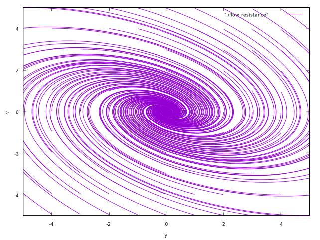

<!-- paginate: true -->

# 基礎からの力学系 (第3章)
#### 参考文献
- [小室，基礎からの力学系，サイエンス社，2002](https://www.saiensu.co.jp/book_support/sgc-17/)
#### Table of contents
- 物体の落下

---
### 物体の落下
原点$O$から鉛直上向きに$x$軸を取り，高さ$x_0$の点から初速度$v_0$で投げ上げた質量$m$の物体の運動
1. 空気抵抗を無視した場合
  $$
  m \frac{d^2x}{dt^2} = -mg \ \ (3.1)
  $$
  $\rightsquigarrow$ $dx/dt = v$とおくと，
  $$
  \begin{cases}
    \frac{dx}{dt} = v \\
    \frac{dv}{dt} = -g
  \end{cases} \ \ (3.2)
  $$
  $\rightsquigarrow$ 2次元自律ベクトル場

---
時刻$t = 0$のとき，$x = x_0, v = v_0$を通る軌道は，
$$
\begin{cases}
  x(t) = \frac{1}{2}gt^2 + v_0t + x_0 \\
  v(t) = -gt + v_0
\end{cases} \ \ (3.3)
$$
で与えられる．

2. 速度に比例する空気抵抗がある場合 (比例定数: $\gamma$)
  $$
  \begin{cases}
    \frac{dx}{dt} = v \\
    \frac{dv}{dt} = -g - \gamma v 
  \end{cases} \ \ (3.4)
  $$
  である．

---
<!--
_footer: '空気抵抗がない場合'
-->
 

---
<!--
_footer: '空気抵抗がある場合'
-->
 

---
### 単振動
質点の運動が一直線上にあり，加速度が常にその直線上の一定点に向かい，大きさがその定点からの距離に比例している運動．
- $L$: バネの自然長，$m$: おもりの質量，$O$: 原点(固定端)，$k$: ばね定数
- $L_0$: おもりに働く重力とばねの変形がつりあう位置
  $$
  k(L_0 - L) = mg \ \ (3.5)
  $$
- $y$: $L_0$からの変位
  $$
  y = x - L_0 \ \ (3.6)
  $$

---
1. バネの質量が無視でき，空気抵抗などによる減衰がないとき
  $$
  m \frac{d^2 x}{dt^2} = -k(x - L) + mg \ \ (3.7) \\
  \Longleftrightarrow m \frac{d^2y}{dt^2} = -ky \ \ (3.8) \\
  \Longleftrightarrow \begin{cases}
    \frac{dy}{dt} = v \\
    \frac{dv}{dt} = - \frac{k}{m}y
  \end{cases} \ \ (3.9)
  $$
  $\rightsquigarrow$ 2次元自律系．

---
ODEの一般解は，
  $$
  y = a \sin(\omega_0 t + \alpha), \ \omega_0 = \frac{k}{m}. \ \ (3.10)
  $$
ただし，$a, \alpha$は任意定数．

時刻$t = 0$で$y = y_0, v = v_0$を通る解の場合，$a, \alpha$は，
$$
\begin{cases}
y_0 = a \sin \alpha \\
v_0 = \frac{ak}{m} \cos \alpha
\end{cases} \ \ (3.11)
$$
から定まる．

---
2. 速さに比例する抵抗力 (粘性抵抗) が働く場合 ($c$: 比例定数)
  $$
  m \frac{d^2y}{dt^2} = -ky - c \frac{dy}{dt} \ \ (3.12) \\
  \Longleftrightarrow \begin{cases}
    \frac{dy}{dt} = v \\
    \frac{dv}{dt} = -\frac{k}{m}y - \frac{c}{m}v
  \end{cases} \ \ (3.13)
  $$

---
3. おもりに鉛直方向の周期的外力が働く場合

周期的外力が
  $$
  F_{\mathrm{ex}} = B \sin \Omega t \ \ (3.14)
  $$
  で与えられる場合，運動方程式は，
  $$
  m \frac{d^2y}{dt^2} = -ky + B \sin \Omega t \ \ (3.15) \\
  \Longleftrightarrow \begin{cases}
    \frac{dy}{dt} = v \\
    \frac{dv}{dt} = - \frac{k}{m}y + \frac{B}{m} \sin \Omega t
  \end{cases} \ \ (3.16)
  $$
  $\rightsquigarrow$ 2次元の非自律系ベクトル場

---
4. 鉛直方向の周期的外力に加え，さらに粘性抵抗も働く場合

$$
m \frac{d^2y}{dt^2} = -ky - c \frac{dy}{dt} + B \sin \Omega t \ \ (3.17) \\
  \Longleftrightarrow \begin{cases}
    \frac{dy}{dt} = v \\
    \frac{dv}{dt} = - \frac{k}{m}y - \frac{c}{m}v + \frac{B}{m} \sin \Omega t
  \end{cases} \ \ (3.18)
$$

5. 質点に直接外力は作用しないが，振動系の支台に周期的に変わる変位が加わる場合

ばねを支持する台が上下に
$$
x_1 = B \sin \Omega t \ \ (3.19)
$$
で振動するとする．

---
$y$: おもりのつりあいの位置からの変位
$\rightsquigarrow$ $y - x_1$: 支台に対するおもりの相対変位

運動方程式は，
$$
m \frac{d^2y}{dt^2} = -k(y - x_1) \ \ (3.20) \\
\Longleftrightarrow m\frac{d^2 y}{dt^2} = -k(y - B \sin \Omega t) \ \ (3.21) \\
  \Longleftrightarrow \begin{cases}
    \frac{dy}{dt} = v \\
    \frac{dv}{dt} = - \frac{k}{m}y + \frac{kB}{m} \sin \Omega t
  \end{cases} \ \ (3.22)
$$
$\rightsquigarrow$ おもりに鉛直方向の周期的外力
$$
F_{\mathrm{ex}} = kB \sin \Omega t \ \ (3.23)
$$
が働く場合と同じ．

---
<!--
_footer: '空気抵抗がない場合'
-->
 

---
<!--
_footer: '空気抵抗がある場合'
-->
 

---

<!--
_footer: '外力が働く場合'
-->
") 

---
### ダフィング (Duffing) 方程式
- 減衰的な駆動振動子のモデル
  $$
  \frac{d^2 x}{dt^2} + \delta \frac{dx}{dt} + \alpha x + \beta x^3 = \gamma \cos \Omega t  \ \ (3.24) \\
  \Longleftrightarrow \begin{cases}
  \frac{dx}{dt} = v \\
  \frac{dv}{dt} = -\alpha x - \beta x^3 - \delta v + \gamma \cos \Omega t 
  \end{cases} \ \ (3.25)
  $$
  - $\alpha$: 剛性の大きさ
  - $\beta$: 復元力に含まれる非線形性
  - $\gamma$: 周期駆動力の振幅
  - $\Omega$: 周期駆動力の周波数
  - $\delta$: 減衰の大きさ

---
Duffing方程式のパラメータを次のように設定する．
- $\alpha = -1, \beta = 1, \gamma = 1, \delta = 0.2, \Omega = 0.4\pi$

また，初期状態$x(0), v(0)$を次のようにする．
1. $x(0) = 0, v(0) = 0.05$
2. $x(0) = 0, v(0) = 0.06$

このとき，
- 状態$x$の時間応答
- $x-v$空間 (相空間) の軌道
- $t-x-v$空間 (拡大相空間) の軌道

を示す．

---
<!--
_footer: '時間応答．初期速度がわずかに異なると，状態の時間応答が大きく異なっている．'
-->
 

---
<!--
_footer: '相空間の軌道'
-->
 

---
<!--
_footer: '拡大相空間の軌道'
-->
 
