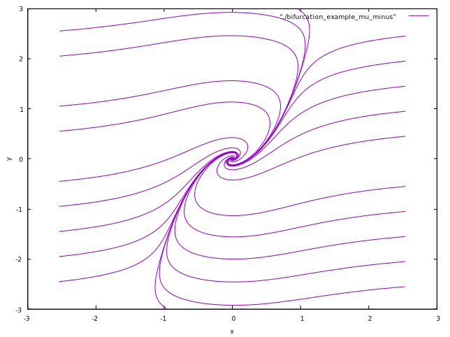
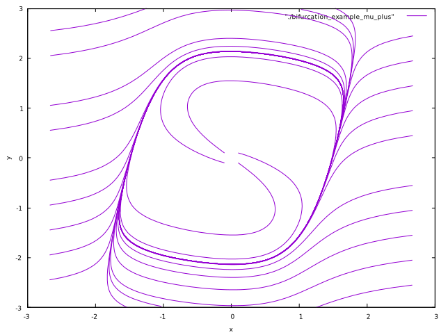
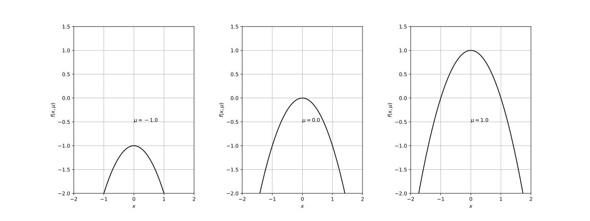
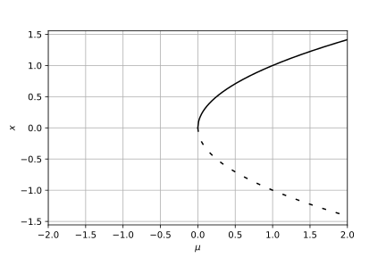
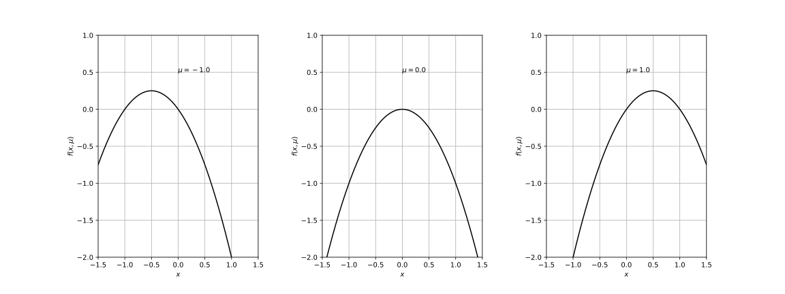
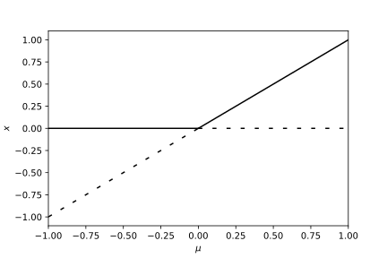
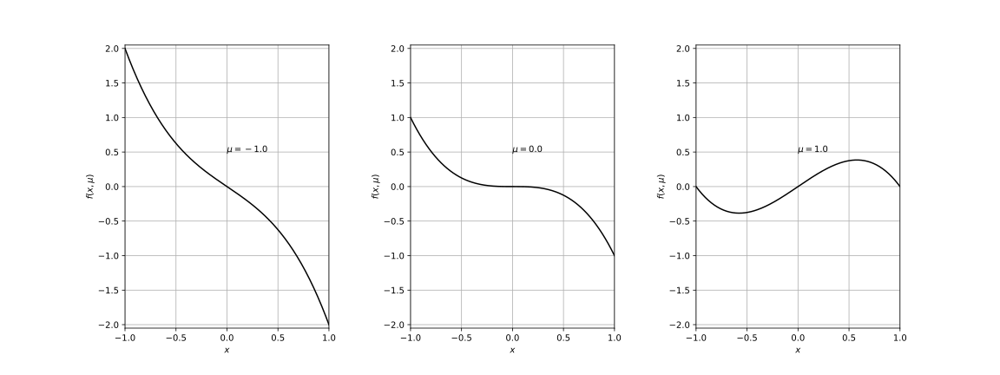
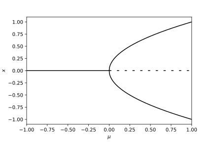

<!-- paginate: true -->

# 基礎からの力学系 (第6章)
#### 参考文献
- [小室，基礎からの力学系，サイエンス社，2002](https://www.saiensu.co.jp/book_support/sgc-17/)
#### Table of contents
- ベクトル場の平衡点の分岐

---
### はじめに ― 分岐現象とは ―
この章では，パラメータをもつ力学系を扱う．
分岐現象: パラメータを変化させたとき力学系の振る舞いが定性的に変化する現象

次の例を考える．
$$
\begin{cases}
    \dot{x} = y + \mu x - x^3 \\
    \dot{y} = -x
\end{cases} \ \ (6.1)
$$
- $\mu < 0$: 原点が安定平衡点
- $\mu > 0$: 原点は不安定平衡点．周囲に周期起動が発生する．

$\rightsquigarrow$ パラメータを変化させるとき，ある値を境にその前後でベクトル場の様子が質的に変化するとき，力学系は分岐を起こしたという．

---
<!--
_footer: 'ベクトル場の平衡点の分岐: $\mu = -1.0$ (左)，$\mu = 2.0$ (右)'
-->
 

---
###### Def 6.1 
パラメータ$\mu \in \mathbb{R}^p$を持つベクトル場
$$
\dot{\boldsymbol{x}} = f(\boldsymbol{x}, \mu), \ \ \boldsymbol{x} \in \mathbb{R}^n \ \ (6.2)
$$
を考える．$\mu = \mu_0$のとき，$\boldsymbol{x} = \boldsymbol{x}_0$が平衡点であるとする．
$$
f(\boldsymbol{x}_0, \mu_0) = \boldsymbol{0} \ \ (6.3)
$$
$\boldsymbol{x}_0$において線形化して得られる線形ベクトル場
$$
\dot{\boldsymbol{u}} = A \boldsymbol{u}, \ \ \boldsymbol{u} \in \mathbb{R}^n \ \ (6.4) \\
A = D_{\boldsymbol{x}} f(\boldsymbol{x}_0, \mu_0) = \left( \frac{\partial f}{\partial x_j} (\boldsymbol{x}_0, \mu_0) \right)_{1 \leq i,j \leq n} \ \ (6.5)
$$
において，$A$のどの固有値も虚軸上にないとき，平衡点$\boldsymbol{x}_0$は双曲型であるという．

---

###### Def 6.1 (続き)
$\boldsymbol{x}_0$が双曲型で，$A$の全ての固有値の実部が負であるとき，$\boldsymbol{x}_0$は安定であるという．$\boldsymbol{x}_0$が双曲型で，$A$の少なくとも1つの固有値の実部が正であるとき，$\boldsymbol{x}_0$は不安定であるという．

ベクトル場の平衡点が分岐を起こさないための十分条件を与える定理を以下に示す．
###### Th 6.1
$\mu = \mu_0$において平衡点$\boldsymbol{x}_0$が双曲型であれば，パラメータ$\mu$を$\mu_0$の近傍で変化させるとき，平衡点は持続して，安定性の型は変化しない．

$\rightsquigarrow$ ベクトル場の平衡点の分岐を考えるには，$\mu = 0$のとき，原点に非双曲型平衡点を持つ場合を考えればよい．

---

### 1次元ベクトル場のサドル・ノード分岐
1次元ベクトル場
$$
\dot{x} = f(x, \mu) = \mu - x^2, \ \ x \in \mathbb{R}, \mu \in \mathbb{R} \ \ (6.6)
$$
を考える．

ベクトル場の特徴
1. $\mu < 0$: ベクトル場は平衡点を持たない．
2. $\mu = 0$: ベクトル場は$x = 0$に固有値$0$を持つ平衡点を持つ．
3. $\mu > 0$: ベクトル場は2つの平衡点$P^{+} = \sqrt{\mu}$と$P^{-} = -\sqrt{\mu}$を持つ．
  - $P^{+}$の固有値は$f(\sqrt{\mu}, \mu) = -2\sqrt{\mu} < 0$で安定
  - $P^{-}$の固有値は$f(-\sqrt{\mu}, \mu) = 2\sqrt{\mu} > 0$で不安定

---
<!--
_footer: 'サドル・ノード分岐: $f(x, \mu)$のグラフの変化'
-->
 

---
<!--
_footer: '$(\mu, x)$-平面でのサドル・ノード分岐'
-->

---
パラメータの変化に伴い，安定平衡点と不安定平衡点が接近し，合体し，そして消滅する．
$\rightsquigarrow$ サドル・ノード分岐
- 2次元ベクトル場での対応する分岐が安定結節点 (ノード) と鞍状点 (サドル) との合体になることによる．

一般に1次元ベクトル場
$$
\dot{x} = f(x, \mu) \ \ (6.7)
$$
が$f(0, 0) = 0, \ f_x(0, 0) = 0$を満たすとき，
$$
f_{\mu}(0, 0) \neq 0, \ f_{xx}(0, 0) \neq 0 \ \ (6.8)
$$
ならば，$\mu = 0$のとき$x = 0$においてサドル・ノード分岐が生じる．

---

サドル・ノード分岐を生じる1次元ベクトル場の標準形は，
$$
\dot{x} = \mu \mp x^2 \ \ (6.9)
$$
で与えられる．

1次元ベクトル場において一般的に観測されるのはサドル・ノード分岐のみ．
しかし，系に対称性などの拘束条件がある場合には，さらに特殊な分岐が観測されることがある．
- トランスクリティカル分岐
- ピッチフォーク分岐

---
### 1次元ベクトル場のトランスクリティカル分岐
ベクトル場$\dot{x} = f(x, \mu)$が，$x = 0$に常に平衡点を持つという拘束条件
$$
f(0, \mu) = 0 \ \ (6.10)
$$
の下で一般的に生じる分岐である．

1次元ベクトル場
$$
\dot{x} = f(x, \mu) = x(\mu - x) \ \ (6.11)
$$
を考える．
1. $\mu < 0$: 平衡点$O = (0)$は固有値$\mu < 0$を持ち，安定．平衡点$P = (\mu)$は固有値$-\mu > 0$を持ち，不安定．
2. $\mu = 0$: 平衡点は$O = (0)$のみ．固有値は$0$．
3. $\mu > 0$: 平衡点$O$は不安定，$P$は安定．

---
<!--
_footer: 'トランスクリティカル分岐: $f(x, \mu)$のグラフの変化'
-->
 

---
<!--
_footer: '$(\mu, x)$-平面でのトランスクリティカル分岐'
-->

---

パラメータの変化に伴い，平衡点$O$に他の平衡点$P$がぶつかり，通過する．
$\rightsquigarrow$ $O$は安定から不安定に，$P$は不安定から安定に (平衡点の安定性の交代)
$\rightsquigarrow$ トランスクリティカル分岐 (安定性交代型分岐)

一般に1次元ベクトル場
$$
\dot{x} = f(x, \mu) \ \ (6.12)
$$
が$f(0, 0) = 0, \ f_{x}(0, 0) = 0$を満たすとき，
$$
f_{\mu}(0, 0) = 0, \ f_{x \mu}(0, 0) \neq 0, \ f_{x x}(0, 0) \neq 0 \ \ (6.13)
$$
ならば$\mu = 0$のとき$x = 0$においてトランスクリティカル分岐が生じる．

トランスクリティカル分岐を生じる1次元ベクトル場の標準形は
$$
\dot{x} = \mu x \mp x^2 \ \ (6.14)
$$
で与えられる．

---

### 1次元ベクトル場のピッチフォーク分岐
ベクトル場$\dot{x} = f(x, \mu)$が$x$に関して奇関数
$$
f(-x, \mu) = -f(x, \mu) \ \ (6.15)
$$
であるという拘束条件の下で一般に生じる分岐である．
$x$に関して奇関数 $\Rightarrow$ 原点は平衡点 より，この拘束条件はトランスクリティカル分岐の拘束条件よりも強い．

---

1次元ベクトル場
$$
\dot{x} = f(x, \mu) = x(\mu - x^2) \ \ (6.16)
$$
を考える．
1. $\mu < 0$: $x = 0$に固有値$\mu < 0$の安定平衡点$O$を持つ．
2. $\mu = 0$: $x = 0$に固有値$0$の平衡点$O$を持つ．
3. $\mu > 0$: 平衡点$x = 0$は固有値$\mu > 0$を持ち不安定．平衡点$P^{\pm} = (\pm \sqrt{\mu})$は固有値$-2\mu$を持ち安定．

$\rightsquigarrow$ パラメータの変化に伴い，安定平衡点$O$が不安定化し，その両側に安定な平衡点$P^{\pm}$が発生する．
$\rightsquigarrow$ ピッチフォーク分岐/熊手型分岐

---

<!--
_footer: 'ピッチフォーク分岐: $f(x, \mu)$のグラフの変化'
-->
 

---
<!--
_footer: '$(\mu, x)$-平面でのピッチフォーク分岐'
-->

---

一般に1次元ベクトル場
$$
\dot{x} = f(x, \mu) \ \ (6.17)
$$
が$f(0, 0) = 0, f_x(0, 0) = 0$をみたすとき，
$$
f_{\mu}(0, 0) = f_{xx}(0, 0) = 0, \ f_{x \mu}(0, 0) \neq 0, \ f_{xxx}(0,0) \neq 0 \ \ (6.18)
$$
ならば$\mu = 0$のとき$x = 0$においてピッチフォーク分岐が生じる．

ピッチフォーク分岐を生じる1次元ベクトル場の標準形は，
$$
\dot{x} = \mu x \mp x^3 \ \ (6.19)
$$
である．

---
2次元ベクトル場の平衡点の分岐について．
$$
\dot{\boldsymbol{x}} = f(\boldsymbol{x}, \mu) = (f_1(x, y, \mu), f_2(x, y, \mu))^{\mathrm{T}} \ \ (6.20) \\
\boldsymbol{x} = (x, y)^{\mathrm{T}} \in \mathbb{R}^2, \ \mu \in \mathbb{R} \ \ (6.21)
$$
を考える．定理6.1より，$\mu = 0$のとき，$\boldsymbol{x} = \boldsymbol{0}$に非双曲型平衡点を持つ場合を考えられば良い．ヤコビ行列
$$
A = \left(
    \begin{array}{cc}
      (f_1)_x & (f_1)_y \\
      (f_2)_x & (f_2)_y
    \end{array}
  \right)(\boldsymbol{0}, 0)
$$
が1つの単純な実固有値$0$になる場合と，1組の複素共役固有値が純虚数になる場合とについて述べる．

---
### 2次元ベクトル場のサドル・ノード分岐