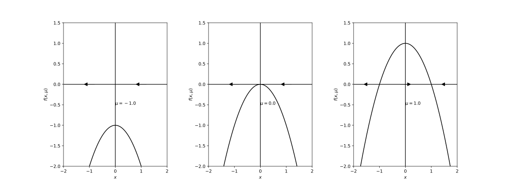
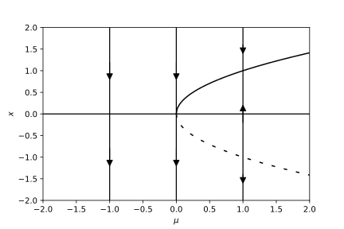

<!-- paginate: true -->

# 基礎からの力学系 (第6章)
#### 参考文献
- [小室，基礎からの力学系，サイエンス社，2002](https://www.saiensu.co.jp/book_support/sgc-17/)
#### Table of contents
- ベクトル場の平衡点の分岐

---
### はじめに ― 分岐現象とは ―
この章では，パラメータをもつ力学系を扱う．
分岐現象: パラメータを変化させたとき力学系の振る舞いが定性的に変化する現象

次の例を考える．
$$
\begin{cases}
    \dot{x} = y + \mu x - x^3 \\
    \dot{y} = -x
\end{cases} \ \ (6.1)
$$
- $\mu < 0$: 原点が安定平衡点
- $\mu > 0$: 原点は不安定平衡点．周囲に周期起動が発生する．

$\rightsquigarrow$ パラメータを変化させるとき，ある値を境にその前後でベクトル場の様子が質的に変化するとき，力学系は分岐を起こしたという．

---
<!--
_footer: 'ベクトル場の平衡点の分岐: $\mu = -1.0$ (左)，$\mu = 2.0$ (右)'
-->
 

---
###### Def 6.1 
パラメータ$\mu \in \mathbb{R}^p$を持つベクトル場
$$
\dot{\boldsymbol{x}} = f(\boldsymbol{x}, \mu), \ \ \boldsymbol{x} \in \mathbb{R}^n \ \ (6.2)
$$
を考える．$\mu = \mu_0$のとき，$\boldsymbol{x} = \boldsymbol{x}_0$が平衡点であるとする．
$$
f(\boldsymbol{x}_0, \mu_0) = \boldsymbol{0} \ \ (6.3)
$$
$\boldsymbol{x}_0$において線形化して得られる線形ベクトル場
$$
\dot{\boldsymbol{u}} = A \boldsymbol{u}, \ \ \boldsymbol{u} \in \mathbb{R}^n \ \ (6.4) \\
A = D_{\boldsymbol{x}} f(\boldsymbol{x}_0, \mu_0) = \left( \frac{\partial f}{\partial x_j} (\boldsymbol{x}_0, \mu_0) \right)_{1 \leq i,j \leq n} \ \ (6.5)
$$
において，$A$のどの固有値も虚軸上にないとき，平衡点$\boldsymbol{x}_0$は双曲型であるという．

---

###### Def 6.1 (続き)
$\boldsymbol{x}_0$が双曲型で，$A$の全ての固有値の実部が負であるとき，$\boldsymbol{x}_0$は安定であるという．$\boldsymbol{x}_0$が双曲型で，$A$の少なくとも1つの固有値の実部が正であるとき，$\boldsymbol{x}_0$は不安定であるという．

ベクトル場の平衡点が分岐を起こさないための十分条件を与える定理を以下に示す．
###### Th 6.1
$\mu = \mu_0$において平衡点$\boldsymbol{x}_0$が双曲型であれば，パラメータ$\mu$を$\mu_0$の近傍で変化させるとき，平衡点は持続して，安定性の型は変化しない．

$\rightsquigarrow$ ベクトル場の平衡点の分岐を考えるには，$\mu = 0$のとき，原点に非双曲型平衡点を持つ場合を考えればよい．

---

### 1次元ベクトル場のサドル・ノード分岐
1次元ベクトル場
$$
\dot{x} = f(x, \mu) = \mu - x^2, \ \ x \in \mathbb{R}, \mu \in \mathbb{R} \ \ (6.6)
$$
を考える．

ベクトル場の特徴
1. $\mu < 0$: ベクトル場は平衡点を持たない．
2. $\mu = 0$: ベクトル場は$x = 0$に固有値$0$を持つ平衡点を持つ．
3. $\mu > 0$: ベクトル場は2つの平衡点$P^{+} = \sqrt{\mu}$と$P^{-} = -\sqrt{\mu}$を持つ．
  - $P^{+}$の固有値は$f(\sqrt{\mu}, \mu) = -2\sqrt{\mu} < 0$で安定
  - $P^{-}$の固有値は$f(-\sqrt{\mu}, \mu) = 2\sqrt{\mu} > 0$で不安定

---
<!--
_footer: 'サドル・ノード分岐: $f(x, \mu)$のグラフの変化'
-->
 

---
<!--
_footer: '$(\mu, x)$-平面でのサドル・ノード分岐'
-->

---
パラメータの変化に伴い，安定平衡点と不安定平衡点が接近し，合体し，そして消滅する．
$\rightsquigarrow$ サドル・ノード分岐
- 2次元ベクトル場での対応する分岐が安定結節点 (ノード) と鞍状点 (サドル) との合体になることによる．

一般に1次元ベクトル場
$$
\dot{x} = f(x, \mu) \ \ (6.7)
$$
が$f(0, 0) = 0, \ f_x(0, 0) = 0$を満たすとき，
$$
f_{\mu}(0, 0) \neq 0, \ f_{xx}(0, 0) \neq 0 \ \ (6.8)
$$
ならば，$\mu = 0$のとき$x = 0$においてサドル・ノード分岐が生じる．

---

サドル・ノード分岐を生じる1次元ベクトル場の標準形は，
$$
\dot{x} = \mu \mp x^2 \ \ (6.9)
$$
で与えられる．

1次元ベクトル場において一般的に観測されるのはサドル・ノード分岐のみ．
しかし，系に対称性などの拘束条件がある場合には，さらに特殊な分岐が観測されることがある．
- トランスクリティカル分岐
- ピッチフォーク分岐
