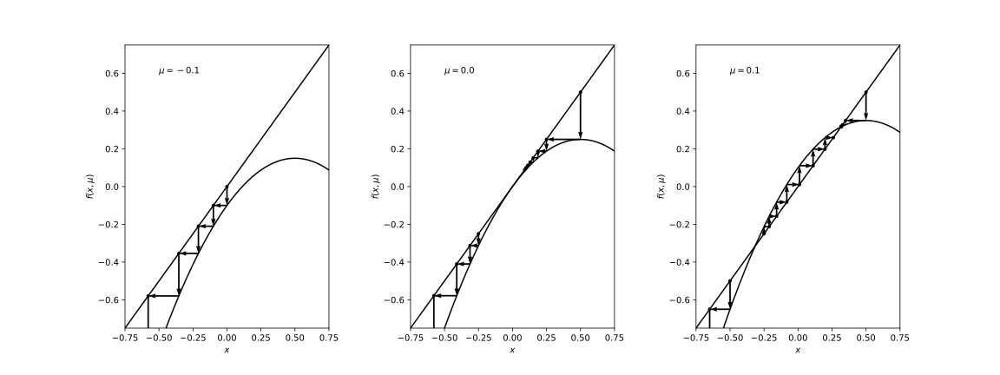
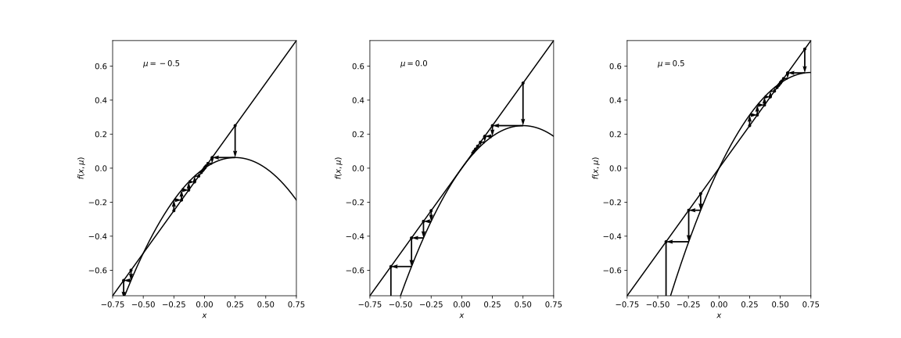

<!-- paginate: true -->

# 基礎からの力学系 (第7章)
#### 参考文献
- [小室，基礎からの力学系，サイエンス社，2002](https://www.saiensu.co.jp/book_support/sgc-17/)
#### Table of contents
- 写像の周期点，およびベクトル場の周期軌道の分岐

---

### はじめに
この章では，写像の周期点の分岐について述べる．
$$
\boldsymbol{x} \mapsto f(\boldsymbol{x}, \mu), \ \ \boldsymbol{x} \in \mathbb{R}^n, \ \mu \in \mathbb{R}^p \ \ (7.1)
$$
$\mu = \mu_0$のとき，$\boldsymbol{x} = \boldsymbol{x}_0$が不動点であるとする．
$$
f(\boldsymbol{x}_0, \mu_0) = \boldsymbol{x}_0 \ \ (7.2)
$$

---

###### Def 7.1 (双曲型，安定，不安定)
$\boldsymbol{x}_0$において線形化して得られる線形写像
$$
\boldsymbol{u} \mapsto A \boldsymbol{u}, \ \boldsymbol{u} \in \mathbb{R}^n, \ \ (7.3) \\
A = D_{\boldsymbol{x}} f(\boldsymbol{x}_0, \mu_0) = \left( \frac{\partial f_i}{\partial x_j}(\boldsymbol{x}_0, \mu_0) \right)_{1 \leq i, j \leq n} \ \ (7.4)
$$
において，$A$のどの固有値も単位円$S = \{\lambda \in \mathbb{C} \, | \, |\lambda| = 1\}$ 上にないとき，不動点$\boldsymbol{x}_0$は双曲型であるという．
$A$のすべての固有値が単位円の内側$\{\lambda \in \mathbb{C} \, | \, |\lambda| < 1\}$ にあるとき，不動点$\boldsymbol{x}_0$は安定であるという．
$A$の少なくとも1つの固有値が単位円の外側$\{\lambda \in \mathbb{C} \, | \, |\lambda| > 1\}$ にあるとき，不動点$\boldsymbol{x}_0$は不安定であるという．

---

###### Def 7.2 
パラメータ$\mu$を固定して，写像$f(\cdot, \mu): \mathbb{R}^n \to \mathbb{R}^n$の$p$回の合成写像を$f^p$で表す．
$$
\boldsymbol{x} \mapsto f^p(\boldsymbol{x}, \mu)  \ \ (7.5) \\
f^p(\cdot, \mu) = f(\cdot, \mu) \circ \cdots \circ f(\cdot, \mu) \ \ (7.6)
$$
点$\boldsymbol{p}$が$f^p$の不動点であり，$1 \leq i < p$ なる任意の$i$に対しては，$f^i$の不動点ではないときは，$\boldsymbol{p}$は$f$の$p$周期点であるという．
$$
f^p(\boldsymbol{p}, \mu) = \boldsymbol{p}, \ f^i(\boldsymbol{p}, \mu) \neq \boldsymbol{p} \ (1 \leq i < p) \ \ (7.7)
$$
$f$の$p$周期点$\boldsymbol{p}$がそれぞれ双曲型，安定，不安定であるとは，$f^p$の不動点として双曲型，安定，不安定であることである．

---

写像$f$の周期点の分岐は合成写像$f^p$の不動点の分岐に帰着する．

###### Th 7.1
$\mu = \mu_0$において不動点$\boldsymbol{x}_0$が双曲的であればパラメータ$\mu$を$\mu_0$の近傍で変化させるとき，不動点は持続して，安定性の型は変化しない．

$\rightsquigarrow$ 写像の不動点の分岐を考えるには，$\mu = 0$のとき，原点に非双曲型不動点を持つ場合を考えればよい．

---

### 1次元写像のサドル・ノード分岐

1次元写像
$$
x \mapsto f(x, \mu) = x + \mu - x^2, \ x \in \mathbb{R}, \mu \in \mathbb{R} \ \ (7.8)
$$
を考える．
1. $\mu < 0$ のとき: 不動点を持たない．
2. $\mu = 0$ のとき: $x = 0$に固有値$1$をもつ不動点を持つ．
3. $\mu > 0$ のとき: 2つの不動点$P^{+} = (\sqrt{\mu})$ と $P^{-} = (-\sqrt{\mu})$ を持つ．
    - $P^{\pm}$の固有値は$f_{x}(\pm \sqrt{\mu}, \mu) = 1 \mp 2 \sqrt{\mu}$で与えられる．
    - $0 < \mu \ll 1$ならば，$P^{+}$は安定，$P^{-}$は不安定．

パラメータの変化に伴って，安定不動点と不安定不動点が接近し，合体し，そして消滅する (サドル・ノード分岐)．

---

一般に1次元写像
$$
x \mapsto f(x, \mu) \ \ (7.9)
$$
が$f(0, 0) = 0, f_x(0, 0) = 1$を満たすとき，
$$
f_{\mu}(0, 0) = 0, \ \ f_{xx}(0, 0) \neq 0 \ \ (7.10)
$$
ならば，$\mu = 0$のとき$x = 0$においてサドル・ノード分岐が生じる．

サドル・ノード分岐を生じる1次元写像の標準形は，
$$
x \mapsto x + \mu \mp x^2 \ \ (7.11)
$$

で与えられる．

---

<!--
_footer: '$(x, f(x, \mu))$-平面での軌道の変化'
-->

---

### 1次元写像のトランスクリティカル分岐
写像$f(x, \mu)$が$x = 0$に常に不動点を持つという拘束条件
$$
f(0, \mu) = 0 \ \ (7.12)
$$
の下で一般的に生じる分岐．

1次元写像
$$
x \mapsto f(x, \mu) = x + \mu x - x^2 \ \ (7.13)
$$
を考える．

---

1. $\mu < 0$かつ$|\mu| \ll 1$のとき: 不動点$O = (0)$は固有値$1 + \mu < 1$を持ち安定．不動点$P = (\mu)$は固有値$1 - \mu > 1$を持ち不安定．
2. $\mu = 0$のとき: 不動点は$O = (0)$のみで，固有値は$1$．
3. $\mu > 0$かつ$|\mu| \ll 1$のとき: 不動点$O = (0)$は固有値$1 + \mu > 1$を持ち不安定，不動点$P = (\mu)$は固有値$1 - \mu < 1$を持ち安定．

パラメータの変化に伴い，不動点$O$に他の不動点$P$がぶつかり，通過し，不動点$O$は安定から不安定に，不動点$P$は不安定から安定になる (安定性の交代)．
$\rightsquigarrow$ トランスクリティカル分岐

---

一般に1次元写像
$$
x \mapsto f(x, \mu) \ \ (7.14)
$$
が$f(0, 0) = 0, f_x(0, 0) = 1$を満たすとき，
$$
f_{\mu}(0, 0) = 0, \ f_{x\mu} \neq 0, \ f_{xx}(0, 0) \neq 0 \ \ (7.15)
$$
ならば，$\mu = 0$のとき$x = 0$においてトランスクリティカル分岐が生じる．

---

<!--
_footer: '$(x, f(x, \mu))$-平面での軌道の変化'
-->

---