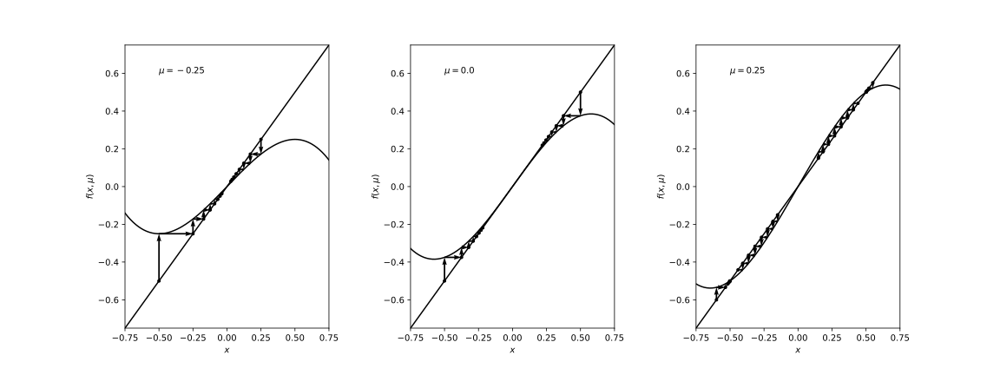
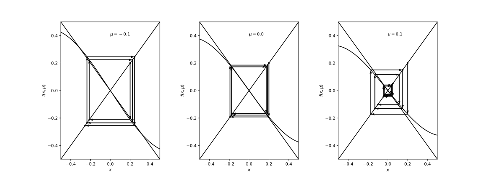
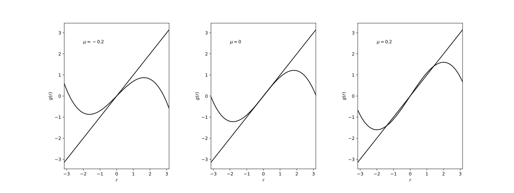
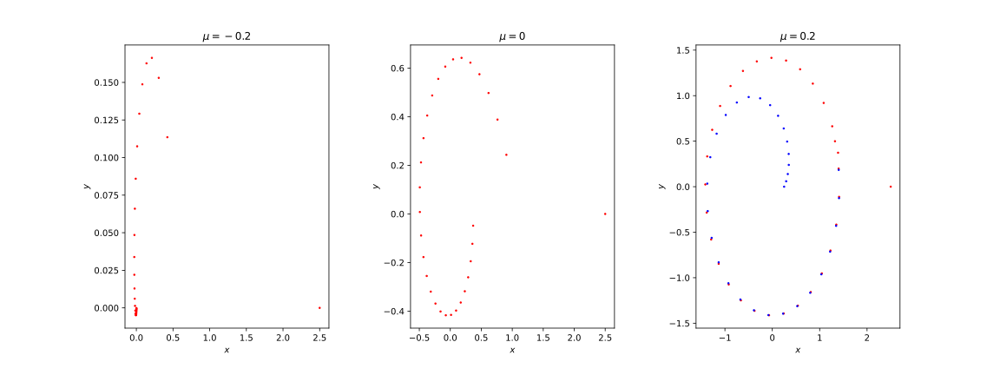

<!-- paginate: true -->

# 基礎からの力学系 (第7章)
#### 参考文献
- [小室，基礎からの力学系，サイエンス社，2002](https://www.saiensu.co.jp/book_support/sgc-17/)
#### Table of contents
- 写像の周期点，およびベクトル場の周期軌道の分岐

---

### はじめに
この章では，写像の周期点の分岐について述べる．
$$
\boldsymbol{x} \mapsto f(\boldsymbol{x}, \mu), \ \ \boldsymbol{x} \in \mathbb{R}^n, \ \mu \in \mathbb{R}^p \ \ (7.1)
$$
$\mu = \mu_0$のとき，$\boldsymbol{x} = \boldsymbol{x}_0$が不動点であるとする．
$$
f(\boldsymbol{x}_0, \mu_0) = \boldsymbol{x}_0 \ \ (7.2)
$$

---

###### Def 7.1 (双曲型，安定，不安定)
$\boldsymbol{x}_0$において線形化して得られる線形写像
$$
\boldsymbol{u} \mapsto A \boldsymbol{u}, \ \boldsymbol{u} \in \mathbb{R}^n, \ \ (7.3) \\
A = D_{\boldsymbol{x}} f(\boldsymbol{x}_0, \mu_0) = \left( \frac{\partial f_i}{\partial x_j}(\boldsymbol{x}_0, \mu_0) \right)_{1 \leq i, j \leq n} \ \ (7.4)
$$
において，$A$のどの固有値も単位円$S = \{\lambda \in \mathbb{C} \, | \, |\lambda| = 1\}$ 上にないとき，不動点$\boldsymbol{x}_0$は双曲型であるという．
$A$のすべての固有値が単位円の内側$\{\lambda \in \mathbb{C} \, | \, |\lambda| < 1\}$ にあるとき，不動点$\boldsymbol{x}_0$は安定であるという．
$A$の少なくとも1つの固有値が単位円の外側$\{\lambda \in \mathbb{C} \, | \, |\lambda| > 1\}$ にあるとき，不動点$\boldsymbol{x}_0$は不安定であるという．

---

###### Def 7.2 
パラメータ$\mu$を固定して，写像$f(\cdot, \mu): \mathbb{R}^n \to \mathbb{R}^n$の$p$回の合成写像を$f^p$で表す．
$$
\boldsymbol{x} \mapsto f^p(\boldsymbol{x}, \mu)  \ \ (7.5) \\
f^p(\cdot, \mu) = f(\cdot, \mu) \circ \cdots \circ f(\cdot, \mu) \ \ (7.6)
$$
点$\boldsymbol{p}$が$f^p$の不動点であり，$1 \leq i < p$ なる任意の$i$に対しては，$f^i$の不動点ではないときは，$\boldsymbol{p}$は$f$の$p$周期点であるという．
$$
f^p(\boldsymbol{p}, \mu) = \boldsymbol{p}, \ f^i(\boldsymbol{p}, \mu) \neq \boldsymbol{p} \ (1 \leq i < p) \ \ (7.7)
$$
$f$の$p$周期点$\boldsymbol{p}$がそれぞれ双曲型，安定，不安定であるとは，$f^p$の不動点として双曲型，安定，不安定であることである．

---

写像$f$の周期点の分岐は合成写像$f^p$の不動点の分岐に帰着する．

###### Th 7.1
$\mu = \mu_0$において不動点$\boldsymbol{x}_0$が双曲的であればパラメータ$\mu$を$\mu_0$の近傍で変化させるとき，不動点は持続して，安定性の型は変化しない．

$\rightsquigarrow$ 写像の不動点の分岐を考えるには，$\mu = 0$のとき，原点に非双曲型不動点を持つ場合を考えればよい．

---

### 1次元写像のサドル・ノード分岐

1次元写像
$$
x \mapsto f(x, \mu) = x + \mu - x^2, \ x \in \mathbb{R}, \mu \in \mathbb{R} \ \ (7.8)
$$
を考える．
1. $\mu < 0$ のとき: 不動点を持たない．
2. $\mu = 0$ のとき: $x = 0$に固有値$1$をもつ不動点を持つ．
3. $\mu > 0$ のとき: 2つの不動点$P^{+} = (\sqrt{\mu})$ と $P^{-} = (-\sqrt{\mu})$ を持つ．
    - $P^{\pm}$の固有値は$f_{x}(\pm \sqrt{\mu}, \mu) = 1 \mp 2 \sqrt{\mu}$で与えられる．
    - $0 < \mu \ll 1$ならば，$P^{+}$は安定，$P^{-}$は不安定．

パラメータの変化に伴って，安定不動点と不安定不動点が接近し，合体し，そして消滅する (サドル・ノード分岐)．

---

一般に1次元写像
$$
x \mapsto f(x, \mu) \ \ (7.9)
$$
が$f(0, 0) = 0, f_x(0, 0) = 1$を満たすとき，
$$
f_{\mu}(0, 0) = 0, \ \ f_{xx}(0, 0) \neq 0 \ \ (7.10)
$$
ならば，$\mu = 0$のとき$x = 0$においてサドル・ノード分岐が生じる．

サドル・ノード分岐を生じる1次元写像の標準形は，
$$
x \mapsto x + \mu \mp x^2 \ \ (7.11)
$$

で与えられる．

---

<!--
_footer: '$(x, f(x, \mu))$-平面での軌道の変化'
-->

---

### 1次元写像のトランスクリティカル分岐
写像$f(x, \mu)$が$x = 0$に常に不動点を持つという拘束条件
$$
f(0, \mu) = 0 \ \ (7.12)
$$
の下で一般的に生じる分岐．

1次元写像
$$
x \mapsto f(x, \mu) = x + \mu x - x^2 \ \ (7.13)
$$
を考える．

---

1. $\mu < 0$かつ$|\mu| \ll 1$のとき: 不動点$O = (0)$は固有値$1 + \mu < 1$を持ち安定．不動点$P = (\mu)$は固有値$1 - \mu > 1$を持ち不安定．
2. $\mu = 0$のとき: 不動点は$O = (0)$のみで，固有値は$1$．
3. $\mu > 0$かつ$|\mu| \ll 1$のとき: 不動点$O = (0)$は固有値$1 + \mu > 1$を持ち不安定，不動点$P = (\mu)$は固有値$1 - \mu < 1$を持ち安定．

パラメータの変化に伴い，不動点$O$に他の不動点$P$がぶつかり，通過し，不動点$O$は安定から不安定に，不動点$P$は不安定から安定になる (安定性の交代)．
$\rightsquigarrow$ トランスクリティカル分岐

---

一般に1次元写像
$$
x \mapsto f(x, \mu) \ \ (7.14)
$$
が$f(0, 0) = 0, f_x(0, 0) = 1$を満たすとき，
$$
f_{\mu}(0, 0) = 0, \ f_{x\mu} \neq 0, \ f_{xx}(0, 0) \neq 0 \ \ (7.15)
$$
ならば，$\mu = 0$のとき$x = 0$においてトランスクリティカル分岐が生じる．

---

<!--
_footer: '$(x, f(x, \mu))$-平面での軌道の変化'
-->

---

### 1次元写像のピッチフォーク分岐
写像$f(x, \mu)$が$x$に関して奇関数
$$
f(-x, \mu) = -f(x, \mu) \ \ (7.17)
$$
であるという拘束条件の下で一般的に生じる分岐．
$x$に関して奇関数 $\Rightarrow$ 原点が不動点
より，この拘束条件はトランスクリティカル分岐の拘束条件より強い．

---

1次元写像
$$
x \mapsto f(x, \mu) = x + \mu x - x^3 \ \ (7.18)
$$
を考える．

1. $\mu < 0$かつ$|\mu| \ll 1$のとき: 不動点は$O = (0)$のみ．固有値$1 + \mu < 1$を持ち安定．
2. $\mu = 0$のとき: 不動点は$O = (0)$のみで，固有値は$1$．
3. $\mu > 0$かつ$|\mu| \ll 1$のとき: 不動点$O = (0)$は固有値$1 + \mu > 1$を持ち不安定．不動点$O = (0)$の両側に2つの不動点$P^{\pm} = \pm \sqrt{\mu}$が存在し，固有値$1 - 2\mu < 1$を持ち安定．

$\rightsquigarrow$ パラメータの変化に伴い，安定不動点$O$が不安定化し，その両側に安定な不動点$P^{\pm}$が発生する (ピッチフォーク分岐)．

---
一般に1次元写像
$$
x \mapsto f(x, \mu) \ \ (7.19)
$$
が$f(0, 0) = 0, f_x(0, 0) = 1$を満たすとき，
$$
f_{\mu}(0, 0) = f_{xx}(0, 0) = 0, \ f_{x\mu}(0, 0) \neq 0, \ f_{xxx}(0, 0) \neq 0 \ \ (7.20)
$$
ならば，$\mu = 0$のとき$x = 0$においてピッチフォーク分岐が生じる．

ピッチフォーク分岐を生じる1次元写像の標準形は，
$$
x \mapsto x + \mu x \mp x^3 \ \ (7.21)
$$
で与えられる．

---
<!--
_footer: '$(x, f(x, \mu))$-平面での軌道の変化'
-->

---

### 1次元写像の周期倍分岐

1次元写像
$$
x \mapsto f(x, \mu) = -x - \mu x + x^3, \ \ x \in \mathbb{R}, \mu \in \mathbb{R} \ \ (7.22)
$$
を考える．

1. $\mu < 0$かつ$|\mu| \ll 1$のとき: 不動点$O = (0)$は固有値$-1 - \mu$をもつ．$|-1 - \mu| < 1$であるから，不動点$O = (0)$は安定．
2. $\mu = 0$のとき: 不動点$O = (0)$は固有値$-1$を持つ．
3. $\mu > 0$かつ$|\mu| \ll 1$のとき: 不動点$O = (0)$は固有値$-1 - \mu < -1$を持ち不安定．不動点$O = (0)$の両側に2つの2周期点$P^{\pm} = \pm \sqrt{\mu}$が存在し，安定である．

$\rightsquigarrow$ 安定不動点$O$が不安定化し，その両側に安定な2周期点$P^{\pm}$が発生する (周期倍分岐)．

---

$\mu > 0$かつ$|\mu| \ll 1$のとき，$P^{\pm} = \pm \sqrt{\mu}$が2周期点であることは，
$$
f(\sqrt{\mu}, \mu) = -\sqrt{\mu} - \mu \sqrt{\mu} + \mu \sqrt{\mu} = -\sqrt{\mu} \ \ (7.23) \\
f(-\sqrt{\mu}, \mu) = \sqrt{\mu} + \mu \sqrt{\mu} - \mu \sqrt{\mu} = \sqrt{\mu} \ \ (7.24)
$$
から分かる．また，これらが安定であることは，
$$
f_{x}(x, \mu) = -1 - \mu + 3x^2 \ \ (7.25)
$$
を使い，
$$
D_x(f^2)(\pm \sqrt{\mu}, \mu) = f_x(\mp \sqrt{\mu}, \mu) f_x(\pm \sqrt{\mu}, \mu) = (-1 + 2\sqrt{\mu})^2 < 1 \ \ (7.26)
$$
から分かる．

---

一般に1次元写像
$$
x \mapsto f(x, \mu) \ \ (7.27)
$$
が$f(0, 0) = 0, f_{x}(0, 0) = -1$を満たすとき，
$$
(f^2)_{\mu}(0, 0) = (f^2)_{xx}(0, 0) = 0, \\
(f^2)_{x \mu}(0, 0) \neq 0, \ (f^2)_{xxx}(0, 0) \neq 0 \ \ (7.28)
$$
ならば，$\mu = 0$のとき$x = 0$において周期倍分岐が生じる．

---

<!--
_footer: '$(x, f(x, \mu))$-平面での軌道の変化'
-->

---

### 2次元写像のサドル・ノード分岐，トランスクリティカル分岐，ピッチフォーク分岐，及び周期倍分岐

補足資料に掲載．

---

### 2次元写像のナイマルク―サッカー分岐
Jacobi行列
$$
A = \left(
  \begin{array}{cc}
    (f_1)_x & (f_1)_y \\
    (f_2)_x & (f_2)_y
  \end{array}
  \right)(\boldsymbol{0}, 0) \ \ (7.31)
$$
が絶対値$1$の複素共役固有値を持つ場合について述べる．

2次元写像
$$
\left(
  \begin{array}{c}
    x \\
    y
  \end{array}
  \right) \mapsto \left(
      \begin{array}{c}
        f_1(x, y, \mu) \\
        f_2(x, y, \mu)
      \end{array}
    \right) \ \ (7.32)
$$
に極座標変換
$$
\begin{cases}
  x = r \cos \theta \\
  y = r \sin \theta
\end{cases} \ \ (7.33)
$$

---
を施したとき，
$$
\left(
  \begin{array}{c}
    r \\
    \theta
  \end{array}
  \right) \mapsto \left(
      \begin{array}{c}
        g(r) \\
        h(r, \theta)
      \end{array}
    \right) = \left(
        \begin{array}{c}
          r + d \mu r + a r^3 \\
          \theta + c_0 + c_1 \mu + b r^2
        \end{array}
      \right) \ \ (7.34)
$$
で与えられる写像を考える ($a, b, c_0, c_1, d$: 定数)．
$g(0) = 0$より，$\boldsymbol{x} = (0, 0)$は不動点．不動点$\boldsymbol{0} = (0, 0)$におけるJacobi行列
$$
A(\mu) = \left(
    \begin{array}{cc}
      (f_1)_x & (f_1)_y \\
      (f_2)_x & (f_2)_y
    \end{array}
  \right)(\boldsymbol{0}, \mu) \ \ (7.35)
$$
は，
$$
A(\mu) = (1 + d \mu) \left(
    \begin{array}{cc}
      \cos (c_0 + c_1 \mu) & -\sin (c_0 + c_1 \mu) \\
      \sin (c_0 + c_1 \mu) & \cos (c_0 + c_1 \mu)
    \end{array}
  \right) \ \ (7.36)
$$
で与えられる．

---

$A(\mu)$の固有値は，
$$
(1 + d \mu)\exp(\pm(c_0 + c_1 \mu)i) = (1 + d \mu) (\cos(c_0 + c_1 \mu) \pm i \sin (c_0 + c_1 \mu)) \ \ (7.37)
$$
である．$d > 0, a < 0$のとき，写像は次の特徴を持つ．

1. $\mu < 0$かつ$|\mu| \ll 1$
    - $\boldsymbol{x} = (0, 0)$に絶対値$1 + d \mu < 1$の複素共役固有値$(1 + d \mu)\exp(\pm (c_0 + c_1 \mu)i)$を持つ安定平衡点が存在する．
2. $\mu = 0$
    - $\boldsymbol{x} = (0, 0)$に絶対値$1$の複素共役固有値$\exp(\pm c_0 i)$を持つ平衡点が存在する．線形化行列は，
    $$
    \left(
        \begin{array}{cc}
          \cos (c_0) & - \sin (c_0) \\
          \sin (c_0) & \cos (c_0)
        \end{array}
      \right)
    $$

---

3. $\mu > 0$かつ$|\mu| \ll 1$
    - $\boldsymbol{x} = (0, 0)$に絶対値$1 + d \mu > 1$の複素共役固有値$(1 + d \mu) \exp(\pm (c_0 + c_1 \mu)i)$を持つ不安定平衡点が存在する．その周囲に，半径$r = \sqrt{- d \mu/a}$の不変円を持つ．不変円は，周囲の店を近づけるという意味で安定である．

一般に，複素共役固有値を持つ安定不動点が，パラメータの変化に伴って不安定化し，その周囲に安定な不変円が発生する分岐をナイマルク―サッカー分岐 (Naimark-Sacker) という．また，時間を反転した力学系も考慮に入れて，複素共役固有値を持つ不安定不動点が安定化し，その周囲に不安定な不変円が発生する分岐も同じ名前で呼ばれる．

---

<!--
_footer: '$g(r)$のグラフの変化'
-->

---

<!--
_footer: '$\boldsymbol{x}$-平面での軌道の変化'
-->

---

### ベクトル場の周期軌道の分岐
$3$次元ベクトル場に周期軌道$\Gamma$が存在するとする．$\Gamma$と1点$\boldsymbol{p}$で横断的に交わる$2$次元平面をとることにより，ポアンカレ写像が定義できる．
$\rightsquigarrow$ $3$次元自律ベクトル場の周期軌道の分岐は，ポアンカレ写像の不動点$\boldsymbol{p}$の分岐に帰着される．

###### Def 7.3
ポアンカレ写像の不動点$\boldsymbol{p}$がサドルノード分岐，トランスクリティカル分岐，ピッチフォーク分岐，周期倍分岐，およびナイマルク―サッカー分岐を起こすとき，周期軌道$\Gamma$は，それぞれ，サドルノード分岐，トランスクリティカル分岐，ピッチフォーク分岐，周期倍分岐，およびナイマルク―サッカー分岐を起こしたという．

---
次に，時間に関して周期$T$の周期性を持つ$2$次元非自律系ベクトル場
$$
\frac{d\boldsymbol{x}}{dt} = g(t, \boldsymbol{x}), \boldsymbol{x} \in \mathbb{R}^2 \ \ (7.39) \\
g(t, \boldsymbol{x}) = g(t + T, \boldsymbol{x}) \ \ (7.40)
$$
の周期軌道の分岐を考える．

このベクトル場の流れを$\varphi: \mathbb{R} \times \mathbb{R} \times \mathbb{R}^2 \to \mathbb{R}^2$とするとき，$\boldsymbol{x} \in \mathbb{R}^2$に対して，$\varphi(T, 0, \boldsymbol{x}) \in \mathbb{R}^2$を対応する写像
$$
P: \mathbb{R}^2 \ni \boldsymbol{x} \mapsto \varphi(T, 0, \boldsymbol{x}) \in \mathbb{R}^2 \ \ (7.41)
$$
を定義する．これを非自律系のポアンカレ写像，またはストロボ写像という．

$2$次元非自律ベクトル場の周期軌道の分岐は，このポアンカレ写像の不動点および周期点の分岐に帰着される．