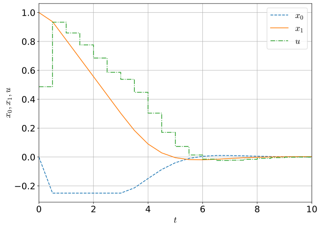

```python
########## Packages ##########
from casadi import *
import numpy as np
import os 
import matplotlib.pyplot as plt 
##############################

########### plt ##########
plt.rcParams["font.family"] = "serif"       # fonts
plt.rcParams["font.serif"] = "Times New Roman"
plt.rcParams["font.size"] = 18              
plt.rcParams["mathtext.cal"] = "serif"      
plt.rcParams["mathtext.rm"] = "serif"       
plt.rcParams["mathtext.it"] = "serif:italic"
plt.rcParams["mathtext.bf"] = "serif:bold"  
plt.rcParams["mathtext.fontset"] = "cm"     
###########################
```


```python
class Direct_single_shooting():
    """
    Solve optimal control problem numerically using direct single shooting method.
    """
    def __init__(self, T, N):
        self.T = T  # time horizon
        self.N = N  # number of control intervals
    
    def model_equation(self, x0, x1, u):
        """
        model equation
        dx_0/dt = (1 - x_1^2)x_0 - x_1 + u
        dx_1/dt = x_0
        """
        return vertcat((1 - x1**2)*x0 - x1 + u, x0)
    
    def stage_cost(self, x0, x1, u):
        """
        stage cost
        L(x, u) = x_0^2 + x_1^2 + u^2
        """
        return x0**2 + x1**2 + u**2 
    
    def discrete_dynamics(self, x0, x1, u):
        """
        Formulate discrete time dynamics
        """
        x = vertcat(x0, x1)
        xdot = self.model_equation(x0, x1, u)
        L = self.stage_cost(x0, x1, u)
        # CVODES from the SUNDIALS suite
        dae = {'x': x, 'p': u, 'ode': xdot, 'quad': L}
        opts = {'tf': self.T/self.N}
        F = integrator('F', 'cvodes', dae, opts)
        return F 
    
    def nlp(self, x0, x1, u, xinit):
        """
        Formulate and solve the NLP
        Given
        - x, u: MX.sym 
        - xinit: initial value of x
        """
        # discrete time dynamics
        F = self.discrete_dynamics(x0, x1, u)

        # empty
        w = []
        w0 = []
        lbw = []
        ubw = []
        J = 0 
        g = []
        lbg = []
        ubg = []

        # Formulate the NLP
        Xk = MX(xinit)
        for k in range(self.N):
            # New NLP variable for the control
            Uk = MX.sym('U_' + str(k))
            w += [Uk]
            lbw += [-1]         # lower bound of u
            ubw += [1]          # upper bound of u
            w0 += [0]

            # Integrate till the end of the interval
            Fk = F(x0=Xk, p=Uk)
            Xk = Fk['xf']
            J = J + Fk['qf']

            # Add inequality constraints
            g += [Xk[0]]
            lbg += [-0.25]         # lower bound of x 
            ubg += [inf]          # upper bound of x
        
        # Create an NLP slver
        prob = {'f': J, 'x': vertcat(*w), 'g': vertcat(*g)}
        solver = nlpsol('solver', 'ipopt', prob)

        # Solve the NLP 
        sol = solver(x0=w0, lbx=lbw, ubx=ubw, lbg=lbg, ubg=ubg)
        return sol 
    
    def plot_solution(self, x0, x1, u, xinit):
        """
        Plot the solution
        Given
        - x, u: MX.sym 
        - xinit: initial value of x
        """
        F = self.discrete_dynamics(x0, x1, u)
        sol = self.nlp(x0, x1, u, xinit)
        u_opt = sol['x']
        x_opt = [xinit]
        for k in range(self.N):
            Fk = F(x0=x_opt[-1], p=u_opt[k])
            x_opt.append(Fk['xf'].full())
        x0_opt = [r[0] for r in x_opt]
        x1_opt = [r[1] for r in x_opt]

        tgrid = [self.T/self.N*k for k in range(self.N + 1)]

        fig = plt.figure(figsize=(10, 7.5))
        ax = fig.add_subplot(1,1,1)
        ax.plot(tgrid, x0_opt, '--', label=r'$x_0$')
        ax.plot(tgrid, x1_opt, '-', label=r'$x_1$')
        ax.step(tgrid, vertcat(DM.nan(1), u_opt), '-.', label=r'$u$')
        ax.legend(loc='best')
        ax.set_xlabel(r'$t$'); ax.set_ylabel(r'$x_0, x_1, u$')
        ax.set_xlim([0, self.T])
        ax.grid(True)
        plt.show()
```


```python
########## Parameters ##########
T = 10
N = 20
################################

########## Instance ##########
direct_single_shooting = Direct_single_shooting(T=T, N=N)
##############################

########## figure ##########
x0 = MX.sym('x0')
x1 = MX.sym('x1')
u = MX.sym('u')
xinit = [0, 1]
direct_single_shooting.plot_solution(x0=x0, x1=x1, u=u, xinit=xinit)
############################
```

    
    ******************************************************************************
    This program contains Ipopt, a library for large-scale nonlinear optimization.
     Ipopt is released as open source code under the Eclipse Public License (EPL).
             For more information visit http://projects.coin-or.org/Ipopt
    ******************************************************************************
    
    This is Ipopt version 3.12.3, running with linear solver mumps.
    NOTE: Other linear solvers might be more efficient (see Ipopt documentation).
    
    Number of nonzeros in equality constraint Jacobian...:        0
    Number of nonzeros in inequality constraint Jacobian.:      210
    Number of nonzeros in Lagrangian Hessian.............:      210
    
    Total number of variables............................:       20
                         variables with only lower bounds:        0
                    variables with lower and upper bounds:       20
                         variables with only upper bounds:        0
    Total number of equality constraints.................:        0
    Total number of inequality constraints...............:       20
            inequality constraints with only lower bounds:       20
       inequality constraints with lower and upper bounds:        0
            inequality constraints with only upper bounds:        0
    
    iter    objective    inf_pr   inf_du lg(mu)  ||d||  lg(rg) alpha_du alpha_pr  ls
       0  3.6096611e+01 2.08e+00 1.91e+00  -1.0 0.00e+00    -  0.00e+00 0.00e+00   0
       1  3.4039110e+01 2.01e+00 5.66e+00  -1.0 4.70e+00    -  1.77e-01 3.47e-02f  1
       2  2.5657321e+01 1.67e+00 8.92e+00  -1.0 6.52e+00    -  2.26e-01 1.27e-01f  1
       3  2.5388354e+01 1.66e+00 3.23e+01  -1.0 3.31e+00    -  2.42e-02 7.55e-03h  1
       4  2.3964866e+01 1.62e+00 1.15e+01  -1.0 1.27e+01    -  2.20e-03 2.25e-02f  1
       5  2.3929382e+01 1.61e+00 2.17e+03  -1.0 3.31e+00    -  9.11e-02 9.39e-04h  1
       6  2.3900052e+01 1.61e+00 3.88e+05  -1.0 3.83e+00    -  1.34e-01 7.63e-04h  1
       7r 2.3900052e+01 1.61e+00 1.00e+03   0.2 0.00e+00    -  0.00e+00 2.56e-07R  6
       8r 2.3119814e+01 1.56e+00 1.00e+03   0.2 4.54e+02    -  5.10e-03 2.61e-04f  1
       9r 2.1619153e+01 1.00e+00 1.00e+03   0.2 1.90e+02    -  5.00e-03 4.32e-03f  1
    iter    objective    inf_pr   inf_du lg(mu)  ||d||  lg(rg) alpha_du alpha_pr  ls
      10r 2.0555517e+01 9.59e-01 9.95e+02   0.2 5.56e+00   2.0 5.21e-02 1.44e-02f  1
      11r 2.7023909e+01 1.58e+00 9.89e+02   0.2 4.11e+01   1.5 1.01e-02 1.92e-02f  1
      12r 2.7547756e+01 1.57e+00 9.76e+02   0.2 1.62e+01   1.0 3.14e-02 4.17e-03f  1
      13r 3.0292258e+01 1.49e+00 9.55e+02   0.2 2.76e+01   0.6 7.85e-02 2.12e-02f  1
      14r 3.0646880e+01 1.43e+00 9.09e+02   0.2 8.95e+00    -  4.24e-02 4.79e-02f  1
      15r 3.0084211e+01 1.40e+00 8.89e+02   0.2 3.91e+00    -  1.13e-01 1.98e-02f  1
      16r 2.8818934e+01 1.36e+00 8.68e+02   0.2 1.10e+01    -  7.37e-02 2.23e-02f  1
      17r 2.5783576e+01 1.29e+00 8.24e+02   0.2 3.01e+01    -  2.52e-03 5.26e-02f  1
      18r 2.4585592e+01 1.24e+00 7.99e+02   0.2 1.19e+01    -  1.91e-02 3.10e-02f  1
      19r 2.1620345e+01 1.14e+00 7.72e+02   0.2 1.08e+01    -  1.38e-02 5.15e-02f  1
    iter    objective    inf_pr   inf_du lg(mu)  ||d||  lg(rg) alpha_du alpha_pr  ls
      20r 1.9834931e+01 1.06e+00 7.30e+02   0.2 6.86e+00    -  5.53e-02 4.70e-02f  1
      21r 1.8925914e+01 1.02e+00 6.85e+02   0.2 2.75e+00    -  9.11e-02 3.18e-02f  1
      22r 1.0562641e+01 4.42e-01 7.31e+02   0.2 2.17e+00    -  9.48e-02 2.95e-01f  1
      23  7.1094158e+00 6.94e-01 3.51e+01  -1.0 6.17e-01    -  4.91e-02 3.40e-01f  1
      24  5.6082184e+00 2.59e-01 2.35e+01  -1.0 6.14e-01    -  1.92e-01 8.68e-01f  1
      25  5.2772388e+00 0.00e+00 1.79e+01  -1.0 4.65e-01    -  4.53e-01 1.00e+00f  1
      26  4.7891851e+00 0.00e+00 5.38e+00  -1.0 6.86e+00    -  3.22e-02 1.33e-02f  2
      27  4.0552576e+00 0.00e+00 1.31e+01  -1.0 2.25e-01    -  9.70e-01 9.40e-01f  1
      28  4.1664489e+00 0.00e+00 2.97e+00  -1.0 1.10e-01    -  1.00e+00 1.00e+00f  1
      29  4.1683553e+00 0.00e+00 2.20e-02  -1.0 1.32e-02    -  1.00e+00 1.00e+00h  1
    iter    objective    inf_pr   inf_du lg(mu)  ||d||  lg(rg) alpha_du alpha_pr  ls
      30  3.8719119e+00 0.00e+00 3.26e+00  -2.5 9.81e-02    -  9.30e-01 1.00e+00f  1
      31  3.7676391e+00 0.00e+00 1.18e+00  -2.5 6.65e-02    -  1.00e+00 1.00e+00h  1
      32  3.7499174e+00 0.00e+00 5.23e-02  -2.5 1.68e-02    -  1.00e+00 1.00e+00h  1
      33  3.7492627e+00 0.00e+00 3.33e-04  -2.5 2.41e-03    -  1.00e+00 1.00e+00h  1
      34  3.7348747e+00 0.00e+00 3.96e-02  -3.8 1.04e-02    -  1.00e+00 1.00e+00f  1
      35  3.7339150e+00 0.00e+00 5.20e-04  -3.8 2.81e-03    -  1.00e+00 1.00e+00h  1
      36  3.7330021e+00 0.00e+00 3.03e-04  -5.7 1.05e-03    -  1.00e+00 1.00e+00h  1
      37  3.7329929e+00 0.00e+00 1.58e-06  -5.7 5.55e-05    -  1.00e+00 1.00e+00h  1


    /usr/local/lib/python3.8/site-packages/numpy/core/shape_base.py:65: VisibleDeprecationWarning: Creating an ndarray from ragged nested sequences (which is a list-or-tuple of lists-or-tuples-or ndarrays with different lengths or shapes) is deprecated. If you meant to do this, you must specify 'dtype=object' when creating the ndarray.
      ary = asanyarray(ary)
    findfont: Font family ['serif'] not found. Falling back to DejaVu Sans.
    findfont: Generic family 'serif' not found because none of the following families were found: Times New Roman
    findfont: Font family ['serif'] not found. Falling back to DejaVu Sans.
    findfont: Generic family 'serif' not found because none of the following families were found: Times New Roman


      38  3.7329818e+00 0.00e+00 6.50e-07  -8.6 1.13e-05    -  1.00e+00 1.00e+00h  1
      39  3.7329818e+00 0.00e+00 3.55e-09  -8.6 1.37e-07    -  1.00e+00 1.00e+00h  1
    
    Number of Iterations....: 39
    
                                       (scaled)                 (unscaled)
    Objective...............:   3.7329818165222717e+00    3.7329818165222717e+00
    Dual infeasibility......:   3.5512134856061715e-09    3.5512134856061715e-09
    Constraint violation....:   0.0000000000000000e+00    0.0000000000000000e+00
    Complementarity.........:   2.5059038197700577e-09    2.5059038197700577e-09
    Overall NLP error.......:   3.5512134856061715e-09    3.5512134856061715e-09
    
    
    Number of objective function evaluations             = 49
    Number of objective gradient evaluations             = 26
    Number of equality constraint evaluations            = 0
    Number of inequality constraint evaluations          = 49
    Number of equality constraint Jacobian evaluations   = 0
    Number of inequality constraint Jacobian evaluations = 41
    Number of Lagrangian Hessian evaluations             = 39
    Total CPU secs in IPOPT (w/o function evaluations)   =      0.068
    Total CPU secs in NLP function evaluations           =      3.885
    
    EXIT: Optimal Solution Found.
          solver  :   t_proc      (avg)   t_wall      (avg)    n_eval
           nlp_f  | 245.41ms (  5.01ms) 245.31ms (  5.01ms)        49
           nlp_g  | 246.57ms (  5.03ms) 246.50ms (  5.03ms)        49
      nlp_grad_f  | 511.16ms ( 18.93ms) 509.98ms ( 18.89ms)        27
      nlp_hess_l  |   3.66 s ( 96.25ms)   3.65 s ( 96.16ms)        38
       nlp_jac_g  | 871.04ms ( 20.74ms) 869.79ms ( 20.71ms)        42
           total  |   5.57 s (  5.57 s)   5.56 s (  5.56 s)         1


    

    

