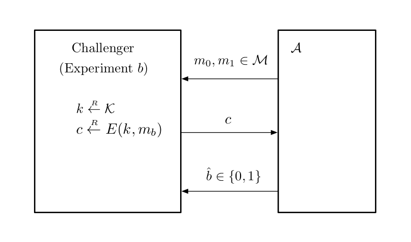

<!-- paginate: true -->

# A Graduate Course in Applied Cryptography (Chap. 2.2)

---
## 2.2 Computational ciphers and semantic security

- perfect security の基準に従うと，鍵長はメッセージ以上でなければならない．
- この節では，短い鍵を用いて長いメッセージを暗号化するために， security requirements を緩める．

$\rightsquigarrow$ *computational feasible* adversaries のみ考慮する．
$\rightsquigarrow$ **semantic security**.

---

### 2.2.1 Definition of a computational cipher
##### Notations
- $\mathcal{K}$: finite key space
- $\mathcal{M}$: finite message space
- $\mathcal{C}$: finite ciphertext space
- $E$: encryption algorithm
- $D$: decryption algorithm

---
$(\mathcal{K}, \mathcal{M}, \mathcal{C})$ 上で定義された **computational cipher** $\mathcal{E} = (E, D)$ は，efficient algorithms $E, D$ のペアである．

ここで，$E$ は probabilistic algorithm とする．計算が確率的であることを強調するため，$E(k, m)$ を実行し，変数 $c$ を得る操作を
$$c \overset{R}{\leftarrow} E(k, m)$$
と表す．同様に，変数 $k$ を key space から一様ランダムに得る操作を
$$k \overset{R}{\leftarrow} \mathcal{K}$$
と表す．

---
ここでは，決定的な復号化アルゴリズムのみ扱う．

暗号化したメッセージを復号化したものがもとのメッセージと一致すること (**correctness requirements**) は，以下のように表される．

$\forall k \in \mathcal{K}, \forall m \in \mathcal{M},$
$$c \overset{R}{\leftarrow} E(k, m), m^{\prime} \leftarrow D(k, c) \Rightarrow m = m^{\prime} \ \text{with probability } 1.$$

以降，computational cipher を単に cipher と表す．また，encryption algorithm が deterministic である cipher を **deterministic cipher** と表す．

---
##### Remark
- deterministic cipher は Shannon cipher である．
- computational cipher が Shannon cipher であるとは限らない．
- Shannon cipher は computational cipher である必要はない．

---

### 2.2.2 Definition of semantic security
$(\mathcal{K}, \mathcal{M}, \mathcal{C})$ 上で定義された deterministic cipher $\mathcal{E} = (E, D)$ を考える．Th. 2.3 より，perfect security は，以下のように表される．

$\forall \phi: \text{all predicates on } \mathcal{C}, \forall m_0, m_1 \in \mathcal{M},$
$$\mathrm{Pr}[\phi(E(\bm{k}, m_0))] = \mathrm{Pr}[\phi(E(\bm{k}, m_1))] \ \ (2.3)$$
ただし，$\bm{k}$ は $\mathcal{K}$ 上の一様分布からの確率変数とする．

---
Perfect security を緩める．十分小さい $\epsilon$ に対して，
$$\left| \mathrm{Pr}[\phi(E(\bm{k}, m_0))] - \mathrm{Pr}[\phi(E(\bm{k}, m_1))] \right| \leq \epsilon \ \ (2.4)$$
とする．

- この緩和自体にはそれほど意味はない．
- すべての $\phi, m_0, m_1$ を考える代わりに，ある efficient algorithm から生成 (計算) されたすべてのメッセージ $m_0, m_1$ やすべての predicate $\phi$ に対して上式を考える．
  - これらの efficient algorithm は probabilistic とする．
- $\epsilon$ が小さければ *secure for all practical purposes* とみなせる．

---

Ex. 2.5 より，variable length one-time pad は，暗号文から平文の長さの情報を漏らすので， perfect security の定義を満たさない．
$\rightsquigarrow$ security の定義を緩和し，長さ以外情報を漏らさないものも secure であるとしたい．

$\rightsquigarrow$ **challenger** と **adversary** の2人ゲーム (**attack game**) を考える．

- challenger は simple な fixed protocol に従う．
- advasary $\mathcal{A}$ は，任意の (efficient な) protocol に従う．
- challenger と attacker は protocol に従いメッセージを相互に送り合い，ゲームの終了時に $\mathcal{A}$ はある値を出力する．

---

- attack game は，2つの "sub-games" ("experiments") から構成される．
  - adversary は同じ protocol に従う．
  - challenger の振る舞いは2つの experiments でわずかに異なる．
- attack game は確率空間を定義し，adversary の *advantage* を定義する．
  - 確率空間における2つの事象が起こる確率の差を測るための指標

---

###### Attack Game 2.1 (semantic security)
Given:
- $\mathcal{E} = (E, D)$: $(\mathcal{K}, \mathcal{M}, \mathcal{C})$ 上で定義された cipher
- $\mathcal{A}$: adversary

に対して，2つの experiments, Experiment 0, Experiment 1 を定義．$b = 0, 1$ に対して，

---

Experiment $b$:

- adversary は，同じ長さの平文 $m_0, m_1 \in \mathcal{M}$ を計算し，challenger に送る．
- challenger は，$k \overset{R}{\leftarrow} \mathcal{K}$, $c \overset{R}{\leftarrow} E(k, m_b)$ を計算し，$c$ を adversary に送る．
- adversary は，$\hat{b} \in \{0, 1\}$ を出力する．

各 $b = 0, 1$ に対し $W_b$ を，Experiment $b$ で $\mathcal{A}$ が$1$を返す事象とする．$\mathcal{A}$ の **semantic security advantage** を以下で定義する．
$$SS\mathrm{adv}[\mathcal{A}, \mathcal{E}] \coloneqq \left| \mathrm{Pr}[W_0] - \mathrm{Pr}[W_1] \right|.$$

---

###### Remark
- 確率空間は以下の要素によって決定される．
  - $k$ の random choice
  - encryption algorithm による random choice
  - adversary による random choice
- $0 \leq SS\mathrm{adv}[\mathcal{A}, \mathcal{E}] \leq 1$

###### Def 2.2 (semantic secure)
cipher $\mathcal{E}$ が **semantically secure** であるとは，任意の efficient advarsaries $\mathcal{A}$ の $SS\mathrm{adv}[\mathcal{A}, \mathcal{E}]$ が無視できることである．

---

###### Experiment の図

---

Attack Game 2.1 において，adversary $\mathcal{A}$ が deterministic とする．

- adversary は，deterministic に $m_0, m_1$ を計算する．
- 暗号文 $c$ 上の predicate $\phi$ を評価する．
- 真であれば$1$，偽であれば$0$を出力する．

$\rightsquigarrow$ semantic security は，(2.4) の $\epsilon$ が無視できるほど小さいこと．

---

adversary $\mathcal{A}$ が probabilistic とする．

- adversary は，ある approximate set から乱数 $r$ を生成する．
- $r$ に依存してメッセージ $m_0^{(r)}, m_1^{(r)}$ を deterministic に計算する．
- $c$ 上の predicate $\phi^{(r)}$ を評価する．

$\rightsquigarrow$ semantic security は，(2.4) で $m_0, m_1, \phi$ を $m_0^{(r)}, m_1^{(r)}, \phi^{(r)}$ にしたものが無視できること．

確率は，randomly chosen key と randomly chosen value of $r$ に関するものである．

---

###### Remark 2.1
Attack Game 2.1 において，adversary が計算するメッセージ $m_0$ と $m_1$ の長さが同じであることの必要性について述べる．

- message の "length" について
  - 平文空間 $\mathcal{M}$ を特徴づける．
  - 逆に，平文空間を特徴づけるために，given message に対して長さに関連したルールを作る必要がある．
  - ここでは，議論の一般化のために，"length" を単に $|m|$ とするのではなく，抽象化して考える．

---

- $m_0$ と $m_1$ の長さが同じであることの必要性について
  - ある長さの平文の暗号化と異なる長さの平文の暗号化を区別できても，adversary がシステムを破壊したとみなされないこと．
  - 暗号文からメッセージの長さが漏洩しても良いことの根拠になっている．

実際の暗号化スキームの多くはメッセージの長さを隠そうとしない
$\rightsquigarrow$ real attack される可能性．

---
###### Ex. 2.9
$\mathcal{E}$ を perfectly secure な deterministic cipher とする．
$\rightsquigarrow$ 任意の adversary $\mathcal{A}$ に対して，$SS\mathrm{adv}[A, \mathcal{E}] = 0$．特に，$\mathcal{E}$ は semantically secure である．

one-time pad $\mathcal{E}$ は perfectly secure な deterministic cipher なので，semantically secure である．

semantic security の定義より， $\mathcal{E}$ が variable length one-time pad のとき，任意の adversary $\mathcal{A}$ に対して $SS\mathrm{adv}[\mathcal{A}, \mathcal{E}] = 0$ であり，semantically secure である．

---

"efficient" と "negligible" について．

- "negligible"
  - 直感的には，"zero for all practical purposes" になるくらい小さい．

また，以下の terms を用いる．

- *efficient adversary*: "reasonable" amount of time だけ動く敵対者
- $1/N$ が negligible ならば，$N$ は *super-poly* である．
- *poly-bounded* value は，"reasonably" なサイズの数である．
  - efficient adversary の running time は poly-bounded である．

---
###### Fact 2.6
$\epsilon, \epsilon^{\prime}$ を negligible values, $Q, Q^{\prime}$ を poly-bounded values とする．

1. $\epsilon + \epsilon^{\prime}$ は negligible value である．
1. $Q + Q^{\prime}$ および $Q \cdot Q^{\prime}$ は poly-bounded value である．
1. $Q \cdot \epsilon$ は negligible value である．

---
### 2.2.3 Connections to weaker notions of security
#### 2.2.3.1 Message recovery attacks

- Message recovery attack の直感的な解釈
  - adversary が random message の暗号化を与えられる．
  - 暗号文からもとのメッセージを random guessing ($1/|\mathcal{M}|$) よりもかなり高い確率で復元できる．

これについて形式的な証明を与えたい．

- *security reduction* について説明するため．
  - systems の security について説明するときの main technique.

---

基本的に証明は，以下を主張する．

- $\mathcal{E}$ に対して message recoverry attack を効率的に行うことができる任意の efficient adversary $\mathcal{A}$ を，$\mathcal{E}$ の semantic security を破る efficient adversary $\mathcal{B}$ を構成するために使うことができる．
  - sementic security は，このような $\mathcal{B}$ が存在しないことを示唆するので，そのような $\mathcal{A}$ が存在しないと結論付けられる．

この証明を定式化する前に，message recovery attack の形式的な定義を与える．challenger と adversary の間の attack game として記述される．

---

###### Attack Game 2.2 (message recovery)
Given:
- $(\mathcal{K}, \mathcal{M}, \mathcal{C})$ 上で定義された cipher
- adversary $\mathcal{A}$

に対して，attack game は以下のように進行する．

- challenger は $m \overset{R}{\leftarrow} \mathcal{M}, k \overset{R}{\leftarrow} \mathcal{K}, c \overset{R}{\leftarrow} E(k, m)$ を計算し，$c$ を adversary に送る．
- adversary は message $\hat{m} \in \mathcal{M}$ を出力する．

---

$W$ を $\hat{m} = m$ となる事象とする．$\hat{m} = m$ のとき，$\mathcal{A}$ はゲームに勝利したという．また，$\mathcal{E}$ に関する $\mathcal{A}$ の **message recovery advantage** を以下で定義する．
$$MR\mathrm{adv}[\mathcal{A}, \mathcal{E}] \coloneqq \left|\mathrm{Pr}[W] - 1/|\mathcal{M}|\right|.$$

###### Def. 2.3 (security against message recovery)

cipher $\mathcal{E}$ が **secure ageinst message recovery** であるとは，任意の efficient adversaries $\mathcal{A}$ に対して，$MR\mathrm{adv}[\mathcal{A}, \mathcal{E}]$ が無視できることである．

---

###### Th. 2.7
$(\mathcal{K}, \mathcal{M}, \mathcal{C})$ 上で定義された $\mathcal{E} = (E, D)$ を考える．$\mathcal{E}$ が semantically secure ならば，$\mathcal{E}$ は secure against message recovery である．

(証明略)

