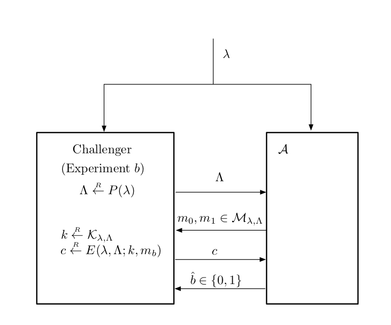

<!-- paginate: true -->

# A Graduate Course in Applied Cryptography (Chap. 2.3)

---
## 2.3 Mathematical details

ここまで，*efficient* や *negligible* という用語を特に数学的な定義を与えることなく用いてきた．

- computational cipher は *efficient* な 暗号化/復号化 アルゴリズムを持つ必要がある．
- semantically secure cipher のために，*efficient* adversary が Attack Game 2.1 で *negligible* advantage を持っていることが求められる．

$\rightsquigarrow$ この節では，これらの用語の数学的な定義を与える．

---

数学的な定義に入る前に，直感的な説明を述べる．

- an efficient encryption or decryption algorithm
    - とても素早く計算できる暗号化/復号化アルゴリズム
        - 10 - 100 computer cycles / byte 程度
- an efficient adversary
    - 大きいが feasible な時間 (やリソース) を用いて計算できるアルゴリズム．
- an adversary's advantage as being negligible
    - 全ての実用的な目的に対して，adversary の advantage がゼロとみなせる．

---

### 2.3.1 Negligible, super-poly, and poly-bounded functions

##### negligible function
直感的には，関数 $f: \mathbb{Z}_{\geq 0} \to \mathbb{R}$ が $n \to \infty$ で $0$ に収束し，その収束速度がどのような多項式の inverse よりも大きいこと．

###### Def. 2.5 
関数 $f: \mathbb{Z}_{\geq 1} \to \mathbb{R}$ が **negligible** であるとは，任意の $c \in \mathbb{R}_{> 0}$ に対して，$n_0 \in \mathbb{Z}_{\geq 1}$ が存在し，任意の $n \geq n_0$ に対して $|f(n)| < 1/n^c$ であることである．

---

###### Th 2.11 
関数 $f: \mathbb{Z}_{\geq 1} \to \mathbb{R}$ が negligible であるための必要十分条件は，任意の $c > 0$ に対して
$$\lim_{n \to \infty} f(n) n^c = 0$$
が成り立つことである．

(証明略)

---

###### negligible function の例
$$2^{-n}, 2^{-\sqrt{n}}, n^{-\log n}.$$

###### non-negligible function の例
$$\frac{1}{1000n^4 + n^2 \log n}, \frac{1}{n^{100}}$$

---
##### super-poly, poly-bounded

###### Def. 2.6
関数 $f: \mathbb{Z}_{\geq 1} \to \mathbb{R}$ で，$1/f$ が negligible であるものは **super-poly** と呼ばれる．

poly-bounded function とは，ある多項式で抑えられる関数である．

###### Def. 2.7
関数 $f: \mathbb{Z}_{\geq 1} \to \mathbb{R}$ が **poly-bounded** であるとは，$c, d \in \mathbb{R}_{>0}$ が存在して，任意の非負整数 $n \geq 0$ に対して $|f(n)| \leq n^c + d$ が成り立つことである．

---

### 2.3.2 Computational ciphers: the formalities

ここまで，computational cipher $\mathcal{E} = (E, D)$ は $(\mathcal{K}, \mathcal{M}, \mathcal{C})$ 上で定義され，$\mathcal{K}$ は鍵空間，$\mathcal{M}$ は平分空間，$\mathcal{C}$ は暗号文空間で，それぞれ有限集合であるとしていた．
$\rightsquigarrow$ 正確な定義を述べる．

数理モデルでは，鍵，平文，暗号文空間の $\mathcal{E}$ の族に以下を関連付ける．

- **security parameter** $\lambda$: 正の整数．
- **system parameter** $\Lambda$: bit string.

---

よって，有限集合 $\mathcal{K}, \mathcal{M}, \mathcal{C}$ の代わりに有限集合の族
$$ \{\mathcal{K}_{\lambda, \Lambda} \}_{\lambda, \Lambda}, \; \{\mathcal{M}_{\lambda, \Lambda} \}_{\lambda, \Lambda}, \; \{\mathcal{C}_{\lambda, \Lambda} \}_{\lambda, \Lambda} $$
を用いる．定義のために，これを bit strings の集合とみなす．

アイデアは，「cipher $\mathcal{E}$ が配置 (deploy) されるときに，security parameter $\lambda$ が固定される」というもの．

$\lambda$ が大きいと security の強度が高いが，暗号化と復号に時間がかかる
$\rightsquigarrow$ security parameter は，security と efficiency の trade-off を調整するもの．

---

$\lambda$ が選ばれた後，cipher に特有のアルゴリズムを用いて $\Lambda$ が生成される．

アイデアは，「system parameter $\Lambda$ は cipher の fixed instance に詳細な説明を与える」というもの．
$$(\mathcal{K}, \mathcal{M}, \mathcal{C}) = (\mathcal{K}_{\lambda, \Lambda}, \mathcal{M}_{\lambda, \Lambda}, \mathcal{C}_{\lambda, \Lambda})$$

- fixed instance が 大規模なシステムにデプロイされ，多くの部分で使われる．
- $\lambda, \Lambda$ は public であり，adversary を含め全員が知ることができる．

---

efficient algorithm を定義する．これは，running time が security parameter $\lambda$ の多項式で抑えられるようなアルゴリズムである．

###### Def. 2.8 (efficient algorithm)

$A$ を security parameter $\lambda \in \mathbb{Z}_{\geq 1}$ と bit string $x \in \{0, 1\}^{\leq p(\lambda)}$ ($p$ は fixed polynomial) を入力とする (possibly probabilistic) algorithm とする．$A$ が **efficient algorithm** であるとは，次のような poly-bounded function $t$ と negligible function $\epsilon$ が存在することである：
任意の $\lambda \in \mathbb{Z}_{\geq 1}$ と任意の $x \in \{0, 1\}^{\leq p(\lambda)}$ に対して，入力 $(\lambda, x)$ における $A$ の running time が $t(\lambda)$ を超える確率が高々 $\epsilon(\lambda)$ である．

---

次に，security and system parameter でパラメタライズされたシステムの要件を捉えるための形式的な定義を与える．
$\mathrm{Supp}(P(\lambda))$ を，分布 $P(\lambda)$ の support とする．

###### Def. 2.9
**System parameterization** とは，efficient probabilistic algorithm $P$ で，入力に security parameter $\lambda \in \mathbb{Z}_{\geq 1}$ をとり，長さが常に $\lambda$ の多項式で抑えられるような **system parameter** と呼ばれる bit string を出力するものである．また，以下の用語を定義する．

---

- **family of spaces with system parameterization**
    - bit strings の有限集合の族 $\bm{S} = \{\mathcal{S}_{\lambda, \Lambda}\}_{\lambda, \Lambda}$ で，$\lambda$ が $\mathbb{Z}_{\geq 1}$ で実行され，$\Lambda$ が $\mathrm{Supp}(P(\lambda))$ で実行されるものであり，集合 $\mathcal{S}_{\lambda, \Lambda}$ に含まれるすべての strings の長さがある $\lambda$ の多項式 $p$ で抑えられる場合．

- $\mathcal{S}$ is **efficiently recognizable**
    - 入力 $\lambda \in \mathbb{Z}_{\geq 1}, \ \Lambda \in \mathrm{Supp}(P(\lambda)), \ s \in \{0, 1\}^{\leq p(\lambda)}$ で，$s \in \mathcal{S}_{\lambda, \Lambda}$ かどうかを決定する効率的な deterministic algorithm が存在する場合．

---

- $\mathcal{S}$ is **efficiently sampleable**
    - 入力 $\lambda \in \mathbb{Z}_{\geq 1}, \ \Lambda \in \mathrm{Supp}(P(\lambda))$ で，$\mathcal{S}_{\lambda, \Lambda}$ 上の一様分布の要素を出力する efficient probabilistic algorithm が存在する場合．

- **$\mathcal{S}$ has an effective length function**
    - 入力 $\lambda \in \mathbb{Z}_{\geq 1}, \ \Lambda \in \mathrm{Supp}(P(\lambda)), \ s \in \mathcal{S}_{\lambda, \Lambda}$ で，$s$ の **length** と呼ばれる非負整数を出力する efficient deterministic algorithm が存在する場合．

ここで，computational cipher の formal definition を与える．

---

###### Def. 2.10 (computational cipher)
**Computational cipher** は，アルゴリズムのペア $E, D$ と，system parameterization $P$ による3つの空間の族
$$\bold{K} = \{\mathcal{K}_{\lambda, \Lambda}\}_{\lambda, \Lambda}, \; \; \bold{M} = \{\mathcal{M}_{\lambda, \Lambda}\}_{\lambda, \Lambda}, \; \; \bold{C} = \{\mathcal{C}_{\lambda, \Lambda}\}_{\lambda, \Lambda}$$
から構成される．ただし，

1. $\bold{K}, \bold{M}, \bold{C}$ は efficient recognizable.

2. $\bold{K}$ は efficient sampleable.

3. $\bold{M}$ は effective length function を持つ．

---

4. Algorithm $E$ は，入力 $\lambda \in \mathbb{Z}_{\geq 1}, \Lambda \in \mathrm{Supp}(P(\lambda)), k \in \mathcal{K}_{\lambda, \Lambda}, m \in \mathcal{M}_{\lambda, \Lambda}$ で，常に $\mathcal{C}_{\lambda, \Lambda}$ を出力する efficient probabilistic algorithm である．

5. Algorithm $D$ は，入力 $\lambda \in \mathbb{Z}_{\geq 1}, \Lambda \in \mathrm{Supp}(P(\lambda)), k \in \mathcal{K}_{\lambda, \Lambda}, c \in \mathcal{C}_{\lambda, \Lambda}$ で，$\mathcal{M}_{\lambda, \Lambda}$ の要素か special symbol $\text{reject} \notin \mathcal{M}_{\lambda, \Lambda}$ を出力する efficient deterministic algorithm である．

6. $\forall \lambda \in \mathbb{Z}_{\geq 1}, \Lambda \in \mathrm{Supp}(P(\lambda)), k \in \mathcal{K}_{\lambda, \Lambda}, m \in \mathcal{M}_{\lambda, \Lambda}, c \in \mathrm{Supp}(E(\lambda, \Lambda; k, m))$ に対して，$D(\lambda, \Lambda; k, c) = m$ である．

暗号化/復号化アルゴリズムで，$\lambda, \Lambda$ は補助入力である．

---

###### Note
- System parameter を必要としない暗号もある (e.g. one-time pad)．
    - System parameter を empty string とする．
- Security parameter がないものもある．
    - 理論と応用のミスマッチ．

---

### 2.3.3 Efficient adversaries and attack games
semantic security を定義するとき，*efficient adversary* というのを使っていた．ここではその定義を与える．

暗号学的なフレームワークでは，security は，adversary $\mathcal{A}$ と challenger の間の attack game を用いて定義される．

- $\mathcal{A}$ は任意のプロトコルに従う．
- challenger は，cryptographic scheme で決定された fixed protocol に従う．

---

adversary と challenger は共通の security parameter $\lambda$ を入力にとり，challenger は system parameter $\Lambda$ を計算し，それを adversary に送ることでゲームを開始する．

このタイプの interaction をモデル化するために，**interactive machine** というものを導入する．

- Machine $M$ が始動する前に，$M$ は常に special buffer に書き込まれた security parameter $\lambda$ を取得し，すべての initial state をある default value に初期化する．

- Machine $M$ はもう2つの special buffer, *incoming message buffer* と *outgoing message buffer* を持つ．

---

- Machine $M$ は何度も呼び出される．
    - 各呼び出しは，$M$ の外部の環境が $M$ の incoming message buffer に string を書き込んだときに始まる．
    - $M$ は message を読み，ある計算を行い，initial state を更新し，outgoing message buffer に string を書き込み，呼び出しを終える．
    - outgoing message は環境に渡される．

$\rightsquigarrow$ $M$ は simple message passing system を介して環境と相互作用する．

---

以下を仮定する．

- $M$ は最後の outgoing message に何らかの信号を含めることで，停止したことを示している可能性がある．
    - $M$ は基本的にそれ以上の呼び出しの試みを無視する．
- $M$ へ出入りする message の長さが *constant length* に制限されている．
    - これは現実的ではないが，簡単化のため．

given environment に対して，$M$ が停止するまでの呼び出しのステップ数をカウントすることで，$M$ の **total running time** をはかることができる．

---

###### Def. 2.11 (efficient interactive machine)
$M$ が **efficient interactive machine** であるとは， 次のような poly-bounded function $t$ と negligible function $\epsilon$ が存在することである：
任意の environments (computationally bounded でなくても良い) に対して，$\mathcal{M}$ の total running time が $t(\lambda)$ を超える確率が高々 $\epsilon(\lambda)$ である．

この定義を用いて，**efficient adversary** を，efficient interactive machine でモデル化する．

---

2つの interactive machines $M^{\prime}$ と $M$ をつなげて新しい interactive machine $M^{\prime \prime} = \langle M^{\prime}, M \rangle$ を作るということを考える．

- 環境から $M^{\prime \prime}$ への message は常に $M^{\prime}$ にルーティングされる．
- Machine $M^{\prime}$ は環境または $M$ に message を送る．
    - 後者の場合，$M$ によって送られた output message は $M^{\prime}$ に送信される．

$M$ が停止すると，$M^{\prime}$ はこれ以上の message を受け取らないと仮定する．

---

$M^{\prime \prime}$ が呼び出されると...

- incoming message は $M^{\prime}$ にルーティングされる．
- $M^{\prime}$ と $M$ は何度か interact する．
- $M^{\prime}$ が environment に message を送ると $M^{\prime \prime}$ の呼び出しは終わる．

$M^{\prime}$ を "open" machine (外界と interact) とし，$M$ を "closed" machine ($M^{\prime}$ のみと interact) とする．

---

challenger と adversary の interaction を 2つの machine を connect することでモデル化する．challenger は open machine に相当し，adversary は closed machine に相当する．

Security reduction では，ある system を破る adversary $\mathcal{A}$ を用いて，別の system を破る adversary $\mathcal{B}$ をどのように構築するかを示す．
ほしい性質は，「$\mathcal{A}$ が efficient ならば $\mathcal{B}$ も efficient」というものであるが，用いる reduction では特別な形になっている：
$\mathcal{B}$ は wrapper around $\mathcal{A}$ であり，$\mathcal{B}$ の challenger と $\mathcal{A}$ の単一の実行中の instance 間の単純で効率的な "interface layer" で構成される．

---

理想的には interface layer の computational complexity は $\mathcal{A}$ の computational complexity に依存しないが，ある程度の依存関係は避けられない．

定式化のため，$\mathcal{B}$ を composed machine $\langle M^{\prime}, M \rangle$ として構成する．

- $M^{\prime}$: interface layer ("open" machine)
- $M$: instance of $\mathcal{A}$ ("closed" machine)

---

###### Def. 2.12 (elementary wrapper)
Interface machine $\mathcal{M}$ が **efficient interface** であるとは，poly-bounded function $t$ と negligible function $\epsilon$ が存在し，任意の $M$ (computationally bounded である必要はない) に対し，任意の environment で composed machine $\langle M^{\prime}, M \rangle$ を実行したときに以下の性質が成り立つことをいう：
$\langle M^{\prime}, M \rangle$ の execution の全ての点で，$I$ を その点における $M^{\prime}$ と $M$ の間の interaction の回数，$T$ を $M^{\prime}$ の total running time としたとき，$T > t(\lambda + I)$ となる確率が高々 $\epsilon(\lambda)$ である．

---

$M^{\prime}$ が efficient interface であるとき，任意の $M$ に対して，$\langle M^{\prime}, M \rangle$ は **elementary wrapper around** $M$ という．

上記のように構成された adversary $\mathcal{B}$ は elementary wrapper around adversary $\mathcal{A}$ である．

- $\mathcal{B}$ が elementary wrapper around $\mathcal{A}$ で，$\mathcal{A}$ が efficient ならば，$\mathcal{B}$ も efficient である．
- $\mathcal{C}$ が elementary wrapper around $\mathcal{B}$ であり，$\mathcal{B}$ が elementary wrapper around $\mathcal{A}$ ならば，$\mathcal{C}$ は elementary wrapper around $\mathcal{A}$ である．

---

### 2.3.4 Semantic security: the formalities
どのタイプのセキュリティを定義するときも，attack game の adversary の advantage を $\mathrm{Adv}(\lambda)$ で定義する．
これは，各 $\lambda$ に対して，challenger の random choices と adversary の random choices によって決定される異なる確率空間を得るということ．

Attack Game 2.1 の semantic security における $SS\mathrm{adv}[\mathcal{A}, \mathcal{E}]$ について再考する．この関数は実際は security parameter $\lambda$ の関数である．

---

Def. 2.2 の適切な解釈は以下．

$\mathcal{E}$ が secure であるとは，全ての efficient adversaries $\mathcal{A}$ (interactive machine でモデル化) に対して，関数 $SS\mathrm{adv}(\lambda)$ が negligible であることである．

---

---

$\mathcal{E}$ が insecure であることについて考える．
ある $\mathcal{A}$ が存在し，$SS\mathrm{adv}[\mathcal{A}, \mathcal{E}]$ が security parameter に関して non-negligible function であることである．
$\rightsquigarrow$ $SS\mathrm{adv}[\mathcal{A}, \mathcal{E}] \geq 1/\lambda^c$ for some $c > 0$, for infinitly many values of the security parameter $\lambda$.

ここで，all values of the security parameter ではなく，infinitely many values of the security parameter であることに注意する．