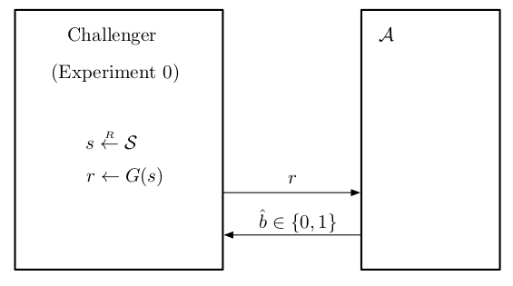
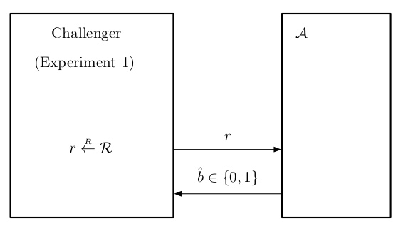

<!-- paginate: true -->

# A Graduate Course in Applied Cryptography (Chap. 3.1)

---
## 3.1 Pseudo-random generators
One-time pad は，鍵，平文，暗号文がすべて $L$-bit string だった．
$\rightsquigarrow$ 鍵長を短くしたい．

idea: 

- $\ell$-bit $(\ell \ll L)$ の "seed" $s$ を暗号化鍵に使う．
- この seed を $L$-bit に引きのばす．
    - $s$ は，$\ell$-bit strings を $L$-bit string にうつす efficient, deterministic algorithm $G$ によって引きのばされる．

---

鍵空間と平文，暗号文空間は以下で定義される．

- key space: $\{0, 1\}^{\ell}$
- message and ciphetext space: $\{0, 1\}^{L}$

$s \in \{0, 1\}^{\ell}, m, c \in \{0, 1\}^{L}$ に対して暗号化と復号化は以下で定義される．

$$E(s, m) \coloneqq G(s) \oplus m, \; \; D(s, c) \coloneqq G(s) \oplus c.$$

この modified one-time pad は，**stream cipher** と呼ばれ，$G$ は **pseudo-random generator** と呼ばれる．

---

- $\ell < L$ のとき，stream cipher は perfect security を達成しない (Shannon's theorem)．
- $G$ が appropriate security property を満たすならば，この cipher は semantically secure である．

$s$ を random $\ell$-bit string とし，$r$ を randomo $L$-bit string とする．

- adversary が $G(s)$ と $r$ の違いを効率的に主張できないとき，stream cipher と one-time-pad の違いを効率的に主張できない．

$\rightsquigarrow$ "effectively tell the difference between $G(s)$ and $r$" を定式化．

---

- **statistical test**
  - pseudo-random string $G(s)$ と truly random string $r$ を区別するために使われるアルゴリズム
  - string を入力し，0 or 1 を出力する．

- **effective**
  - pseudo-random input に対して 1 を出力する確率と truly random input に対して 1 を出力する確率に有意差がある．
    - 有意: 1% などでも有意差がある場合がある．

---

どのように effective statistical test を design する？

- given: $L$-bit string に対して，ある統計量を計算し，string が truly random のときと大きく異なるかどうかを見る．

簡単に計算できる simple statistic の例: string に現れる 1 の数

- truly random string では，$k \approx L/2$ と推定する．
- PRG $G$ が bias を持っている場合，次のような statistical test で効率的に検出できる:
  - $|k - 0.5 L| < 0.01 L$ ならば 1 を出力し，それ以外は 0 を出力する．

---

### 3.1.1 Definition of a pseudo-random generator

- **pseudo-random generator (PRG)**
  - efficient で deterministic な algorithm $G$
  - **seed** $s$ を入力 (given) とし，output $r$ を計算する．
    - $s \in \mathcal{S}$ (**seed space**), $r \in \mathcal{R}$ (**output space**)
  - $G$ は $(\mathcal{S}, \mathcal{R})$ 上で定義された PRG という．

---

security for a PRG の直感的な説明

- $s$ が $\mathcal{S}$ からの random choice で選ばれ，$r$ が $\mathcal{R}$ からの random choice で選ばれるとき，$G(s)$ と $r$ の違いを主張できる efficient adversary はない．
  - この2つは **computationally indistinguishable**

この定義は attack game として定式化される．

---

###### Attack Game 3.1 (PRG)
$(\mathcal{S}, \mathcal{R})$ 上で定義された given PRG $G$ と，given adversary $\mathcal{A}$ に対して，2つの experiments, Experiment 0 と Experiment 1 を定義する．

Experiment $b$:
- challenger は $r \in \mathcal{R}$ を以下のように計算する．
  - $b = 0$: $s \overset{R}{\leftarrow} \mathcal{S}, r \leftarrow G(s)$;
  - $b = 1$: $r \overset{R}{\leftarrow} \mathcal{R}$.
- Given $r$ に対して adversary は bit $\hat{b} \in \{0, 1\}$ を計算し出力する．

---

$b = 0, 1$ に対して，$W_b$ を $\mathcal{A}$ が Experiment $b$ で 1 を出力するという事象とする．$G$ に関する $\mathcal{A}$ の **advantage** を以下で定義する．

$$\mathrm{PRGadv}[\mathcal{A}, \mathcal{G}] \coloneqq \left| \mathrm{Pr}[W_0] - \mathrm{Pr}[W_1] \right|.$$

 

---

###### Def. 3.1 (secure PRG)
PRG $G$ が **secure** であるとは，$\mathrm{PRGadv}[\mathcal{A}, \mathcal{G}]$ が 全ての efficient adversaries $\mathcal{A}$ に対して negligible であることである．

- Attack Game 3.1 は "bit guessing game" に recast できる．
  - 2つの separate experiments の代わりに challenger が $b \in \{0, 1\}$ を random に選び，Experiment $b$ を走らせる．
- $\mathcal{A}$ の *bit-guessing advantage* $\mathrm{PRGadv}^{\ast}[\mathcal{A}, \mathcal{G}]$ を，$|\mathrm{Pr}[\hat{b} = b] - 1/2|$ で定義する．

---
- 2.2.5 節の結果より，
  $$\mathrm{PRGadv}[\mathcal{A}, \mathcal{G}] = 2\cdot \mathrm{PRGadv}^{\ast}[\mathcal{A}, \mathcal{G}].$$
- PRG は seed space の cardinality が super-poly のときに限り secure である．

---

### 3.1.2 Mathematical details
PRG の正確な定義を述べる．

###### Def. 3.2 (pseudo-random generator)
**pseudo-random generator** $G$ は，algorithm $G$ と system parameterization $P$ と2つの族
$$\bold{S} = \{\mathcal{S}_{\lambda, \Lambda}\}_{\lambda, \Lambda}, \bold{R} = \{\mathcal{R}_{\lambda, \Lambda}\}_{\lambda, \Lambda}$$
から構成され，以下を満たす．

---

1. $\bold{S}$ と $\bold{R}$ は efficiently recognizable and sampleable である．
1. Algorithm $G$ は $\lambda \in \mathbb{Z}_{\geq 1}, \Lambda \in \mathrm{Supp}(P(\lambda)), s \in \mathcal{S}_{\lambda, \Lambda}$ を入力にし，element of $\mathcal{R}_{\lambda, \Lambda}$ を出力とする efficient deterministic algorithm である．

Def. 3.1 の解釈について

- security parameter $\lambda$ の各値に対して確率空間が決定される．
- challenger が system parameter $\Lambda$ を生成，adversary に送信．
- advantage $\mathrm{PRGadv}[\mathcal{A}, \mathcal{G}]$ は security parameter $\lambda$ の関数．