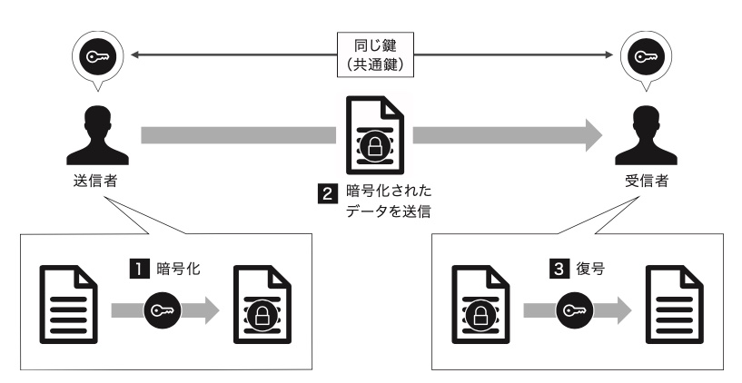
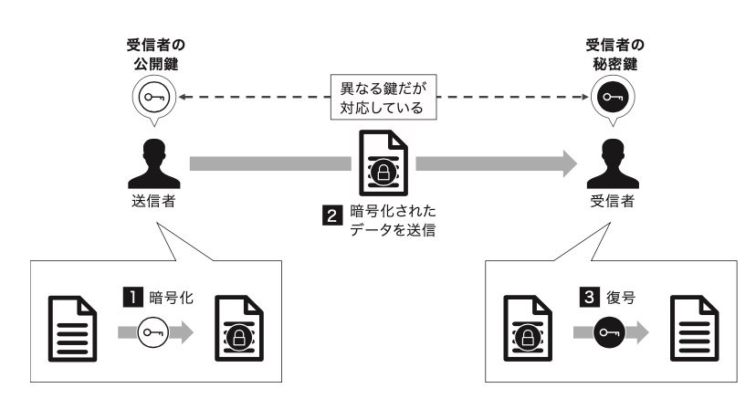
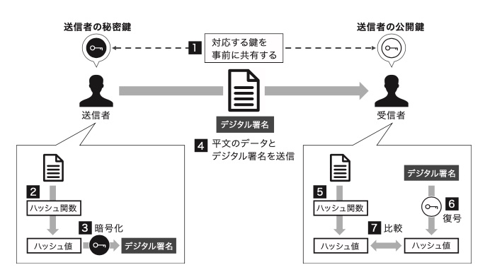
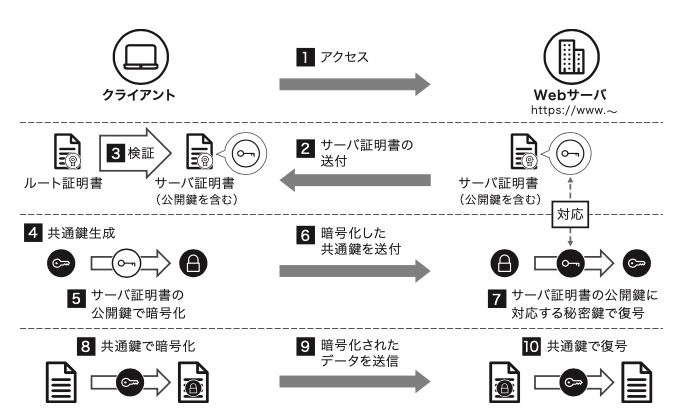

<!-- paginate: true -->

# 暗号技術のお気持ちを知りたい

---
## はじめに

#### 参考資料
1. 清藤 武暢，岸 純也，[【ゼロ知識証明入門】第2章 ゼロ知識証明技術の 基礎知識（前編）](https://enterprisezine.jp/article/detail/14515)，閲覧日: 2021/10/18．
1. 清藤 武暢，岸 純也，[【ゼロ知識証明入門】第2章 ゼロ知識証明技術の 基礎知識（後編）](https://enterprisezine.jp/article/detail/14516)，閲覧日: 2021/10/18．
1. システム制御情報学会・計測自動制御学会 チュートリアル講座 2021 資料
1. 電子情報通信学会 関西支部 ICT基礎講座 暗号技術とセキュリティ設計の基礎 資料
1. [SSHの公開鍵認証における良くある誤解の話](https://qiita.com/angel_p_57/items/2e3f3f8661de32a0d432)

---
## はじめに
#### Table of contents
- 暗号の定義
- 共通鍵暗号・公開鍵暗号
- デジタル署名
- 鍵交換
- SSL/TLS
- SSH

#### Remark
- 暗号やその応用のお気持ちをなるべく数式を使ってまとめようとしたが，数学的に厳密でないところも多い．

---
## 暗号の定義

暗号方式 / 暗号系とは，5つの組 $(\mathcal{M}, \mathcal{C}, \mathcal{K}, \mathcal{E}, \mathcal{D})$ で構成され，次の要素を持つとする．

- $\mathcal{M}$: 平文空間． $m \in \mathcal{M}$: 平文．
- $\mathcal{C}$: 暗号文空間．$c \in \mathcal{C}$: 暗号文．
- $\mathcal{K}$: 鍵空間．$k \in \mathcal{K}$: 鍵．
- $\mathcal{E} = \{\mathrm{Enc}_k \, : \, k \in \mathcal{K} \}$: 関数 $\mathrm{Enc}_k$ の族．$\mathrm{Enc}_k \in \mathcal{E}$: 暗号化関数．
- $\mathcal{D} = \{ \mathrm{Dec}_k \, : \, k \in \mathcal{K} \}$: 関数 $\mathrm{Dec}_k$ の族．$\mathrm{Dec}_k \in \mathcal{D}$: 復号化関数．

このとき，以下の性質が成り立つ．

$$\forall e \in \mathcal{K}, \forall m \in \mathcal{M}, \exists d \in \mathcal{K} \; \text{s.t.} \; \mathrm{Dec}_d(\mathrm{Enc}_e(m)) = m.$$

---
## 共通鍵暗号

---
## 共通鍵暗号の問題点
- 暗号文の送信者と受信者の間であらかじめ鍵を共有しておかなければならないこと．
- データを送受信する相手が多いほど，管理しなければならない鍵の数が多くなること．
    - $n$ 人と通信を行う当事者は各人に対応した $n$ 個の共通鍵を秘密に管理しなければならない．
- データを安全に送るためには鍵を安全に送る必要がある．その鍵共有の方法．

---
## 公開鍵暗号

---
## 公開鍵暗号の手順
1. **受信者**が秘密鍵と公開鍵のペア $(sk, pk)$ を作成し，$pk$ を公開する．

1. 送信者は**公開鍵** $pk$ **を用いて**データ $m \in \mathcal{M}$ を暗号化する．
    - $c = \mathrm{Enc}_{pk}(m) \in \mathcal{C}$.
    - $\mathrm{Enc}_{pk}(m)$ は 秘密鍵 $sk$ を持つ受信者以外に復号できない．

1. 受信者は秘密鍵 $sk$ を用いて送信者から受け取った暗号文 $c \in \mathcal{C}$ を復号する．
    - $\mathrm{Dec}_{sk}(c)$ を求める．$c = \mathrm{Enc}_{pk}(m)$ であれば $m$ に一致する．

###### 広く用いられている公開鍵暗号
- RSA
- 楕円曲線暗号

---
## 公開鍵暗号のメリットとデメリット
#### メリット
- 送信者と受信者の間で事前の鍵共有が不要．
    - 公開鍵は参加者間で公開され共有されるため，各々が秘密鍵と公開鍵のペアを1つだけ作っておけば良い．
    - 当事者が秘密に管理する必要がある鍵は秘密鍵1つのみである．

#### デメリット
- 共通鍵暗号と比較して処理速度が遅いこと．
    - 暗号通信プロトコル SSL/TLS においては，送信者と受信者は公開鍵暗号を用いて共通鍵暗号の共通鍵を共有し，その後の処理は共通鍵を用いている．

---
## (暗号学的) ハッシュ関数
- $\mathcal{H} \coloneqq \{h: \mathcal{M} \to \mathcal{M}^{\prime}\}$
    - $\mathcal{M}^{\prime}$: 固定長のビット列の空間

暗号学的ハッシュ関数 $H \in \mathcal{H}$ は以下の性質を持つ．

- 現像計算困難性
    - ハッシュ値 $h \in \mathcal{M}^{\prime}$ が与えられたとき，$h = H(m)$ となるような任意のメッセージ $m \in \mathcal{M}$ を見つけることが困難．
- 弱衝突耐性
    - 入力 $m_1 \in \mathcal{M}$ が与えられたとき，$H(m_1) = H(m_2)$ となるような $\mathcal{M} \ni m_2 \neq m_1$ を見つけることが困難．
- 強衝突耐性
    - $H(m_1) = H(m_2)$ となるような $m_1, m_2 \in \mathcal{M}, \; m_1 \neq m_2$ を見つけることが困難．

---
## デジタル署名 (ここ以降書き直し)

---
## デジタル署名の手順
###### 送信者
1. **送信者**は秘密鍵と公開鍵 $(sk, pk)$ を作成し，公開鍵 $pk$ を受信者に伝える．
2. (暗号学的) ハッシュ関数 $H \in \mathcal{H}$ を用いて送りたいデータ (ファイル) $m$ のハッシュ値 $h = H(m) \in \mathcal{M}^{\prime}$ を得る．
3. 秘密鍵 $sk$ を用いてハッシュ値 $h$ を暗号化する．
    - $c = \mathrm{Enc}_{sk}(h) \in \mathcal{C}$.
    - 暗号化されたハッシュ値 $c \in \mathcal{C}$ を**デジタル署名**という．
4. 送りたいデータ (ファイル) $m$ とデジタル署名 $c$ を受信者へ送信する．

---
## デジタル署名の手順
###### 受信者
5. ハッシュ関数 $H$ を用いて，受信したデータ (ファイル) $m$ のハッシュ値 $h^{\prime}$ を得る．
6. 送信者の公開鍵 $pk$ を用いて，受信したデジタル署名 $c$ を復号して，暗号化されていないハッシュ値を得る．
    - $h^{\prime \prime} = \mathrm{Dec}_{pk}(c)$.
7. 5, 6で得たハッシュ値を比較する．
    - $h^{\prime} = h^{\prime \prime}$ であれば，受信したデータ $m$ は破損していないことがわかる．

5 - 7 をデジタル署名の**検証**という．

---
## 認証局
- デジタル署名において，送信者が受信者に公開鍵を伝える方法が問題になる．
    - 攻撃者が作成した秘密鍵に対応する公開鍵を正当な送信者が作成した秘密鍵に対応する公開鍵として受信者に伝えていれば，受信者は攻撃者が作ったデジタル署名を正当なものだと信じてしまう．
- **認証局 (CA, Certificate Authority)**
    - ある公開鍵がある人のものであることを証明する機関．
    - 公開鍵の作成者 (デジタル署名における送信者) はあらかじめ認証局へ申請を行う．
    - 公開鍵を用いてデジタル署名の検証を行うユーザは，デジタル証明書によって検証に用いる公開鍵が作成者のものであると確認できる．

---
## 暗号通信プロトコル SSL/TLS
- SSL (Secure Sockets Layer) / TLS (Transport Layer Security)
    - **インターネットを介した**データの送受信を暗号化し，盗聴や改ざんを防ぐ仕組み．
    - SSL/TLS を利用しているWebサイトのURLは，"https"から始める．
        - Chromeで SSL/TLS を使用しているWebサイトを開いた場合，URLの←に鍵のアイコンが表示される．

---
## SSL/TLSの概要

---
## SSL/TLSの手順
1. クライアントがWebサーバにアクセスする．このとき，クライアントとWebサーバは通信で用いる暗号化方式などについて合意する．

###### 公開鍵暗号通信の準備
2. Webサーバはサーバ証明書をクライアントに送付する．
    - 証明書は，Webサーバの運営者があらかじめ認証局事業者から発行を受けており，ある公開鍵 $pk$ が特定のWebサーバの管理者が保有するものであることを証明する証明書である．
    - この公開鍵 $pk$ に対応する秘密鍵 $sk$ はWebサーバが秘密に保管し，暗号通信に使用する．

---
## SSL/TLSの手順
3. クライアントは，Webサーバから受け取ったサーバ証明書が改ざんされていないか，ルート証明書を用いて検証する．
    - これにより，サーバ証明書に含まれる公開鍵がWebサーバの公開鍵 $pk$ で間違いないことがわかる．
    - サーバ証明書
        - Webサーバの管理者が認証局事業所に申請し，その認証を受けて発行してもらうデジタルの証明書
        - 認証局事業所の名称，サーバの管理者である組織名，Webサーバの公開鍵，証明書の有効期限が明記．認証局事業所のデジタル署名が付与．
        - 認証局の証明書の真正性は，より上位の認証局による証明書を検証することで確かめられる．

---
## SSL/TLSの手順
###### 公開鍵暗号通信
4. クライアントは，共通鍵暗号で用いる共通鍵 $ck$ を生成する．
5. クライアントは，作成した共通鍵 $ck$ を安全にWebサーバに伝えるため，共通鍵 $ck$ をサーバ証明書の公開鍵 $pk$ で暗号化する．
    - $c_{ck} = \mathrm{Enc}_{pk}(ck)$.
6. クライアントは，暗号化した共通鍵 $c_{ck}$ をWebサーバに送信する．
7. Webサーバは，クライアントから受け取った暗号化された共通鍵 $c_{ck}$ をWebサーバが持つ秘密鍵 $sk$ で複合し，共通鍵を得る．
    - $ck = \mathrm{Dec}_{sk}(c_{ck})$.

---
## SSL/TLSの手順
###### 共通鍵暗号通信
8. クライアントは，データ $m$ を共通鍵 $ck$ で暗号化する．
    - $c_m = \mathrm{Enc}_{ck}(m)$.
9. クライアントは共通鍵 $ck$ で暗号化したデータ $c_m$ を送信する．
10. Webサーバは受け取ったデータ $c_m$ を共通鍵で復号して利用する．
    - $m = \mathrm{Dec}_{ck}(c_m)$.

---
## SSH
- SSH (Secure Shell)
    - 他のコンピュータを**遠隔操作**する際のやり取りを暗号化する．
        - リモート接続時に生データが流れないように．
    - パスワード認証 / 公開鍵認証 がある．

---
## パスワード認証の流れ
1. クライアントがサーバに対して接続要求する．
2. クライアントはサーバが提示する公開鍵 $pk_s$ を入手する．
3. クライアントは乱数を用いて共通鍵 (セッション鍵) $ck$ を生成し，サーバの公開鍵 $pk_s$ を用いて暗号化する．
    - $c_{ck} = \mathrm{Enc}_{pk_s}(ck)$.
4. クライアントは暗号化された共通鍵 $c_{ck}$ をサーバに送付する．
5. サーバは受け取った (暗号化された) 共通鍵 $c_{ck}$ を自身の秘密鍵 $sk_s$ で復号化する．
    - $ck^{\prime} = \mathrm{Dec}_{sk_s}(c_{ck})$.

---
## パスワード認証の流れ
6. サーバ - クライアント間で共通鍵の照合