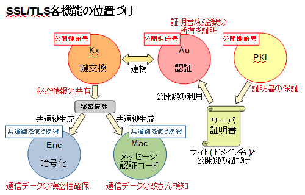

<!-- paginate: true -->

# 暗号技術のお気持ちを知りたい

---
## はじめに

#### 参考資料
1. 清藤 武暢，岸 純也，[【ゼロ知識証明入門】第2章 ゼロ知識証明技術の 基礎知識（前編）](https://enterprisezine.jp/article/detail/14515)，閲覧日: 2021/10/18．
1. システム制御情報学会・計測自動制御学会 チュートリアル講座 2021 資料
1. 電子情報通信学会 関西支部 ICT基礎講座 暗号技術とセキュリティ設計の基礎 資料
1. [電子署名の基礎知識](https://qiita.com/angel_p_57/items/437ca6235defc938b97d)，閲覧日: 2021/10/19．
1. [SSL/TLSの基本](https://qiita.com/angel_p_57/items/446130934b425d90f89d)，閲覧日: 2021/10/19．

---
## はじめに
#### Table of contents
- 暗号の定義
- 共通鍵暗号・公開鍵暗号
- デジタル署名
- 鍵交換
- SSL/TLS

#### Remark
- 暗号やその応用のお気持ちをなるべく数式を使ってまとめようとしたが，数学的に厳密でないところも多い．
- 間違っている箇所や誤解している箇所もあるかもしれない．

---
## 暗号の定義

暗号方式 / 暗号系とは，5つの組 $(\mathcal{M}, \mathcal{C}, \mathcal{K}, \mathcal{E}, \mathcal{D})$ で構成され，次の要素を持つとする．

- $\mathcal{M}$: 平文空間． $m \in \mathcal{M}$: 平文．
- $\mathcal{C}$: 暗号文空間．$c \in \mathcal{C}$: 暗号文．
- $\mathcal{K}$: 鍵空間．$k \in \mathcal{K}$: 鍵．
- $\mathcal{E} = \{\mathrm{Enc}_k \, : \, k \in \mathcal{K} \}$: 関数 $\mathrm{Enc}_k$ の族．$\mathrm{Enc}_k \in \mathcal{E}$: 暗号化関数．
- $\mathcal{D} = \{ \mathrm{Dec}_k \, : \, k \in \mathcal{K} \}$: 関数 $\mathrm{Dec}_k$ の族．$\mathrm{Dec}_k \in \mathcal{D}$: 復号化関数．

このとき，以下の性質が成り立つ．

$$\forall e \in \mathcal{K}, \forall m \in \mathcal{M}, \exists d \in \mathcal{K} \; \text{s.t.} \; \mathrm{Dec}_d(\mathrm{Enc}_e(m)) = m.$$

---
## 共通鍵暗号

---
## 共通鍵暗号の問題点
- 暗号文の送信者と受信者の間であらかじめ鍵を共有しておかなければならないこと．
- データを送受信する相手が多いほど，管理しなければならない鍵の数が多くなること．
    - $n$ 人と通信を行う当事者は各人に対応した $n$ 個の共通鍵を秘密に管理しなければならない．
- データを安全に送るためには鍵を安全に送る必要がある．その鍵共有の方法．

---
## 公開鍵暗号

---
## 公開鍵暗号の手順
1. **受信者**が鍵生成アルゴリズム $G$ によって秘密鍵と公開鍵のペア $(sk, pk)$ を作成し，$pk$ を公開する．

1. 送信者は**公開鍵** $pk$ **を用いて**データ $m \in \mathcal{M}$ を暗号化する．
    - $c = \mathrm{Enc}_{pk}(m) \in \mathcal{C}$.
    - $\mathrm{Enc}_{pk}(m)$ は 秘密鍵 $sk$ を持つ受信者以外に復号できない．

1. 受信者は秘密鍵 $sk$ を用いて送信者から受け取った暗号文 $c \in \mathcal{C}$ を復号する．
    - $\mathrm{Dec}_{sk}(c)$ を求める．$c = \mathrm{Enc}_{pk}(m)$ であれば $m$ に一致する．

---
## 公開鍵暗号のメリットとデメリット
#### メリット
- 送信者と受信者の間で事前の鍵共有が不要．
    - 公開鍵は参加者間で公開され共有されるため，各々が秘密鍵と公開鍵のペアを1つだけ作っておけば良い．
    - 当事者が秘密に管理する必要がある鍵は秘密鍵1つのみである．

#### デメリット
- 共通鍵暗号と比較して処理速度が遅いこと．
    - 暗号通信プロトコル SSL/TLS においては，送信者と受信者は公開鍵暗号を用いて共通鍵暗号の共通鍵を共有し，その後の処理は共通鍵を用いている．

---
## (暗号学的) ハッシュ関数
- $\mathcal{H} \coloneqq \{h: \mathcal{M} \to \mathcal{M}^{\prime}\}$
    - $\mathcal{M}^{\prime}$: 固定長のビット列の空間

暗号学的ハッシュ関数 $H \in \mathcal{H}$ は以下の性質を持つ．

- 現像計算困難性
    - ハッシュ値 $h \in \mathcal{M}^{\prime}$ が与えられたとき，$h = H(m)$ となるような任意のメッセージ $m \in \mathcal{M}$ を見つけることが困難．
- 弱衝突耐性
    - 入力 $m_1 \in \mathcal{M}$ が与えられたとき，$H(m_1) = H(m_2)$ となるような $\mathcal{M} \ni m_2 \neq m_1$ を見つけることが困難．
- 強衝突耐性
    - $H(m_1) = H(m_2)$ となるような $m_1, m_2 \in \mathcal{M}, \; m_1 \neq m_2$ を見つけることが困難．

---
## デジタル署名
- デジタル情報に対し，手書きによる署名と同じ機能を実現する方式．
    - 本人でなければ有効な署名はできない．
    - データの改ざん検出．

###### 署名が持つべき機能
- 認証
    - 受信者はメッセージが確かに送信者から送られてきたと納得できる．
- 否認不可
    - 送信者は第三者に対し，そのメッセージを送信した事実を否定できない．
---
## デジタル署名の処理
- 鍵生成
    - 署名を行うために必要な**署名鍵**と，検証を行うために必要な一般に公開する**検証鍵**のペアを作る．
    - 暗号の用語で書くと署名鍵は**秘密鍵**，検証鍵は**公開鍵**である．
- 署名
    - 対象のデータから署名者独自の署名データを作成する．
- 検証
    - 対象のデータと署名との整合性を確認する．

---
## デジタル署名の原理
1. 署名者は，鍵生成アルゴリズム $G$ を用いて検証鍵 (公開鍵) $pk$ および署名鍵 (秘密鍵) $sk$ を生成し，$pk$ を公開しておく．
2. 署名者は，署名生成アルゴリズム $S$ と署名鍵 $sk$ を用いて，メッセージ $m$ の署名 $\sigma$ を計算し，検証者に $(m, \sigma)$ を送る．
3. 検証者は，検査アルゴリズム $V$ と検証鍵 $pk$ を用いて $\sigma$ がメッセージ $m$ の正しい署名であるかを検証する．

---
## 認証
- 通信相手の正当性を確認する．
    - ネットワークを介した各種サービスにおいて，利用者の正当性を確認する．

ここでは，デジタル署名を用いた認証方式についてまとめる．

- **正しい署名を作ることができるのは秘密鍵の持ち主だけ**ということを利用し，秘密鍵を提示することなく秘密鍵の所有を証明する．

###### 記号
- $S_k$: (秘密) 鍵 $k$ を用いた署名生成関数
- $V_k$: (公開) 鍵 $k$ を用いた署名検証関数

---
## 認証方式
1. 利用者は鍵生成アルゴリズム $G$ を用いて秘密鍵 $sk$ および公開鍵 $pk$ を生成し，$pk$ を公開しておく．
1. 検証者は乱数 $r$ を生成し，利用者に送る．
1. 利用者は秘密鍵 $sk$ を用いて，$r$ に対する署名 $t = S_{sk}(r)$ を求め，検証者に送る．
1. 検証者は，利用者の公開鍵 $pk$ を用いて，$t$ の正当性を署名検証関数 $V_{pk}(r, t)$ で検証する．
    - 検証結果が正しければ正しい利用者と認証する．

---
## 認証局
- デジタル署名において，送信者が受信者に公開鍵を伝える方法が問題になる．
    - 攻撃者が作成した秘密鍵に対応する公開鍵を正当な送信者が作成した秘密鍵に対応する公開鍵として受信者に伝えていれば，受信者は攻撃者が作ったデジタル署名を正当なものだと信じてしまう．
- **認証局 (CA, Certificate Authority)**
    - ある公開鍵がある人のものであることを証明する機関．
    - 公開鍵の作成者 (デジタル署名における送信者) はあらかじめ認証局へ申請を行う．
    - 公開鍵を用いてデジタル署名の検証を行うユーザは，デジタル証明書によって検証に用いる公開鍵が作成者のものであると確認できる．

---
## 鍵交換
- 両者でそれぞれの公開鍵を交換し，自身の秘密鍵と組み合わせて計算を行うことで，秘密裏に何らかの情報を共有できる方式．
    - この共有した情報は，共通鍵暗号の鍵などに利用する．
- 実現方法
    - 公開鍵暗号に基づく方法
        - Diffie-Hellman鍵配送方式
        - 公開鍵暗号利用
        - 認証センター利用

---
## 暗号通信プロトコル SSL/TLS
- SSL (Secure Sockets Layer) / TLS (Transport Layer Security)
    - **インターネットを介した**データの送受信を暗号化し，盗聴や改ざんを防ぐ仕組み．
    - SSL/TLS を利用しているWebサイトのURLは，"https"から始める．
        - Chromeで SSL/TLS を使用しているWebサイトを開いた場合，URLの←に鍵のアイコンが表示される．

---
## SSL/TLSの概要
ここでは，OpenSSLにおけるSSL/TLSについて簡単にまとめる．

OpenSSLでは，SSL/TLSを次の4つの要素として整理している．
- Kx
- Au
- Enc
- Mac

---
## 4つの要素の詳細 (共通鍵暗号を使った技術)
- Enc
    - 暗号化による**通信データの秘匿**．
    - 送信側が暗号化，受信側で復号．
    - **共通鍵暗号**を用いる．
- Mac
    - 通信データの改ざんがないかどうかを調べる．
        - 以前: データと共通鍵を混合してハッシュを計算する **HMAC**.
        - 近年: Encの共通鍵暗号が Mac の機能も兼ねる **AEAD**.

---
## 4つの要素の詳細 (公開鍵暗号を使った技術)
- Kx
    - Enc, Mac に使用する**共通鍵の元になるデータを秘密裏に共有する**機能．
    - ECDH等の**鍵交換**を用いる．
- Au
    - 鍵交換とも連携し，サーバ側が**なりすましではないことを確認**する機能．
    - **電子署名**を主に用いる．
        - 秘密鍵自体を提示することなく，秘密鍵の所有を証明する．
    - サーバ証明書の正当な所有者であることを，証明書に含まれる公開鍵に対応する秘密鍵を使って証明する．

---
## 各要素の位置づけ[5]

